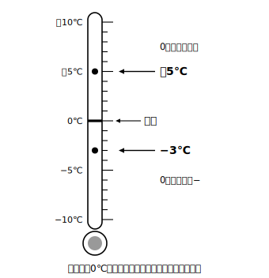

# L01 0より小さい数——符号のついた数

## ねらい

- 0より小さい数（**負の数**）が必要になる場面を知り、**符号**（＋・−）のついた数の意味を理解する。
- 反対の性質をもつ量を、正の数・負の数を使って**一組の言葉で表せる**よさを実感する。

## 主概念1：0より小さい数の世界

冬のある朝、天気予報がこう言ったとしよう。「今朝の気温は0℃より3度低く、氷点下（ひょうてんか）3度です」。

温度計を見ると、目盛りは0℃の**下**まで続いている。0より3度低い温度を、数学では **−3℃** と書く。「−」は「マイナス」と読む。逆に、0より5度高い温度は **＋5℃**（プラス5℃）と書ける。ふだん「5℃」と呼んでいる温度だ。

> 【ことば】**正の数・負の数・符号**
> 0より大きい数を**正（せい）の数**、0より小さい数を**負（ふ）の数**という。数の頭につける「＋」を**正の符号（ふごう）**、「−」を**負の符号**という。0は正の数でも負の数でもない。

−3や−0.5や−1/2のように、負の数には整数だけでなく小数や分数もある。正の数は、＋5のように符号をつけて書いても、いつもどおり5と書いてもよい。

ここで1つ確認してみよう。0はどちらの仲間だろう？　0は「0より大きい」わけでも「0より小さい」わけでもないから、**正の数でも負の数でもない**。0はちょうど境目に立つ、特別な数だ。

## 主概念2：反対の性質を一組で表す

気温のほかにも、0より小さい数が活躍する場面はたくさんある。共通しているのは、**反対の性質をもつ量がペアで現れる**ことだ。

| 場面 | 正の数で表すもの | 負の数で表すもの |
|---|---|---|
| 温度 | 0℃より高い（＋5℃） | 0℃より低い（−3℃） |
| お金 | 500円の収入（＋500円） | 300円の支出（−300円） |
| 移動 | 東へ2km（＋2km） | 西へ2km（−2km） |
| 高さ | 海面より高い（＋300m） | 海面より低い（−20m） |
| 増減 | 4人増えた（＋4人） | 4人減った（−4人） |

たとえば「東へ2km進むことを＋2kmと表す」と決めれば、「西へ2km進む」はわざわざ別の言葉を使わなくても **−2km** と表せる。「収入と支出」「増えると減る」のような反対の言葉のペアが、符号のちがいだけで**一組の数の言葉**になる。これが負の数を使う大きなよさの1つだ。

「基準（きじゅん）をどこに置くか」も自分で決められる。海面を0mとすれば山頂は＋300m、湖底は−20m。基準の決め方しだいで、身の回りのいろいろな量が正負の数で表せるようになる。

:::guide
**「−」は「引き算の記号」だと思っている人へ**

小学校まで、「−」は「ひく」という計算の記号だった。この章からは、−3の「−」のように**数の性質（0より小さい側）を表す符号**としての役目が加わる。同じ記号が2つの役目をもつ。このことはL06でもう一度正面から扱うので、いまは「−3は『3をひく』ではなく『0より3小さい数』という1つの数の名前だ」とだけつかんでおけば十分だ。
:::

:::guide
**「0より小さい数なんて、本当にあるの？」という感覚は正しい**

ものの個数を数える世界では、0個より少ない個数はたしかに存在しない。負の数は「個数」ではなく、**基準からどちら向きにどれだけずれているか**を表すための数だ。だから、温度・お金の出入り・移動のように「基準と反対向き」がある量でこそ活躍する。この「数は数えるためだけの道具ではない」という視点の切り替えが、この章全体の入口になる。
:::

:::zatsudan
天気予報では「今日の最高気温は昨日より4度低いでしょう」のように、**前の日との差**で気温を伝えることがある。下がる日は−4度、上がる日は＋4度。実は、みんな毎朝のように正負の数の予報を聞いているわけだ。今日の気温、昨日と比べると符号はどちらだろう？
:::

## 練習

1. 次の温度を、符号のついた数で表そう。
   (1) 0℃より7度高い温度　(2) 0℃より2.5度低い温度
2. 東へ進むことを正の数で表すことにする。次の移動を符号のついた数で表そう。
   (1) 東へ6km進む　(2) 西へ4km進む
3. 「＋800円」が800円の収入を表すとき、「−600円」はどんなことを表しているか、言葉で書こう。
4. 次の数の中から、負の数をすべて選ぼう。また、正の数でも負の数でもない数があれば答えよう。
   ＋4、−0.7、0、−13、2/3（3分の2）、−5/2（2分の5にマイナス）
5. 「いまいる場所から北へ50m移動する」を＋50mと表すことにした。−120mはどんな移動を表すか、言葉で書こう。

:::stretch
**S1** 身の回りから「反対の性質をもつ量のペア」を2組さがし、どちらを正の数にするか自分で決めて、例を1つずつ符号のついた数で表してみよう（例: エレベーターの上と下、時間の前と後、など）。「どちらを＋にするか」は自分で決めてよいことにも注目しよう。
:::

---

対応解答: answer_key_L01-04.md

<!-- gen_nav:nav:start（自動生成・手編集しない） -->

---

[単元の目次](README.md)｜[解答](answer_key_L01-04.md)｜[次のレッスン →](lesson_02.md)

<!-- gen_nav:nav:end -->
