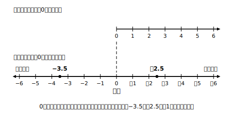
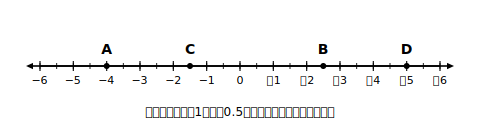

# L02 数直線——数の並びを目で見る

## ねらい

- 小学校で使った数直線を0より左へ延長し、**原点**・正の方向・負の方向を理解して、正負の数を数直線上に表せるようになる。
- 数直線を使って数の**大小**を判断し、**不等号**で表せるようになる。

## 主概念1：数直線を左へ延ばす

小学校の数直線を思い出してみよう。0から右へ、1、2、3、…と目盛りが並んでいた。では、0の**左**には何があるだろう？

L01で学んだ負の数の出番だ。0の左へ1目盛りごとに−1、−2、−3、…と並べると、正の数と負の数がひとつづきの直線の上にそろう。

> 【ことば】**数直線・原点**
> 正負の数を対応させた直線を**数直線（すうちょくせん）**という。0の点を**原点（げんてん）**といい、原点から右の向きを**正の方向**、左の向きを**負の方向**という。

数直線の上では、−3.5のような小数や−1/2（2分の1にマイナス）のような分数も、目盛りと目盛りの間の点として表せる。「どの数も数直線の上の1つの点」。この見方がこの章の道具箱の1番目だ。

ここで、小学校の線分図とのちがいを1つ確認しておこう。線分図は「長さ」で量の大きさを表す図だった。数直線はそれに加えて、**原点から見てどちら向きか**という情報をもっている。−3は「原点から負の方向へ3」、＋3は「原点から正の方向へ3」。長さは同じ3でも、向きが反対だ。

## 主概念2：右にあるほど大きい

数直線の上で、数の大小はどう見えるだろうか。正の数の範囲では、3より5が右にあり、3＜5だった。このきまりは、負の数まで広げても**そのまま**使える。

> 【ことば】**数の大小**
> 数直線の上では、**右にある数ほど大きい**。大小は**不等号（ふとうごう）**「＜」「＞」で表し、開いた側に大きい数を書く。

たとえば−2と−5を比べてみよう。数直線の上では−2のほうが右にある。だから **−5＜−2**。「5のほうが数字が大きいのに？」と感じたら、気温で考えるとよい。−5℃と−2℃なら、−2℃のほうが高い（0℃に近い）温度だ。

負の数どうしでは、**0から遠いほど小さい**。また、負の数はどれも0より小さく、0はどの正の数よりも小さい。まとめると「負の数＜0＜正の数」の並びになる。

3つ以上の数の大小を1本の式で書くこともできる。たとえば−4、＋1、−2.5なら、小さい順に並べて **−4＜−2.5＜＋1** と書く。不等号の向きは1本の式の中でそろえるのが約束だ。

:::guide
**「−5＜−2」に納得がいかないときの戻り先**

「絶対値（次のレッスンで学ぶ、0からの距離）が大きいほうが大きい数だ」という感覚は、正の数の世界では正しかった。負の数では逆になる。ここが最初のつまずきどころだ。迷ったら、数字だけで考えずに**数直線を描いて、どちらが右かを見る**。この「迷ったら数直線に戻る」は、この先の加法・減法でも同じように使える、章全体の型だ。
:::

:::guide
**「−1/2はどこ？」整数の間の数の置き方**

−1/2は「原点から負の方向へ1/2」だから、0と−1のちょうど真ん中に置く。もし「−1と−2の間」と置いてしまったら、「マイナスがつくと1つ左の区間へずれる」という思い込みがないか確かめよう。＋1/2（0と＋1の真ん中）と原点をはさんで対称の位置、と覚えると迷わない。
:::

:::zatsudan
世界地図に、架空の2つの都市を置いてみよう。東の町アオバは日本より3時間進んでいて＋3、西の町スナオカは7時間遅れていて−7。時差も「日本を基準0とした正負の数」で表せるわけだ。基準を自分の国に置くと、世界中の時刻が1本の数直線に乗る。なかなか気持ちのいい眺めだと思わない？（実在の都市の時差は変わることがあるので、ここでは架空の町で考えた。）
:::

## 練習

1. 
   数直線上の点A、B、C、Dが表す数をそれぞれ読み取ろう。
2. 数直線をかいて、次の数を表す点を打とう。
   ＋3、−5、−0.5、−7/2（2分の7にマイナス）
3. 次の2数の大小を、不等号を使って表そう。
   (1) −5 と −2　(2) 0 と −3　(3) −0.1 と −0.01
4. −4、＋3、−2.5 の3つの数を、不等号を使って小さい順に1本の式で表そう。
5. −6より大きく、＋2より小さい整数をすべて書こう。

:::stretch
**S1** 数直線の上で、−2と＋6の**ちょうど真ん中**にある数は何だろう。数直線をかいて確かめてみよう。また、−7と＋1の真ん中ならどうなるか。2つの答えを見比べて、気づいたことを一言で書こう。
:::

---

対応解答: answer_key_L01-04.md

<!-- gen_nav:nav:start（自動生成・手編集しない） -->

---

[← 前のレッスン](lesson_01.md)｜[単元の目次](README.md)｜[解答](answer_key_L01-04.md)｜[次のレッスン →](lesson_03.md)

<!-- gen_nav:nav:end -->
