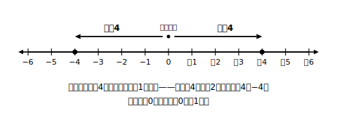
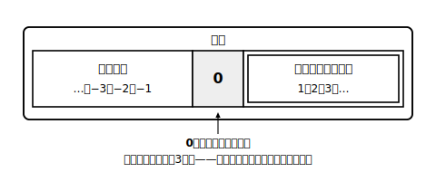

# L03 絶対値と「整数」の広がり

## ねらい

- **絶対値**を「原点からの距離」として理解し、「絶対値が◯である数を**すべて**答える」問いに正しく答えられるようになる。
- 「整数」という言葉が中学で**広がる**ことを知り、自然数の輪郭（0を含まない）をはっきりさせる。

## 主概念1：絶対値——0からどれだけ離れているか

数直線の上で、＋4と−4を見てみよう。向きは反対だが、どちらも原点からの距離は4。この「距離」に名前をつける。

> 【ことば】**絶対値**
> 数直線の上で、ある数を表す点と原点との距離を、その数の**絶対値（ぜったいち）**という。＋4の絶対値も−4の絶対値も4である。0の絶対値は0とする。

絶対値は距離だから、符号を考えない。実用的には「数から符号を取りのぞいた数」と考えてよい。−2.5の絶対値は2.5、＋2/3の絶対値は2/3だ。

ここで大事な問いを1つ。「絶対値が4である数をすべて書こう」と言われたら、答えはいくつあるだろう？　＋4だけ……ではない。原点から距離4の点は右と左に1つずつ、つまり **＋4と−4の2つ**ある。「すべて」と聞かれたら数直線を思いうかべて、**原点の両側**を確かめる——これを癖にしよう。ただし例外が1つ、絶対値が0である数は0ただ1つだ。

絶対値を使うと、L02の大小のきまりを言い直せる。正の数どうしでは絶対値が大きいほど大きく、**負の数どうしでは絶対値が大きいほど小さい**（0から遠い＝左にあるから）。−8と−11なら、絶対値は11のほうが大きいので、−11＜−8となる。

## 主概念2：「整数」が広がる

小学校で「整数」といえば、0、1、2、3、…のことだった。中学からは、この言葉の中身が広がる。

> 【ことば】**整数・自然数**
> −3、−2、−1のような数を**負の整数**という。中学からは、**負の整数と、0と、正の整数をあわせて整数（せいすう）**という。また、正の整数1、2、3、…を**自然数（しぜんすう）**という。

つまり同じ「整数」という言葉でも、小学校とは指す範囲がちがう。新しい数の世界が広がったのに合わせて、言葉の意味も広がったわけだ。

注意したいのは**0の居場所**。0は整数の仲間ではあるが、**自然数ではない**。自然数は「正の整数」、つまり1から始まる。「0は自然数か？」と聞かれたら、自信をもって「ちがう」と答えよう。同じく、−2は整数だが自然数ではない。0.5や−1/2は、整数ですらない（目盛りの間の数だ）。

:::guide
**「すべて書く」問題の落とし穴**

「絶対値が6である数をすべて」と聞かれて＋6だけ答える、あるいは絶対値の話なのに6の約数（1、2、3、6）や倍数を並べてしまう。どちらも実際に見られるすれちがいだ。問われているものを確かめる前に「数を並べる作業」を始めてしまうことが原因になっていることがある。絶対値の問題ではまず数直線、が合言葉。原点からの距離、と唱えてから答えを書こう。
:::

:::guide
**言葉の範囲が変わるのは「ずるい」ことではない**

「整数の意味が変わるなんて」と思うかもしれない。でもこれは数学ではよくあることで、数の世界を広げたときに、言葉の守備範囲も広げ直すのだ。この章の終わり（L11）では、自然数・整数・数全体という3つの範囲を並べて、どの範囲でどんな計算が自由にできるかを調べる。今日の「輪郭をはっきりさせる」作業は、そのための下ごしらえでもある。
:::

:::zatsudan
辞書の言葉の意味が版を重ねて増えていくように、数学の言葉も学年が上がると意味が広がることがある。「整数」はその代表選手だ。小学校の自分が使っていた「整数」と今日からの「整数」、中身がちがう。こういう「言葉の引っこし」に気づけると、数学の教科書がぐっと読みやすくなるよ。
:::

## 練習

1. 次の数の絶対値を答えよう。
   (1) ＋7　(2) −3.2　(3) 0　(4) −4/5（5分の4にマイナス）
2. (1) 絶対値が6である数をすべて書こう。
   (2) 絶対値が0である数をすべて書こう。
3. −8と−11の大小を、不等号を使って表そう。また、そう判断した理由を「絶対値」という言葉を使って説明しよう。
4. 絶対値が3以下である整数をすべて書こう。
5. 次の数の中から、(1)整数をすべて、(2)自然数をすべて選ぼう。
   5、−3、0、2/3（3分の2）、14、−0.7
6. 次の文が正しければ○、正しくなければ×をつけて、×は正しく直そう。
   (1) 0は自然数である。
   (2) −2は整数である。
   (3) 絶対値が5である数は＋5の1つだけである。

:::stretch
**S1** 絶対値が2.5より小さい整数は、全部で何個あるだろう。数直線をかいて数えてみよう。次に「絶対値が2.5より小さい**数**」なら何個あるか。整数に限らない場合を考えて、気づいたことを書こう。
:::

---

対応解答: answer_key_L01-04.md

<!-- gen_nav:nav:start（自動生成・手編集しない） -->

---

[← 前のレッスン](lesson_02.md)｜[単元の目次](README.md)｜[解答](answer_key_L01-04.md)｜[次のレッスン →](lesson_04.md)

<!-- gen_nav:nav:end -->
