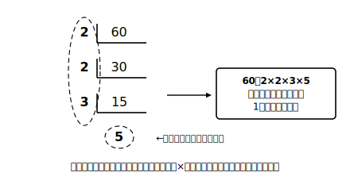

# L04 素数——数を積の部品に分ける

## ねらい

- **素数**の定義（「1より大きい自然数」という条件つき）を理解し、1が素数に入らない理由を説明できるようになる。
- 自然数を**素因数分解**する。約数を並べることとのちがいを分かったうえで、「積の形で表す」ことができるようになる。

## 主概念1：それ以上分けられない数

12は 12＝3×4 のように、より小さい自然数の積に分けられる。4はさらに 2×2 に分けられるから、12＝2×2×3。では2や3は？　これ以上、1より大きい数の積には分けられない。この「積の部品」にあたる数に名前がある。

> 【ことば】**素数**
> **1より大きい自然数**のうち、約数が1とその数自身の2個しかない数を**素数**（そすう）という。2、3、5、7、11、…が素数である。

定義の頭に「1より大きい自然数」という条件がついていることに注目してみよう。この条件のおかげで、**1は最初から素数の候補に入らない**。「1の約数は1だけ（1個）だから素数ではない」と説明することもできるが、どちらにしても結論は同じで、1は素数ではない。

では、なぜわざわざ1を仲間はずれにするのだろう？　その理由は、次の主概念2ではっきりする。

素数かどうかは、約数を調べれば判定できる。たとえば9の約数は1、3、9の3個だから素数ではない（9＝3×3と分けられる）。13の約数は1と13の2個だけだから素数だ。2は素数の中でただ1つの偶数、というのも覚えておくと役に立つ。

## 主概念2：素因数分解は「積の形で表す」

1より大きい自然数は、素数だけの積の形に分けられる。

> 【ことば】**素因数分解**
> **1より大きい自然数**を素数だけの積の形に表すことを**素因数分解**（そいんすうぶんかい）という。例: 60＝2×2×3×5

分け方の手順は「小さい素数から順に割っていく」。60なら、2で割って30、もう一度2で割って15、2では割れないので3で割って5、5は素数なのでおしまい。割った数と最後に残った素数をかけ集めて、60＝2×2×3×5となる。同じ素数の積は、L09で学ぶ累乗（るいじょう）の書き方で 2²×3×5 とまとめて書けるようになる。

ここで大事なのは、素因数分解は「**積で表す**」ことであって、約数を並べることではない、という点だ。比べてみよう。

| 問い | 60についての答え | 答えの形 |
|---|---|---|
| 約数をすべて書く | 1、2、3、4、5、6、10、12、15、20、30、60 | 数の**リスト** |
| 素因数分解する | 60＝2×2×3×5 | ×でつながれた**1本の式** |

素因数分解の答えに「、」は出てこない。**×だけで書けているか**を、答えを書いたあとに確かめる癖をつけよう。なお、素数そのものはそれ以上分けられないから、素因数分解してもその数自身のまま（13なら13のまま）で、×が出てこないこともある。1を掛け足す必要はない。

そして、素因数分解には、きわだった性質がある。順序のちがいを除けば、**分け方はただ一通りに決まる**のだ。60をどの順で割っていっても、部品はかならず2が2個、3が1個、5が1個になる。もし1を素数の仲間に入れると、60＝1×2×2×3×5＝1×1×2×2×3×5＝…と、いくらでも別の書き方ができてしまい、「ただ一通り」がこわれてしまう。1が素数から除外されているのは、この便利な性質を守るためでもある。

:::guide
**「素因数分解しなさい」で手が止まったら**

問いの意味が取れずに、約数を全部書いたり、たし算の式（60＝50＋10など）を書いたりするすれちがいが起こることがある。「分解」という言葉から「ばらばらにする」イメージだけが先行するのが原因になっていることがある。素因数分解の合言葉は「**素数だけの、かけ算の式**」。答えの形が「＝」と「×」でできた1本の式になっていなければ、問いを読み直そう。
:::

:::guide
**素数の判定を速くするコツ**

たとえば91が素数かどうか。小さい素数で順に割ってみる。2でだめ（奇数）、3でだめ（9＋1＝10は3の倍数でない）、5でだめ（一の位が1）、7で割ると91＝7×13。素数ではなかった。このように「小さい素数から順に試す」だけで判定できる。どこまで試せば打ち切ってよいかの目安は「**試している数どうしの積が、もとの数を超えたら終わり**」。もし91が2つの数の積に分けられるなら、小さいほうは10より小さい（10×10＝100が91を超えるから）。だから10より小さい素数の2、3、5、7まで試せば十分だ。試し割りの途中経過をメモに残すと、見落としも防げる。
:::

:::zatsudan
素因数分解が「ただ一通りに決まる」というのは、考えてみればすごいことだ。60を誰がどの順番で分解しても、部品の顔ぶれは世界中で同じになる。いわば素数は自然数の世界の原子で、素因数分解は原子の成分表。成分表が一通りに決まるからこそ、安心して数の性質を調べる道具に使えるんだね。
:::

## 練習

1. 次の数の中から、素数をすべて選ぼう。
   1、2、9、13、21、31、51、57
2. 次の数を素因数分解しよう（同じ素数の積はそのまま×で並べて書いてよい）。
   (1) 30　(2) 84　(3) 90
3. 「60の約数をすべて書くこと」と「60を素因数分解すること」のちがいを、答えの形に注目して1〜2文で説明しよう。
4. 次の文が正しければ○、正しくなければ×をつけて、×は正しく直そう。
   (1) 1は素数である。
   (2) 素数の約数は2個である。
   (3) 51は素数である。

:::stretch
**S1** 2けたの自然数のうち、いちばん大きい素数を見つけよう。99から順に下りながら、小さい素数で試し割りをして判定してみよう。
:::

---

対応解答: answer_key_L01-04.md

<!-- gen_nav:nav:start（自動生成・手編集しない） -->

---

[← 前のレッスン](lesson_03.md)｜[単元の目次](README.md)｜[解答](answer_key_L01-04.md)｜[次のレッスン →](lesson_05.md)

<!-- gen_nav:nav:end -->
