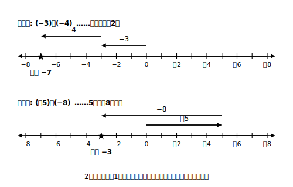

# L05 負の数のたし算——符号と絶対値で考える

## ねらい

- 正負の数の**加法（かほう）**（たし算）を、数直線の上の移動として意味づけできる。
- 同符号・異符号の加法のしかたを「**符号と絶対値**」の2段でまとめ、交換法則・結合法則が使えることを確かめて、3つ以上の数の加法に生かす。

## 主概念1：たし算は数直線の移動

「＋◯をたす」を「正の方向へ◯進む」、「−◯をたす」を「負の方向へ◯進む」と決めると、正負の数のたし算が数直線の上の移動で考えられる。

まず**同符号**のたし算。(−3)＋(−4)は、原点から負の方向へ3進み、続けて負の方向へ4進む。着いた場所は−7だ。

> (−3)＋(−4)＝−7

同じ向きへ2回進むのだから、進んだ距離は3＋4＝7で、向きは負のまま。符号が同じ2数の和は、こうなる。

次に**異符号**のたし算。(＋5)＋(−8)は、正の方向へ5進んでから、負の方向へ8進む。5歩進んで8歩もどるのだから、原点より3歩負の側に着く。

> (＋5)＋(−8)＝−3

反対向きの移動が打ち消し合うのがポイントだ。とくに、(＋6)＋(−6)＝0のように、絶対値が等しい異符号の2数の和は0になる。また、どんな数に0をたしても、移動しないのだから答えはもとの数のままだ。

## 主概念2：「符号と絶対値」でまとめる

数直線でいくつも計算してみると、いちいち図を描かなくても答えを出せるきまりが見えてくる。**答えの符号を決めてから、絶対値を計算する**という2段のまとめだ。

> 【ことば】**加法のまとめ**
> - **同符号の2数の和**……絶対値の**和**に、**共通の符号**をつける。例: (−3)＋(−4)＝−(3＋4)＝−7
> - **異符号の2数の和**……絶対値の**差**（大−小）に、**絶対値の大きいほうの符号**をつける。例: (＋5)＋(−8)＝−(8−5)＝−3

この「符号を先に決め、絶対値はあとで計算する」という考え方は、このあと乗法でも除法でも**同じ形のまま**使い回せる（減法は、いったんたし算に直してから〔L06〕この型に合流する）。この章の背骨になる型だから、ここでしっかり手になじませておこう。

もう1つ確かめておきたいことがある。小学校で使っていた**交換法則**（たす順序を入れかえてよい）と**結合法則**（どこから組にして計算してもよい）は、負の数の世界でも成り立つだろうか？　試してみよう。(＋5)＋(−8)＝−3で、順序を入れかえた(−8)＋(＋5)も、負の方向へ8進んでから正の方向へ5進むので−3。ちゃんと一致する。数の世界を広げても、計算の法則はそのまま保存されるのだ。

法則が使えると、3つ以上の加法がぐっと楽になる。**正の数どうし・負の数どうしを先にまとめる**工夫ができるからだ。

> (＋8)＋(−3)＋(−5)＋(＋2)
> ＝{(＋8)＋(＋2)}＋{(−3)＋(−5)}
> ＝(＋10)＋(−8)
> ＝＋2

:::guide
**「絶対値の差」で引っかかったら**

異符号の和の「絶対値の差（大−小）」は、絶対値どうしの引き算であって、答えの符号とは別の作業だ。(＋5)＋(−8)なら、①符号: 絶対値は8のほうが大きいから答えは−。②絶対値: 8−5＝3。③合体して−3。この3ステップを声に出して唱えながら解くと、「5−8ができない」という混乱（それはまだ習っていない引き算だ）に迷いこまずにすむ。迷ったら数直線に戻ってもよい。図はいつでも待っていてくれる。
:::

:::guide
**なぜ「まとめ」を急がず数直線から始めたのか**

きまりを先に暗記して速く解くこともできる。でも、きまりを忘れたときに立ち直れるのは、「たし算は数直線の移動だった」という意味を持っている人だ。この章では、意味で導入して、形式でうまくなって、つまずいたら意味へ帰る。この往復を何度もする。まとめの2行が思い出せなくなったら、恥ずかしがらずに矢印の図を描こう。
:::

:::zatsudan
数の世界を負の数まで広げたのに、交換法則も結合法則も壊れずにそのまま使えた。実はこれ、偶然ではなく「計算の法則が保たれるように」数の世界の広げ方を選んでいるからなんだ。この先、数学で新しい数や新しい計算に出会うたびに「前の法則はまだ使える？」と確かめる場面がやってくる。今日のは、その記念すべき第1回というわけ。
:::

## 練習

1. 次の計算をしよう。
   (1) (−2)＋(−6)　(2) (＋4)＋(−9)　(3) (−7)＋(＋7)　(4) 0＋(−5)
2. 次の計算をしよう。
   (1) (−3.5)＋(＋1.2)　(2) (−2/3)＋(＋1/2)（3分の2にマイナス、たす、2分の1）
3. 次の計算を、正の数どうし・負の数どうしをまとめる工夫をして解こう。
   (1) (＋8)＋(−3)＋(−5)＋(＋2)　(2) (−6)＋(＋10)＋(−4)
4. 「異符号の2数の和の符号は、絶対値の大きいほうの符号になる」。このきまりが成り立つ例を、自分で数を決めて1つ作り、数直線の移動で確かめよう。

:::stretch
**S1** (−1)＋(＋2)＋(−3)＋(＋4)＋(−5)＋(＋6)＋(−7)＋(＋8)＋(−9)＋(＋10) を計算しよう。1つずつ順にたすより速い、うまい組の作り方がないか探してみよう。
:::

---

対応解答: answer_key_L05-08.md

<!-- gen_nav:nav:start（自動生成・手編集しない） -->

---

[← 前のレッスン](lesson_04.md)｜[単元の目次](README.md)｜[解答](answer_key_L05-08.md)｜[次のレッスン →](lesson_06.md)

<!-- gen_nav:nav:end -->
