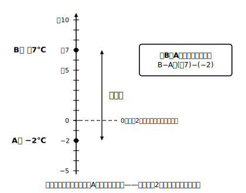

# L06 負の数のひき算——「ひく」は「たす」に化ける

## ねらい

- 記号「−」の2つの役目（ひく・マイナス）を区別したうえで、**減法（げんぽう）**（ひき算）を「符号を変えた数をたすこと」として計算できる。
- 「差」を求める場面で、**図や数直線に表してから**どちらからどちらをひくかを決めて立式できる。

## 主概念1：「−」の2つの顔と、減法の正体

まず、記号「−」の役目を整理しておこう。実はここまで、同じ記号を2つの意味で使ってきた。

| 使われ方 | 例 | 役目 |
|---|---|---|
| 数の頭につく | −3 | **符号**（0より小さい側の数であることを表す） |
| 数と数の間に立つ | 5−3 | **演算（えんざん）記号**（ひき算を表す） |

−3の「−」は数の名前の一部で、5−3の「−」は計算の指図。同じ顔の記号が2役をこなしている。ここを意識できると、この先の式がずっと読みやすくなる。

さて、本題のひき算だ。たとえば (＋2)−(＋5)。小学校の感覚では「2から5はひけない」場面だが、数直線で考えてみよう。「＋5をたす」が正の方向へ5進むことだったから、「＋5を**ひく**」はその**逆もどし**、つまり負の方向へ5進むことになる。＋2から負の方向へ5進むと−3だ。

> (＋2)−(＋5)＝−3

ところで「負の方向へ5進む」は、(−5)をたす移動と同じだった。つまり、

> (＋2)−(＋5)＝(＋2)＋(−5)＝−3

同じように、「(−7)をひく」は「(−7)をたす」（負の方向へ7進む）の逆もどしだから、正の方向へ7進むこと、すなわち(＋7)をたすことと同じになる。

> (−3)−(−7)＝(−3)＋(＋7)＝＋4

> 【ことば】**減法のまとめ**
> 正負の数をひくことは、**ひく数の符号を変えた数をたす**ことと同じである。
> 例: −(＋5) → ＋(−5)　／　−(−7) → ＋(＋7)

これで、ひき算はぜんぶ、L05で身につけたたし算に**化けさせられる**。新しい計算のしかたを覚え直す必要はない。しかも、自然数の世界では「2−5」は答えが出せなかったのに、負の数まで世界を広げたおかげで、**どんな2数でもかならずひき算ができる**ようになった。これも数の世界を広げた大きなよさの1つだ。

答えの確かめには「逆算」が使える。ひき算の答えは「答え＋ひく数＝ひかれる数」で確かめられる。(＋2)−(＋5)＝−3なら、(−3)＋(＋5)＝＋2でもとに戻る。合っている。この**逆算で確かめる**は、わり算（L09）でも同じ形で使える検算の型だ。

## 主概念2：「差」はどちらからどちらをひく？

ひき算のもう1つの出番は、2つの量の**差**を求める場面だ。ここでは計算よりも**立式の向き**が急所になる。

問題。「A町の朝の気温は−2℃、B町は＋7℃だった。B町の気温はA町より何度高いか」。

いきなり式を書かずに、まず数直線に2つの温度を置いてみよう。

「BはAより何度高いか」と聞かれているから、**Bの温度からAの温度をひく**。

> (＋7)−(−2)＝(＋7)＋(＋2)＝＋9　……B町のほうが9度高い

数直線を見ると、＋7と−2のへだたりは、0から上に7、0から下に2で、たしかに9目盛りぶん。答えと図が一致していることまで確かめられた。

立式の向きのきまりはこうだ。「**PはQよりどれだけ大きいか**」は P−Q。大きいほうから小さいほうをひくのではなく、**「〜より」の直後にある基準の数をひく**。もし「AはBより何度高いか」なら (−2)−(＋7)＝−9、つまり「−9度高い＝9度低い」となって、これも筋が通る。

:::guide
**「大きい数から小さい数をひく」という古い習慣**

小学校のひき算では答えがいつも0以上だったから、「大きいほうから小さいほうをひく」で困らなかった。負の数の世界では、その習慣が立式の向きをまちがえる原因になる。問題文の「〜より」に印をつけ、図に2点を置いてから式を書く。手間に見えるが、この一手間が向きの誤りを大きく減らしてくれる。計算がひととおりできる人ほど、図を省略したくなるので要注意だ。
:::

:::guide
**「ひく数の符号を変えてたす」を機械的に使う前に**

変換の規則だけ覚えると、−(−7)を−7のまま書き写すような写しまちがいが増える。おすすめは、変換した瞬間に「もとの式と同じ意味か？」を数直線で1回だけ確かめること。(−3)−(−7)なら「−7をたす移動の逆もどし＝正の方向へ7」。意味とセットで規則を使う人は、規則を忘れても自力で復元できる。
:::

:::zatsudan
「−」という1つの記号が「ひく」と「マイナス」の2役をこなしているなんて、ちょっと欲ばりな話だよね。実は今日の学びで、この2役は「符号を変えてたす」を通じて行き来できる親戚どうしだと分かった。役者の一人二役が、じつは物語の仕掛けだった。そんな種明かしの回だったというわけ。
:::

## 練習

1. 次の計算をしよう。
   (1) (＋3)−(＋8)　(2) (−4)−(−9)　(3) (−6)−(＋2)　(4) 0−(−5)
2. 次の計算をしよう。
   (1) (−1.8)−(−0.8)　(2) (＋1/4)−(−1/2)（4分の1、ひく、マイナス2分の1）
3. 1の(1)〜(4)のうち2つを選び、「答え＋ひく数＝ひかれる数」の逆算で確かめよう。
4. C町の朝の気温は−5℃、D町は＋3℃だった。
   (1) D町の気温はC町より何度高いか。数直線に2点を置いてから立式して求めよう。
   (2) C町の気温はD町より何度高いか。答えの符号の意味も言葉で説明しよう。
5. ある数から(−6)をひいたら＋2になった。ある数を求めよう。

:::stretch
**S1** 表は、ある山の観測点の朝の気温である。「前日よりどれだけ高いか」を、火曜から金曜まで符号のついた数で表そう。
   | 曜日 | 月 | 火 | 水 | 木 | 金 |
   |---|---|---|---|---|---|
   | 気温(℃) | −1 | ＋3 | ＋1 | −4 | −2 |
   さらに、求めた4つの数をぜんぶたすと何になるか計算し、その答えが「金曜の気温−月曜の気温」と一致する理由を考えてみよう。
:::

---

対応解答: answer_key_L05-08.md

<!-- gen_nav:nav:start（自動生成・手編集しない） -->

---

[← 前のレッスン](lesson_05.md)｜[単元の目次](README.md)｜[解答](answer_key_L05-08.md)｜[次のレッスン →](lesson_07.md)

<!-- gen_nav:nav:end -->
