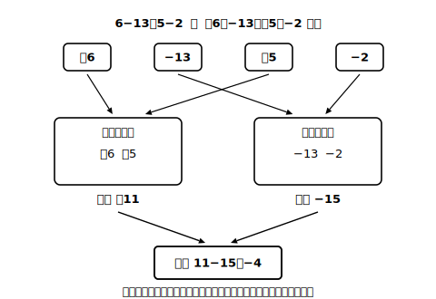

# L07 加法と減法をひとつにする——正の項・負の項

## ねらい

- 加法だけの式に直したうえで、かっこと加法の記号を省いた**簡単な書き方**ができるようになる。
- 式を**正の項・負の項**の集まりとして見て、「正の項の和」と「負の項の和」にまとめて計算できるようになる。

## 主概念1：式の着ぶくれを脱がせる

L06までの式は、かっこと符号でだいぶ着ぶくれしていた。たとえば、

> (＋5)＋(−9)−(−4)

まず、ひき算をたし算に直す（L06の変換）。−(−4)は＋(＋4)だから、

> (＋5)＋(−9)＋(＋4)

こうして**加法だけの式**になったら、かっこと加法の記号「＋」を省いて、すっきり書いてよいことにする。

> 5−9＋4

見た目はひき算が混ざった式のようだが、意味は「(＋5)と(−9)と(＋4)をたし合わせた式」だ。この見方に立つと、式の中の「−9」は「9をひく」ではなく「**−9という数がそこにいる**」と読める。−の二義性（L06）の、これが到達点だ。

> 【ことば】**正の項・負の項**
> 加法だけの式に直したとき、たし合わされている1つ1つの数を、その式の**項（こう）**とよぶ。5−9＋4という式では、5、−9、＋4が項である。正の数の項（5、＋4）を**正の項**、負の数の項（−9）を**負の項**という。

## 主概念2：正の項の和と、負の項の和

式が「項の集まり」に見えると、計算の作戦が変わる。たし算は順序を入れかえてよい（交換法則・L05）から、**正の項どうし・負の項どうしを先に集めて**しまえばよい。

> 5−9＋4
> ＝(5＋4)−9　……正の項の和は9、負の項は−9
> ＝9−9
> ＝0

もう1問。6−13＋5−2 を計算してみよう。

> 6−13＋5−2
> ＝(6＋5)−(13＋2)　……正の項の和は11、負の項の和は−15
> ＝11−15
> ＝−4

答えの確かめは、先頭から順に1つずつたしても同じ答えになるかで検算できる。6−13＝−7、−7＋5＝−2、−2−2＝−4。一致した。

じつは、この「見方の切りかえ」には前例がある。小学校の算数で、分数のわり算を「逆数のかけ算とみる」ことを学んだのを覚えているだろうか？　わり算をかけ算に統一すると、計算の見通しがよくなった。今日やったことはその中学版だ。ひき算をたし算に統一して、式を「項の和」とみる。**計算の種類を減らして、見通しをよくする**という同じ発想だ。

:::guide
**「5−9＋4」の2つの読み方は、どちらも正しい**

この式は「5から9をひいて4をたす」（演算の列）とも、「5と−9と＋4の和」（項の和）とも読める。答えはどちらでも同じ。ただ、項の和として読めると、順序の入れかえ・まとめ計算が自由にできて、この先の文字式や方程式でも同じ見方がそのまま働く。急いで前の読み方を捨てる必要はない。2つの読み方を行き来できることが、ここでの目標だ。
:::

:::guide
**この見方は、今ここで完成しなくていい**

「項の和とみる」感覚は、1回の練習でしみこむものではなく、この先の文字式・方程式の章で何度も出会いながらだんだん自分のものになる。今日の時点では、①ひき算を加法に直せる ②項を指させる ③正の項・負の項を集めて計算できる、の3つができれば十分。もし先の章でこの計算がぐらついたら、ここへ戻って項の仕分け図を描き直せばよい。
:::

:::zatsudan
かっこだらけの式から、かっこのないすっきりした式へ。じつはこれ、見た目の問題だけではなくて、「ひき算とたし算」という2種類の計算が「たし算1種類」に統一されたという事件なんだ。道具が1種類に減ると、人はまちがえにくくなる。数学が時々やる「わざわざ言いかえる」には、こういう実利がちゃんとあるんだね。
:::

## 練習

1. 次の式を、かっこと加法の記号を省いた式に直してから計算しよう。
   (1) (−6)＋(＋9)　(2) (＋7)−(＋12)　(3) (−6)＋(＋9)−(＋4)−(−3)
2. 次の式の正の項と負の項をすべて答えよう。
   −7＋3−8＋10
3. 正の項の和と負の項の和にまとめて計算しよう。
   (1) 6−13＋5−2　(2) −7＋3−8＋10　(3) −0.5＋1.7−1.2
4. 次の計算をしよう。
   −2/3＋1/4−1/3（3分の2にマイナス、たす4分の1、ひく3分の1）
5. 「12−5」という式を、(1)演算の列としての読み方、(2)項の和としての読み方、の2通りの言葉で説明しよう。

:::stretch
**S1** 1−2＋3−4＋5−6＋…＋99−100 を計算しよう。100個の項を前から順にたすのは大変だ。となり合う項を2つずつ組にすると、何が見えてくるだろう？
:::

---

対応解答: answer_key_L05-08.md

<!-- gen_nav:nav:start（自動生成・手編集しない） -->

---

[← 前のレッスン](lesson_06.md)｜[単元の目次](README.md)｜[解答](answer_key_L05-08.md)｜[次のレッスン →](lesson_08.md)

<!-- gen_nav:nav:end -->
