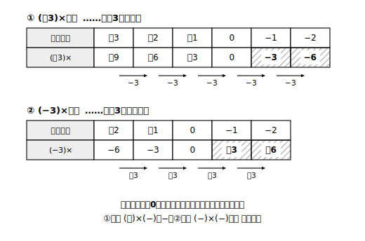

# L08 負の数のかけ算——パターンから見つける符号のきまり

## ねらい

- かけ算の表の**パターン**を観察して、(−)×(＋)や(−)×(−)の符号のきまりを自分で見つけ、納得して使えるようになる。
- 3つ以上の数の積の符号を、**負の数の個数**で判断できるようになる。

## 主概念1：表のパターンが教えてくれる

ここで1つ、大事な切りかえの宣言をしておこう。たし算・ひき算では「数直線の上の移動」で考えてきたが、**かけ算では同じ絵をそのまま使わない**。「−3進む移動を−2回する」と言われても、意味がよく分からないからだ。かけ算では、道具を**表のパターン観察**に持ちかえる。

まず、答えの分かる計算から表を作る。(＋3)×(かける数)で、かける数を1ずつ減らしてみよう。

| かける数 | ＋3 | ＋2 | ＋1 | 0 | −1 | −2 |
|---|---|---|---|---|---|---|
| (＋3)×(かける数) | ＋9 | ＋6 | ＋3 | 0 | ？ | ？ |

かける数が1減るごとに、積は**3ずつ減っている**（＋9→＋6→＋3→0）。このパターンが0の先も続くとすれば、次は0より3小さい−3、その次は−6になるはずだ。

> (＋3)×(−1)＝−3、(＋3)×(−2)＝−6　……つまり **(＋)×(−)は−**

次に、かけられる数を−3にした表で同じことをしてみよう。(−3)×(＋2)＝−6、(−3)×(＋1)＝−3は、「−3を2個・1個たし合わせた数」と考えれば求められる。ここからかける数を1ずつ減らす。

| かける数 | ＋2 | ＋1 | 0 | −1 | −2 |
|---|---|---|---|---|---|
| (−3)×(かける数) | −6 | −3 | 0 | ？ | ？ |

今度は、かける数が1減るごとに積は**3ずつ増えている**（−6→−3→0）。パターンを0の先へ延ばすと、次は＋3、その次は＋6。

> (−3)×(−1)＝＋3、(−3)×(−2)＝＋6　……つまり **(−)×(−)は＋**

「(−)×(−)が＋になる」は、たし算の繰り返し（同じ数を何個もたす）ではうまく意味づけられないので、**かけ算の表のパターンが自然につながるように決めた**結果だ。そしてこう決めておくと、交換法則や分配法則などの計算の法則も、負の数の世界でそのまま保存される（L10で確かめる）。パターンと法則の両方が、この決め方を支えている。

> 【ことば】**乗法（じょうほう）の符号のきまり**
> 2数の積は、**同符号なら＋**、**異符号なら−の符号に**、絶対値の積をつけたものになる。
> 例: (−7)×(−4)＝＋(7×4)＝＋28　／　(−7)×(＋4)＝−(7×4)＝−28

「符号を決めてから絶対値を計算する」というL05で身につけた2段構えが、かけ算でもそのまま使えることに注目しよう。

## 主概念2：3つ以上の積は、負の数を数える

3つ以上の数の積の符号はどうなるだろう。(−2)×(＋5)×(−3)を左から計算すると、(−10)×(−3)＝＋30。符号だけ追いかけると、−は2個あって、(−)×(−)のペアが＋に変わったと見える。

一般に、負の数を1個かけるたびに符号がひっくり返るから、積の符号は**負の数の個数**だけで決まる。

> 負の数が**偶数個なら積は＋**、**奇数個なら積は−**（0でない数の積の場合）

たとえば (−1)×(−2)×(−3)×(−4) は負の数が4個（偶数個）だから符号は＋、絶対値は1×2×3×4＝24で、答えは＋24。先に符号を宣言してから絶対値の計算にかかると、途中で符号を見失わない。

:::guide
**「移動の絵」をかけ算に持ちこまないわけ**

たし算で活躍した数直線の移動の絵は、かけ算では「−2回進む」のような説明のつかない場面を生む。道具にはそれぞれ得意分野があって、境目で持ちかえるのが正しい使い方だ。かけ算の根拠はあくまで「表のパターンがまっすぐ続くこと」と「計算の法則が保存されること」。もし(−)×(−)の符号に迷ったら、(−3)×の表を自分で書き出してパターンを延長し直せばよい。30秒で再発見できる。
:::

:::guide
**「決めた」という言い方に引っかかった人へ**

「(−)×(−)＝＋は人間が決めたのか。それなら(−)×(−)＝−と決めてもよかったのでは？」これはよい疑問だ。もし−と決めると、表のパターン（3ずつ増える）が0のところで急に折れ曲がり、分配法則も壊れてしまう。つまり「どう決めても自由」ではなく、**計算の世界の筋が通る決め方はこれしかない**。観察で納得できて、しかも論理の裏づけもある。数学の「決めごと」はそういう作りになっている。
:::

:::zatsudan
今日の授業、じつは「証明した」のではなく「表のパターンを観察して納得した」という進め方だった。数学はいつも上から規則を配るわけではなくて、まず手を動かして観察し、パターンから規則を見つける。科学の実験とよく似た進め方をすることがあるんだ。自分の手で表を延長して規則を見つけた今日の経験は、ちょっとした発見者の体験というわけ。
:::

## 練習

1. 次の計算をしよう。
   (1) (−7)×(＋4)　(2) (−6)×(−8)　(3) (＋0.5)×(−12)　(4) (−9)×0
2. 次の計算をしよう。
   (1) (−2/3)×(−9/4)（3分の2にマイナス、かける、4分の9にマイナス）　(2) (＋3/5)×(−10)
3. まず積の符号だけを宣言してから、計算しよう。
   (1) (−2)×(＋5)×(−3)　(2) (−1)×(−2)×(−3)×(−4)　(3) (−5)×(＋2)×(−1)×(−3)
4. (＋3)×(かける数)の表をかける数−3まで自分で延長して、(＋3)×(−3)の値をパターンから求めよう。

:::stretch
**S1** 負の数どうしのかけ算(−)×(−)＝＋を使うと、「−1を何回もかける」計算に面白い規則が現れる。(−1)×(−1)、(−1)×(−1)×(−1)、(−1)を4個かけたもの、5個かけたもの……と順に計算して、答えの並びの規則を見つけよう。この規則は、次のレッスンで学ぶ「累乗」の符号判定にそのままつながる。
:::

---

対応解答: answer_key_L05-08.md

<!-- gen_nav:nav:start（自動生成・手編集しない） -->

---

[← 前のレッスン](lesson_07.md)｜[単元の目次](README.md)｜[解答](answer_key_L05-08.md)｜[次のレッスン →](lesson_09.md)

<!-- gen_nav:nav:end -->
