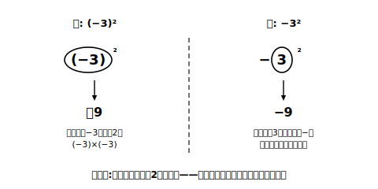

# L09 わり算・逆数・累乗

## ねらい

- 正負の数の**除法（じょほう）**（わり算）を乗法の逆として理解し、符号のきまりを使って計算できる。
- **逆数**を負の数まで広げ、除法を「逆数の乗法」とみて計算できる。
- **累乗**（るいじょう）の書き方を知り、−3²と(−3)²のちがいを説明できる。

## 主概念1：わり算は、かけ算の逆

(−12)÷(＋4)の答えは何だろう。わり算の答えは「答え×わる数＝わられる数」を満たす数だった（小学校と同じ）。つまり、□×(＋4)＝−12となる□を探せばよい。L08の符号のきまりから、□＝−3だ。

> (−12)÷(＋4)＝−3　……検算: (−3)×(＋4)＝−12

同じように□を探すと、(−12)÷(−4)＝＋3、(＋12)÷(−4)＝−3。答えの符号は、かけ算とまったく同じきまりになる。

> 【ことば】**除法の符号のきまり**
> 2数の商は、**同符号なら＋、異符号なら−の符号に**、絶対値の商をつけたものになる。
> 例: (−24)÷(−6)＝＋(24÷6)＝＋4

かけ算の逆なのだから、きまりが同じになるのは当然といえば当然。ここでも「符号を決めてから絶対値を計算」の2段構えは健在だ。なお、0を0でない数で割った商は0だが、**0で割ることは考えない**（□×0＝わられる数となる□が、うまく決まらないからだ）。

## 主概念2：逆数——わり算をかけ算に化けさせる

小学校で、積が1になる2数の一方を他方の**逆数**（ぎゃくすう）とよんだ。この言葉も負の数の世界へ広げよう。(−3/4)×(−4/3)＝＋1だから、−3/4の逆数は−4/3。**負の数の逆数は負の数**になる（積を＋1にするには同符号が必要だから）。なお、0はどんな数とかけても0で、積を＋1にできないから、**0に逆数はない**（0でわることを考えないのと表裏の関係だ）。

そして小学校と同じく、**わり算は、わる数の逆数のかけ算に直せる**。

> (−5/6)÷(＋10/3)＝(−5/6)×(＋3/10)＝−(5×3)/(6×10)＝−15/60＝−1/4

どこかで見た景色ではないだろうか。L06〜L07では「ひき算を、符号を変えた数のたし算に直す」ことで計算を加法に統一した。今日は「わり算を、逆数のかけ算に直す」ことで乗法に統一している。**計算の種類を減らして見通しをよくする**、あの同じ作戦のかけ算・わり算版だ。

## 主概念3：累乗——同じ数の積を短く書く

(−3)×(−3)のように同じ数をいくつかかけ合わせたものを、その数の**累乗**といい、右肩の小さな数字で書く。

> 【ことば】**累乗・指数**
> (−3)×(−3)＝(−3)²と書き、「−3の2乗（じょう）」と読む。右肩の小さな数字（かけ合わせた個数）を**指数**（しすう）という。

累乗の符号は、L08の「負の数の個数」のきまりから、(−3)²＝＋9、(−3)³＝(−3)×(−3)×(−3)＝−27のように、**指数が偶数なら＋、奇数なら−**（底が負の数のとき）となる。

さて、ここに要注意の書き分けがある。次の2つの式は**別物**だ。

| 式 | 2乗されているもの | 計算 | 答え |
|---|---|---|---|
| (−3)² | かっこの中の−3全体 | (−3)×(−3) | ＋9 |
| −3² | 3だけ（−は符号として残る） | −(3×3) | −9 |

−3²は「3²に−をつけた数」という約束で読む。**何が2乗されているか**、つまり累乗の底（そこ）にあたる部分を丸で囲んでから計算すると、この2つを取りちがえない。(−3)²ならかっこごと丸、−3²なら3だけ丸。丸の中だけを2乗するのだ。

なお、累乗の1行書き（(−3)²など）は画面でもノートでも同じ形だが、ノートでは指数を**小さく右上に**書く。大きさの区別があいまいだと、(−3)²と(−3)×2の読みちがいが起こるので、指数は意識して小さく書こう。

:::guide
**わり算は「交換」できないことに注意**

たし算・かけ算には交換法則があったが、わり算にはない（ひき算にもないが、ひき算はL06でたし算に直せるようになった）。(−12)÷(＋4)と(＋4)÷(−12)は答えがちがう（−3と−1/3）。だからこそ逆数の乗法に直す価値がある。かけ算に直してしまえば、順序の入れかえも3数以上のまとめ計算も自由になる。分数が混ざるわり算は「直してから考える」を既定の手にしよう。
:::

:::guide
**−3²で手が止まった人へ**

「かっこがないのに、なぜ−を2乗に入れないのか」という疑問はもっともだ。これは論理ではなく**記号の読み方の約束**で、「指数は、すぐ左にある数（かっこがあればかっこ全体）だけに働く」と決められている。約束である以上、慣れるまでは丸囲みの一手間で自分を守るのが賢い。テストの直前まで有効な、費用ゼロの保険だと思ってほしい。
:::

:::zatsudan
小6で「わり算は逆数のかけ算に直せる」と習ったとき、ちょっとした手品みたいだと思わなかった？　今日、その手品の種が負の数の世界でもそのまま通用した。しかもひき算→たし算（L06）と、わり算→かけ算（今日）は、そっくり同じ形の作戦。一度覚えた手品の種が、世界を広げても使い続けられる。数学の道具の息の長さを感じる場面だね。
:::

## 練習

1. 次の計算をしよう。検算（答え×わる数）も1問選んでやってみよう。
   (1) (−24)÷(−6)　(2) (＋18)÷(−3)　(3) 0÷(−7)
2. 次の数の逆数を答えよう。
   (1) −5　(2) −3/8（8分の3にマイナス）　(3) 0.4
3. 逆数の乗法に直して計算しよう。
   (1) (−5/6)÷(＋10/3)　(2) (＋8)÷(−2/3)
4. 次の計算をしよう。
   (1) (−5)²　(2) −5²　(3) (−2)³　(4) 2⁴
5. (−5)²と−5²の答えがちがう理由を、「何が2乗されているか」という言葉を使って1〜2文で説明しよう。

:::stretch
**S1** (−1)¹、(−1)²、(−1)³、…と(−1)の累乗を順に計算すると、答えはどんな並びになるだろう。この規則を使って、(−1)を100個かけた数と101個かけた数を、計算せずに即答してみよう。
:::

---

対応解答: answer_key_L09-12.md

<!-- gen_nav:nav:start（自動生成・手編集しない） -->

---

[← 前のレッスン](lesson_08.md)｜[単元の目次](README.md)｜[解答](answer_key_L09-12.md)｜[次のレッスン →](lesson_10.md)

<!-- gen_nav:nav:end -->
