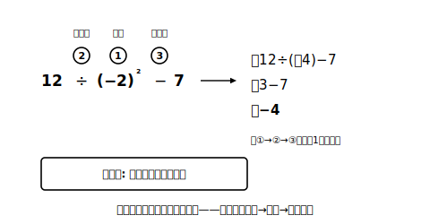

# L10 四則の混じった計算

## ねらい

- 加減乗除と累乗・かっこの混じった式を、正しい**順序**で計算できる。
- **分配法則**が正負の数でも成り立つことを確かめ、計算の**工夫**に使えるようになる。

## 主概念1：計算の順序は小学校と同じ

たし算・ひき算・かけ算・わり算をまとめて**四則（しそく）**という。四則の混じった式の計算の順序は、小学校で学んだきまりがそのまま生きている。

> 【ことば】**計算の順序**
> ① **累乗・かっこの中**を先に計算する
> ② 次に**乗法・除法**
> ③ 最後に**加法・減法**

例題で確かめよう。5＋(−3)×4 は、かけ算が先だ。

> 5＋(−3)×4＝5＋(−12)＝5−12＝−7

累乗が混じる式。12÷(−2)²−7 は、まず累乗から。

> 12÷(−2)²−7＝12÷(＋4)−7＝3−7＝−4

なお、かっこの中に計算があり、そのかっこ全体に指数がついているとき（例: (4−6)²）は、**かっこの中→累乗**の順で計算する（(4−6)²＝(−2)²＝＋4）。

もし順序を無視して左から計算すると、5＋(−3)×4を「2×4＝8」としてしまうような事故が起こる。**式全体を見わたして、計算の順番に番号をふってから**手を動かす習慣が効く。丸で囲む型（L09）と同じで、書きこみの一手間が符号と順序の両方を守ってくれる。

## 主概念2：分配法則も保存されている

小学校で使った**分配法則**——(a＋b)×c＝a×c＋b×c の形のきまり——は、負の数の世界でも成り立つ。1つ確かめてみよう。

> {(−2)＋5}×(−4)を、かっこの中を先に計算すると: (＋3)×(−4)＝−12
> 分配して計算すると: (−2)×(−4)＋5×(−4)＝(＋8)＋(−20)＝−12

どちらの道でも同じ−12に着いた。加法・乗法の交換法則・結合法則（L05・L08）に続いて、分配法則も無事に保存されている、というわけだ。

保存されているなら、道具として使える。分配法則が光るのは、**そのまま計算すると面倒な式**だ。

> (−18)×(5/6−2/9)
> ＝(−18)×5/6−(−18)×2/9　……かっこの中を通分するかわりに分配
> ＝(−15)−(−4)
> ＝−15＋4＝−11

逆向きに使う（共通の数でくくる）工夫もある。

> 25×(−7)＋75×(−7)＝(25＋75)×(−7)＝100×(−7)＝−700

25×7と75×7を別々に計算するより、ずっと速くて安全だ。「同じ数がかけられている項はないか？」と式をながめる目を持てると、計算は一段らくになる。

:::guide
**工夫は「見つけたら使う」でよい**

分配法則の工夫は、いつでも使わなければならないものではない。まっすぐ計算しても答えは同じだ。ただ、通分が重い分数や、たすと切りのよい数になる組（25と75など）が見えたときに使えると、計算量と写しまちがいが目に見えて減る。練習では「工夫できる形か？」と10秒だけ探し、見つからなければ迷わず正面から計算する。この切りかえの速さも実力のうちだ。
:::

:::guide
**符号の事故がいちばん起こる場所**

四則混合で特に注意したいのは、①累乗の底の取りちがえ（−2²と(−2)²・L09）②ひき算の直後の負の数（−(−4)の見落とし）③分配のときの符号のかけ忘れ、の3か所だ。①は「丸で囲む」型（L09）で、②③は「符号を先に処理してから絶対値の計算へ」の2段構えでふせげる。ただしどちらも、計算の順序（累乗・かっこ→乗除→加減）を確かめたうえでの話だ。途中式を省略しないことが、遠回りに見えて最短の安全策になる。
:::

:::zatsudan
数の世界を負の数まで広げても、交換法則・結合法則・分配法則がぜんぶ生き残った。引っこしをしたのに、前の家の家具がすべてそのまま使えたようなものだ。じつは数学では、新しい世界を作るとき「古い法則が使い続けられること」を最優先の設計条件にすることが多い。法則が変わらないから、私たちは安心して新しい数を計算に混ぜられるんだね。
:::

## 練習

1. 次の計算をしよう。
   (1) 5＋(−3)×4　(2) (−6)−(−12)÷(＋3)　(3) (−2)³＋3×(−1)
2. 次の計算をしよう。
   (1) 12÷(−2)²−7　(2) 18−(4−7)×6
3. 分配法則を使って計算しよう。
   (1) (−18)×(5/6−2/9)（6分の5、ひく、9分の2）　(2) 25×(−7)＋75×(−7)
4. 次の計算のまちがいを見つけて、正しく直そう。
   「8−2×(−3)＝6×(−3)＝−18」

:::stretch
**S1** (−0.25)×13×(−4) を工夫して計算しよう。どの2つを先に組にすると楽になるだろうか。また、その組みかえが許される根拠は、どの法則だろう？
:::

---

対応解答: answer_key_L09-12.md

<!-- gen_nav:nav:start（自動生成・手編集しない） -->

---

[← 前のレッスン](lesson_09.md)｜[単元の目次](README.md)｜[解答](answer_key_L09-12.md)｜[次のレッスン →](lesson_11.md)

<!-- gen_nav:nav:end -->
