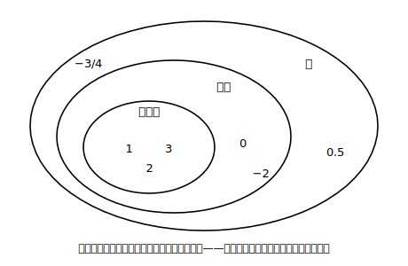

# L11 数の集合と四則——どこまで自由に計算できる？

## ねらい

- **自然数の集合・整数の集合・数全体の集合**という3つの範囲を区別し、それぞれの範囲で四則の計算が**いつでもできるか**を、**反例（はんれい）**を探して判断できる。

## 主概念：計算の自由度は、数の範囲で決まる

この章で、数の世界は「自然数」から「整数」へ、さらに小数・分数も含めた「数全体」へと広がってきた。ここで一度立ち止まって、**それぞれの範囲でどの計算が自由にできるのか**を点検してみよう。

言葉を1つ用意する。数の集まりのことを**集合（しゅうごう）**という。自然数の集合は整数の集合にすっぽり含まれ、整数の集合は（分数・小数を含む）数全体の集合に含まれる。

問いはこうだ。「自然数と自然数をたすと、答えはかならず自然数か？」　3＋5＝8、1＋1＝2、どうやらいつでも自然数になりそうだ（実際、いつでもできる）。では「自然数から自然数をひくと、答えはかならず自然数か？」

こちらは様子がちがう。7−4＝3は自然数だが、**2−5＝−3は自然数ではない**。「いつでもできる」と言うためには全部の場合で成り立つ必要があるから、成り立たない例が**1つ**見つかった時点で「いつでもできるとは言えない」と決着する。この、主張をくずす1つの例を**反例**という。

> 【ことば】**反例**
> 「いつでも〜できる」という主張に対して、成り立たない具体例を1つ示せば、その主張は否定できる。この例を**反例**という。反例探しは「あてはまる数を代入して確かめる」だけでできる、強力な点検法だ。

3つの集合について、四則それぞれを反例探しで点検した結果が次の表だ（○=いつでもできる、×=できない場合がある。除法では0でわることは考えない）。

| 集合 | 加法 | 減法 | 乗法 | 除法 |
|---|---|---|---|---|
| 自然数 | ○ | ×（例: 2−5） | ○ | ×（例: 2÷3） |
| 整数 | ○ | ○ | ○ | ×（例: 3÷2） |
| 数全体 | ○ | ○ | ○ | ○ |

表を縦に見ると、範囲を広げるたびに×が○に変わっていくのが分かる。**減法を自由にするために整数（負の数）が必要になり、除法を自由にするために分数・小数が必要になった**。この章の「数の世界を広げる物語」は、計算の自由を手に入れる物語でもあったわけだ。

注意したいのは、**4つの計算をぜんぶ点検し切る**こと。加減乗まで調べて安心すると、除法の×（整数の集合の3÷2など）を見落としやすい。表の点検は「マスの数だけ、代入の実験をする」つもりで最後までやり切ろう。

:::guide
**「○」の側は反例探しでは決められない**

反例が見つかれば×と言い切れるが、見つからないからといって○と言い切るのは、本当は慎重さが要る（まだ探し足りないだけかもしれない）。中1の段階では、「いくつも試して成り立ちそうなら○とみなす」でよい。ただ、「×は反例1つで決まる。○は試しただけでは証明にならない」という非対称があることは、頭の片すみに置いておこう。この感覚は、中2の「説明・証明」の学びにつながっていく。
:::

:::guide
**この表は暗記しなくていい**

表の○×を丸暗記するのではなく、×のマスに自分の反例を1つずつ持っておくのがよい。「自然数の減法なら2−5」のように、自作の反例はいつでも再現できる知識になる。逆に○のマスは「広げた数の世界がその計算を引き受けてくれた」と物語で覚える。丸暗記より、作り直せる理解のほうが長持ちする。
:::

:::zatsudan
「わり算がいつでもできる世界がほしい」から分数が生まれ、「ひき算がいつでもできる世界がほしい」から負の数が使われるようになった、と見ることもできる。数って、はじめから全部そろっていたのではなく、計算の不自由を解消するたびに増えてきた道具箱なんだ。じゃあ、この道具箱、まだ増えるのかな？　……その続きは、中学3年のお楽しみ。
:::

## 練習

1. 次の主張の反例を1つずつ挙げよう。
   (1) 「自然数から自然数をひいた差は、いつでも自然数である」
   (2) 「整数を整数でわった商は、いつでも整数である」（0でわることは考えない）
2. 「整数から整数をひいた差は、いつでも整数である」という主張について、あてはまる数の組を3組以上代入して確かめ、○とみなしてよさそうか答えよう（○の側は試しただけでは証明にならない、というguideの注意も思い出そう）。
3. 上の表の「自然数の除法」のマスが×である理由を、反例を1つ挙げて説明しよう。
4. 0.5と−3/4は、自然数・整数・数全体のどの集合に入るか。あてはまる集合をすべて答えよう。

:::stretch
**S1** 「奇数（きすう）の集合」（…、−3、−1、1、3、…）で四則を点検してみよう。加法・減法・乗法・除法のそれぞれについて、答えがいつでも奇数になるか、反例探しで○×を判定しよう。整数の集合と結果がちがうマスはどこだろう？
:::

---

対応解答: answer_key_L09-12.md

<!-- gen_nav:nav:start（自動生成・手編集しない） -->

---

[← 前のレッスン](lesson_10.md)｜[単元の目次](README.md)｜[解答](answer_key_L09-12.md)｜[次のレッスン →](lesson_12.md)

<!-- gen_nav:nav:end -->
