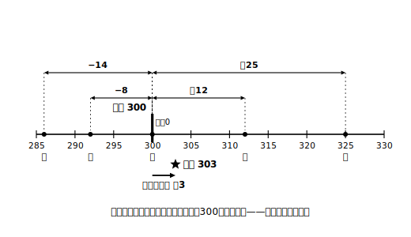

# L12 基準を決めると見えてくる——正負の数の活用と章のまとめ

## ねらい

- 身のまわりの量を「**基準からの増減**」として正負の数で表し、読み取れるようになる。
- **仮平均**（かりへいきん）の考えを使って、平均を効率よく求められるようになる。
- 章全体をふり返り、「意味・計算・使う」の3部屋で自分の到達を点検する。

## 主概念1：基準を0とみる

L01で「基準の決め方しだいで、いろいろな量が正負の数で表せる」ことを見た。活用の第一歩は、この**基準を自分で決めて0とみる**技だ。

ある店の1週間（平日5日間）の来客数を、目標の300人を基準にして表した記録があるとしよう。

| 曜日 | 月 | 火 | 水 | 木 | 金 |
|---|---|---|---|---|---|
| 基準との差(人) | ＋12 | −8 | 0 | ＋25 | −14 |

この表は「月曜は312人、火曜は292人、…」と書くよりも、**基準からのずれ**が一目で分かる。水曜はちょうど300人、木曜がいちばん多く、金曜がいちばん少ない。「多い・少ない」の比較なら、もとの人数に戻さなくても符号と絶対値だけで読み取れてしまう。

差の読み取りには、L06の型がそのまま使える。木曜は金曜より何人多いか？　「〜より」の直後の金曜が基準だから、(＋25)−(−14)＝＋39で、39人多い。

## 主概念2：仮平均は平均計算の近道

この5日間の平均来客数を求めてみよう。まともにやると、312＋292＋300＋325＋286を計算することになる。3けたのたし算が5回で、ちょっと重い。

そこで、基準からの差の表をそのまま使う。**差の平均を求めて、基準にたし戻す**のだ。

> 差の合計: (＋12)＋(−8)＋0＋(＋25)＋(−14)＝＋15
> 差の平均: (＋15)÷5＝＋3
> 来客数の平均: 300＋(＋3)＝**303人**

検算してみよう。312＋292＋300＋325＋286＝1515、1515÷5＝303。一致した。このときの基準300人のように、平均の計算のために仮に置いた基準を**仮平均**という。

なぜこれで正しい答えになるのだろう。5日分の来客数はどれも「300＋ずれ」の形をしている。合計すると300が5個と、ずれの合計に分かれる。だから平均は「300＋ずれの平均」になる。仮平均の技の正体は、たし算の分解と分配のしくみ（L10で確かめた法則たち）そのものだ。

大きな数がそろっている平均は、「近くの切りのよい数を仮平均に置いて、ずれの平均をたし戻す」。計算がらくになるうえ、ずれの表には正負の数が自然に現れる。この章の学びが日常の計算をらくにする、代表的な場面だ。

## 章のまとめ：3部屋の自己チェック

この章の到達を、3つの部屋に分けて点検しよう。あてはまるか、1つずつ確かめてみてほしい。

**【意味の部屋】**
- 0より小さい数の意味と、符号・絶対値・原点という言葉を自分の言葉で説明できる（L01〜L03）
- 「整数」の意味が中学で広がったこと、0が自然数でないことを説明できる（L03）
- 1が素数に入らない理由を、素因数分解が「ただ一通り」であることと結びつけて説明できる（L04）
- −3²と(−3)²のちがいを「何が2乗されているか」で説明できる（L09）

**【計算の部屋】**
- 加減乗除と累乗・四則混合を、計算の順序を守り、「符号を決めてから絶対値」の2段構えで計算できる（ひき算はたし算に、わり算はかけ算に直してから。L05〜L10）
- ひき算→たし算、わり算→かけ算の統一の作戦を説明できる（L06・L07・L09）
- 計算の法則（交換・結合・分配）が保存されていることを、例で確かめられる（L05・L10）

**【使う部屋】**
- 「〜より」型の差の立式を、図や数直線に表してから正しい向きで書ける（L06・L12）
- 基準を0とみて量を正負の数で表し、仮平均で平均を求められる（L12）
- 数の集合ごとの四則の可能性を、反例探しで点検できる（L11）

弱い部屋が見つかったら、かっこ内のレッスンへ戻ろう。とくに計算でつまずいたときは、数直線・表・丸囲みという「意味の道具」まで戻るのが最短の回復ルートだ。

そして、この章の物語をひとことでまとめれば「**数の世界を広げても、計算の法則は保存された**」。この物語には続きがある。次の章からは数を文字で表し（文字式）、やがて方程式で「正の項・負の項」の見方（L07）が主役級の働きをする。比例・反比例では、変数の動く範囲が負の数まで広がる。さらに中学3年では、もう一度「数の世界を広げる」大きな拡張が待っている。今日たたんだ道具箱は、この先ずっと開けっぱなしになる。

:::guide
**活用場面でこそ、立式の向きに立ち止まる**

基準からの増減の表を読むとき、「木曜は金曜より何人多いか」のような差の問いが自然に現れる。計算に慣れたころほど、図を飛ばして「大きそうな数から小さそうな数をひく」古い習慣が顔を出しやすい。活用場面でも手順は同じで、「〜より」の直後を基準に置き、必要なら数直線に2点を打ってから立式する（L06の型）。技能の総仕上げの場面は、型の総仕上げの場面でもある。
:::

:::guide
**「弱い部屋」の直し方には順序がある**

自己チェックで×がついたとき、練習問題を量でこなす前に、その項目の【ことば】枠と図をもう一度読むことをすすめたい。絶対値の見落とし・立式の向き・−3²型のようなつまずきは、どれも計算力不足ではなく**意味の取りちがえ**というタイプの誤りだからだ。意味を直してから練習すると、少ない問題数で立て直せる。順番は、意味→形式。この章で何度もやった往復の、最後の使いどころだ。
:::

:::zatsudan
仮平均の技、テストの平均点を自分で出すときにも使える。たとえば5教科の点数がどれも70点前後なら、70を仮平均にして「＋6、−3、＋1、…」とずれだけメモすればいい。暗算でやれる量になるのがうれしいところ。電卓を出すまでもなく平均の見当がつく人は、この技をこっそり使っていたりするんだよ。
:::

## 練習

1. 上の来客数の表について答えよう。
   (1) 来客数がいちばん多い曜日と少ない曜日の差は何人か。
   (2) 月曜の来客数は火曜より何人多いか。立式してから求めよう。
2. 6人のハンドボール投げの記録は、22m、18m、25m、20m、19m、16mだった。20mを仮平均として、記録の平均を求めよう。
3. ある日の朝の気温は−1℃で、翌日の朝は＋4℃だった。翌日の朝の気温は前日の朝より何度高いか。
4. 章の総復習。次の計算をしよう。
   (1) (−3)²−4×(−2)　(2) −6＋18÷(−3)²　(3) (−12)×(3/4−5/6)（4分の3、ひく、6分の5）
5. 3部屋の自己チェックで×だった項目を1つ選び、対応するレッスンの練習問題を1問解き直そう（×がなければ、いちばん自信のない項目で）。

:::stretch
**S1** 仮平均を300人ではなく290人に取り直して、来客数の平均をもう一度計算してみよう（差の表も作り直す）。答えは同じ303人になるだろうか。基準の取り方を変えても答えが変わらない理由を、「合計」の式の形から説明してみよう。
:::

---

対応解答: answer_key_L09-12.md

<!-- gen_nav:nav:start（自動生成・手編集しない） -->

---

[← 前のレッスン](lesson_11.md)｜[単元の目次](README.md)｜[解答](answer_key_L09-12.md)

<!-- gen_nav:nav:end -->
