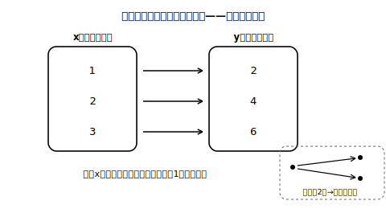
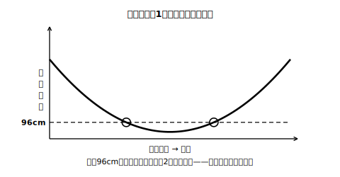

# L01 決めると、決まる——関数

## ねらい

- ともなって変わる二つの数量の間の、「一方の値を決めると、もう一方の値が**ただ一つ**決まる」関係に名前を付ける（**関数**）。
- 「AはBの関数」の**向き**を意識し、逆向きが成り立つとは限らないことを反例で確かめられるようになる。

## 主概念1：「ただ一つ決まる」に名前を付ける

空の水そうに、じゃ口から一定の割合で水を入れていく。1分たつと深さ2cm、2分で4cm、3分で6cm……。入れ始めてからの時間を決めれば、そのときの水の深さは**ぴったり一つ**に決まる。

このように、ともなって変わる二つの数量があって、一方の値を決めるとそれに対応するもう一方の値が**ただ一つ決まる**とき、この関係に数学は名前を付けている。

> 【ことば】**関数（かんすう）**
> ともなって変わる二つの数量x, yがあって、xの値を決めるとそれに対応するyの値が**ただ一つ**決まるとき、**yはxの関数である**という。

水そうの例なら、時間をx分、深さをy cmとすると「yはxの関数である」。また、xやyのようにいろいろな値をとる文字を**変数（へんすう）**という。

<!-- figure-spec: 意図=「xの値1つから矢印がちょうど1本だけ出る」ことが関数の見た目であることを示す。主要数値=対応1→2・2→4・3→6（水そう・深さ=2×時間）。再現説明=矢印が2本に枝分かれする図（関数でない場合）を右下に小さく対比で添える。生成方法=assets_provenance/generate_figures.py のパラメトリックSVG（対応y=2x・矢印1本/値をassert検算） -->

大事なのは、**きまった式に表せなくても関数は関数**だということ。たとえば「ある日の、時刻xにおける気温y℃」を考えると、時刻を決めればそのときの気温はただ一つに決まるから、yはxの関数だ。でも、気温を計算で求める式は書けそうにない。式に表すことができない関数関係もあるのだ。「ただ一つ決まるかどうか」だけが判定の基準になる。

:::guide
**「ただ一つ」を強調する理由**

関数の定義で本当に効いているのは「決まる」ではなく「**ただ一つ**決まる」の部分だ。対応する値が2つ以上ありえたら関数ではない。この一言を落とすと、次の主概念2（方向の話）が判定できなくなる。授業・独習のどちらでも、判定のたびに「ただ一つか」と声に出して確認する習慣をつけたい。なお、xのように先に値を決める側・yのように決まる側という役割の区別は、この先の学習でずっと使う見方になる。
:::

## 主概念2：向きを逆にすると、成り立つとは限らない

「yはxの関数」と言うとき、実は**向き**を決めて言っている。向きを逆にした「xはyの関数」は、成り立つこともあれば、成り立たないこともある。反例を二つ見てみよう。

**反例1：荷物の重さと料金。** ある宅配便で、荷物の重さを決めれば料金はただ一つに決まるとしよう（重さで料金が決まる仕組み）。このとき料金は重さの関数だ。では逆に、「料金を決めれば重さはただ一つに決まる」だろうか。同じ料金になる重さは、たとえば「2kgまで一律」のような区切りの中に**いくらでもある**。料金を決めても重さはただ一つには決まらない。つまり、逆向きは関数ではない。

**反例2：棒の影の長さ。** 校庭に立てた棒の影は、朝は長く、昼に向かって短くなり、夕方また長くなる。時刻を決めれば影の長さはただ一つに決まるから、影の長さは時刻の関数だ。では逆向きはどうか。たとえばある日にこの棒で「影の長さが96cmになる時刻」を調べたら、午前に1回、午後に1回——**2つあった**。長さを決めても時刻がただ一つに決まるとは限らないから、逆向きは関数とはいえない（ただ一つに決まらない例が1つ見つかれば十分だ）。

<!-- figure-spec: 意図=「y（長さ）を決めるとx（時刻）が2つ出てくる＝逆向きは関数でない」を目で見せる。主要数値=96cmの水平線と交点2つ。再現説明=軸に目盛りの数値は不要、交点2つに丸印。生成方法=assets_provenance/generate_figures.py のパラメトリックSVG（水平線とU字曲線の交点数=2を符号変化で数値検算） -->

つまり、関数かどうかを調べるときは、**どちらからどちらへの向きの話をしているのか**を先にはっきりさせよう。「AはBの関数か」と「BはAの関数か」は、別々に調べる別の問題だ。

:::zatsudan
影の反例、ちょっと不思議な感じがしないだろうか。「決めれば決まる」なんて当たり前に思えるのに、向きを逆にしただけで崩れてしまう。数学では、命題の向きを逆にすると成り立たなくなる例がたくさんある。「逆は必ずしも成り立たない」——この感覚は、関数に限らず数学全体で効いてくる大切な用心だ。
:::

:::guide
**逆向きの判定でつまずきやすいところ**

「yはxの関数」を確かめたあと、勢いで「だからxもyの関数」と書いてしまう誤りは、よくある考え方だ。修正のコツは、逆向きを調べるときに主役を交代させることだ。「**yの値を先に一つ決めて**、対応するxが何個あるか数える」と手順にしてしまう。1個ならば関数、2個以上見つかったらその時点で関数ではない（反例が1つあれば十分）。
:::

:::guide
**「独立変数・従属変数」という言い方について**

先に値を決める側の変数・それにともなって決まる側の変数には、数学の世界では独立変数・従属変数という呼び名もあるが、この段階の本文ではあえて使わない。名前より先に「決める側・決まる側」という役割の感覚をつくるのがこの2時間のねらいで、役割が入れかわると関数かどうかも変わる、という主概念2の経験がその土台になる。呼び名は先の学習で出会ったときに引き出せれば十分だ。
:::

## 練習

1. 次のそれぞれについて、yはxの関数といえるか、「いえる」「いえない」で答えよう。いえない場合は理由を一言で書こう。
   (1) 1辺がx cmの正方形の、周りの長さy cm
   (2) 年れいがx才の人の、身長y cm
   (3) 自然数xの、約数の個数y個
   (4) 面積がx cm²の長方形の、たての長さy cm
2. 1mあたりの重さが20gの針金がある。針金の長さをx m、重さをy gとする。
   (1) yはxの関数といえるか。
   (2) xはyの関数といえるか（向きを逆にして、yの値を一つ決めたときのxの個数を考えよう）。
3. 「ある日の時刻xにおける、校庭の気温y℃」について、正しいものをすべて選ぼう。
   ア yはxの関数である　イ 式に表せないので関数ではない　ウ 気温を決めると時刻がただ一つに決まるとは限らない
4. 次の文が正しければ○、正しくなければ×を付けて、×は正しく直そう。
   (1) yがxの関数であれば、xも必ずyの関数である。
   (2) 式に表すことができなくても、yがxの関数であることはある。

:::stretch
**S1** 「整数xを決めると、xの絶対値yが決まる」という対応を考える。yはxの関数といえるだろうか。また、xはyの関数といえるだろうか。y＝3になるxをすべてあげて考えよう。
:::

---

対応解答: answer_key_L01-04.md

<!-- gen_nav:nav:start（自動生成・手編集しない） -->

---

[単元の目次](README.md)｜[解答](answer_key_L01-04.md)｜[次のレッスン →](lesson_02.md)

<!-- gen_nav:nav:end -->
