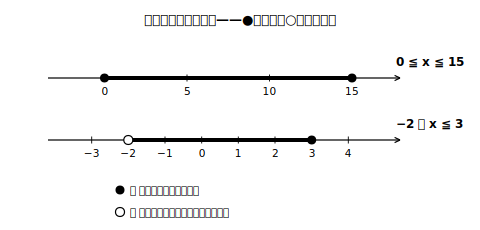

# L02 変数の動く範囲——変域

## ねらい

- 変数の**取りうる値の範囲＝変域**（へんいき）の意味を理解する。
- 変域を不等号（≦・＜）で正しく書き分け、数直線で表せるようになる。

## 主概念：変数には「動ける範囲」がある

L01の水そうをもう一度。深さ30cmの空の水そうに、1分あたり深さ2cmの割合で水を入れる。時間をx分、深さをy cmとすると、yはxの関数だった。

ではこのx、どんな値でも取れるだろうか。水を入れ始める前（xが負の数）は考えない。また、15分で水そうはいっぱいになる（2×15＝30）。だからxが取れるのは**0から15まで**だ。

> 【ことば】**変域（へんいき）**
> 変数の取りうる値の範囲を、その変数の**変域**という。変域は、ふつう不等号を使って表す。

xの変域「0以上15以下」は、不等号でこう書く。

> **0 ≦ x ≦ 15**

書き方の区別を整理しておこう。

| 言い方 | 記号 | その値を… |
|---|---|---|
| x は a **以上** | a ≦ x | ふくむ |
| x は a **以下** | x ≦ a | ふくむ |
| x は a **より大きい** | a ＜ x | ふくまない |
| x は a **未満（みまん）**（a より小さい） | x ＜ a | ふくまない |

数直線の上では、ふくむ端（はし）を●、ふくまない端を○でかいて区別する。

<!-- figure-spec: 意図=「以上・以下は●／より大きい・未満は○」の使い分けを一目で示す。主要数値=0, 15, −2, 3。再現説明=2本の数直線を縦に並べ、●○の凡例を小さく添える。生成方法=assets_provenance/generate_figures.py のパラメトリックSVG（区間端点の大小・数直線範囲内をassert検算） -->

変域は負の数に広がることもある。たとえば「氷点下もふくめた1日の気温x℃が、最低−3℃・最高8℃だった」なら、xの変域は −3 ≦ x ≦ 8。小学校では変域を負でない数の範囲だけで考えてきたが、負の数を学んだ今は、変域も**数直線全体**を舞台にできる。この拡張が、次のレッスンで比例を捉え直すときの鍵になる。

:::guide
**表記の崩れは「日本語→記号」の順で防ぐ**

変域の答案でよくある崩れは、「以上」と「より大きい」の混同、そして不等号の向きの取り違えだ。おすすめの手順は、①まず日本語で「xは□以上□以下」と言い切る ②上の表で記号に置きかえる ③最後に「小さい数が左、大きい数が右」の形（a ≦ x ≦ b）に整える、の3段階。特に③の「小さい→大きいの順に左から書く」を守ると、15 ≦ x ≦ 0 のような向きの事故がなくなる。
:::

:::zatsudan
「0 ≦ x ≦ 15」と書いたとき、xは0でも15でも、その間の3.5でも0.001でも、とにかく範囲の中の数なら**どれでも**取れる。たった一行の式が、無数の値をまとめて引き受けている。変域は、変数という役者が動き回れる「舞台の広さ」を決める一行なのだ。
:::

:::guide
**変域は場面が決める**

同じ式でも、場面がちがえば変域はちがう。水そうの例で変域が 0 ≦ x ≦ 15 になったのは、「入れ始める前は考えない」「満水で止まる」という**場面の事情**からだ。数学の式そのものは負のxでも計算できてしまうから、「式が許す範囲」と「場面が許す範囲」を分けて考える習慣をここで作っておくと、4節（活用）で具体的な場面の変域を考えるときに効いてくる。
:::

## 練習

1. 次の変域を、不等号を使って表そう。
   (1) xは5以上12以下　(2) xは−4より大きく3未満　(3) xは0以上7より小さい　(4) xは−1以上
2. 次の変域を数直線に表そう（●と○の区別をつけること。図はノートにかく）。
   (1) 2 ≦ x ≦ 6　(2) −3 ＜ x ≦ 1
3. 深さ24cmの空の水そうに、1分あたり深さ3cmの割合で水を入れる。入れ始めてからx分後の深さをy cmとするとき、xの変域とyの変域をそれぞれ求めよう。
4. 次の文が正しければ○、正しくなければ×を付けて、×は正しく直そう。
   (1) 「xは4未満」は x ≦ 4 と表す。
   (2) 変域が −2 ≦ x ≦ 2 のとき、xは0や1.5の値も取れる。

:::stretch
**S1** 「xは3以上3以下」つまり 3 ≦ x ≦ 3 という変域を考えると、xの取れる値はどうなるだろうか。また、「3より大きく3未満」（3 ＜ x ＜ 3）ではどうだろう。それぞれ言葉で説明してみよう。
:::

---

対応解答: answer_key_L01-04.md

<!-- gen_nav:nav:start（自動生成・手編集しない） -->

---

[← 前のレッスン](lesson_01.md)｜[単元の目次](README.md)｜[解答](answer_key_L01-04.md)｜[次のレッスン →](lesson_03.md)

<!-- gen_nav:nav:end -->
