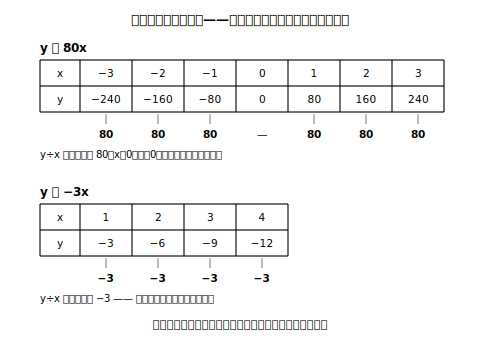

# L03 比例を捉え直す——負の数の世界へ

## ねらい

- 小学校で学んだ比例を、関数・文字式の道具で**捉え直し**、y＝axの形と**比例定数**で表せるようになる。
- 比例の判定を「増えるか減るか」ではなく「**商（わり算の答え）が一定か**」で行えるようになる。
- 変域と比例定数の**2方向**で、比例の世界を負の数へ広げる。

## 主概念1：比例をy＝axで捉え直す

分速80mで歩く人がいる。歩き始めてからx分間に進む道のりをy mとすると、

| x（分） | 1 | 2 | 3 | 4 |
|---|---|---|---|---|
| y（m） | 80 | 160 | 240 | 320 |

xが2倍、3倍……になると、yも2倍、3倍……になる。これが小学校で学んだ**比例**だった。y＝80×xの形に書けることも小6で経験している。中学では、文字式の書き方でこう表す。

> **y ＝ 80x**

ここで表をたてに見てみよう。y÷xを計算すると、80÷1＝80、160÷2＝80、240÷3＝80、320÷4＝80。**どの列でも商は80**。この「いつも同じ数」が式の80の正体だ。

> 【ことば】**比例（ひれい）・比例定数（ひれいていすう）**
> yがxの関数で、aを**0でない**一定の数として
> **y ＝ ax**
> と表されるとき、**yはxに比例する**といい、aを**比例定数**という。x≠0のとき商 y÷x はいつもaに等しい（y/x＝a）。

だから、比例かどうか迷ったら**y÷xを何列か計算して、いつも同じ数になるか**を見ればいい。増えるか減るかは見なくていい。その理由は主概念2ですぐ分かる。

:::guide
**「2倍、3倍……」と「商一定」は同じことの二つの顔**

小学校の「xが2倍、3倍になるとyも2倍、3倍になる」と、今日の「y÷xがいつも一定」は、同じ性質を別の角度から言ったものだ。ただし判定の道具としては商一定の方が強い。表の値が(2, 160)と(5, 400)のように飛び飛びでも、160÷2＝80、400÷5＝80と**どの1列からでも**確かめられるからだ。この先、負の数が混ざっても商一定の判定はそのまま使える。
:::

## 主概念2：負の数の世界へ——2方向の拡張

小学校の比例では、変域は負でない数だけだった。負の数を手に入れた今、比例の世界は**2つの方向**へ広がる。

**拡張1：変域を負の数へ。** さっきの歩く人を、東西にまっすぐのびた道の上で考えよう。今いる地点を0、東向きを正として、東へ分速80mで歩き続けているとする。x分**後**の位置はy＝80x（m）。ではxに負の数を入れると？　x＝−2は「2分**前**」を表し、y＝80×(−2)＝−160。つまり2分前は160m**西**にいた。式は変えずに、変域を負の数までのばせた。

| x（分） | −3 | −2 | −1 | 0 | 1 | 2 | 3 |
|---|---|---|---|---|---|---|---|
| y（m） | −240 | −160 | −80 | 0 | 80 | 160 | 240 |

商を確かめよう。(−240)÷(−3)＝80、(−160)÷(−2)＝80。負の側でも商はやはり80だ。

**拡張2：比例定数を負の数へ。** こんどは水そうから、1分あたり3Lずつ水をぬく。x分間の水の量の**増えた分**をy Lとすると、水は減るのだからyは負で、y＝−3x。

| x（分） | 1 | 2 | 3 | 4 |
|---|---|---|---|---|
| y（L） | −3 | −6 | −9 | −12 |

商は (−3)÷1＝−3、(−6)÷2＝−3。いつも−3で一定。だから**これも比例**だ。比例定数が負の数になっただけである。

<!-- figure-spec: 意図=比例定数が正でも負でも・xが負でも「商一定」という同じ判定が通ることを視覚化。主要数値=80と−3。再現説明=x＝0の列だけ書きこみなし（0でわることは考えない注意書きを小さく添える）。生成方法=assets_provenance/generate_figures.py のパラメトリックSVG（表の全値をy=axから再計算・全列の商一定をassert検算） -->

ここで大事な注意をひとつ。y＝−3xでは、xが増えるとyは**減っていく**。それでも比例だ。つまり「**増えると比例**」という覚え方は、もう通用しない。比例かどうかを決めるのは増減の向きではなく、**商がいつも一定かどうか**——判定の基準をここで入れかえてしまおう。

:::zatsudan
負の数を手に入れたとたん、比例の世界は「変域」と「比例定数」の2方向へ、いっぺんに倍以上に広がった。おもしろいのは、世界がこれだけ広がっても y＝ax という式の形と「商一定」という性質は、まったく変わらずに通用すること。よくできた定義は、世界を広げても壊れない。
:::

:::guide
**「増えると比例・減ると反比例」という思いこみ**

「xが増えるとyも増えるのが比例、減るのが反比例」というイメージは、正の比例定数の例ばかり見てきた人ほど、自然に持ってしまいやすい考え方だ。修正の柱は2つ。①y＝−3xのような**負の比例定数の例をふつうの例として**扱うこと（発展扱いにしない）。②判定を「増減の向き」から「**商一定か**」に置きかえること。3節で反比例（積一定）を学ぶと、この置きかえの価値がもう一段はっきりする。
:::

:::guide
**x＝0の列の扱い**

商 y÷x の判定は、x＝0の列では使えない（0でわることは考えない）。x＝0のときは式 y＝ax に代入して y＝0。つまり比例では、x＝0にはy＝0が必ず対応する。判定は「x≠0の列で商一定」＋「x＝0ならy＝0」のセットで完成する。
:::

## 練習

1. 次の表のうち、yがxに比例するものを選び、比例定数を答えよう（判定は商で確かめること）。
   ア

   | x | 1 | 2 | 3 | 4 |
   |---|---|---|---|---|
   | y | 6 | 12 | 18 | 24 |

   イ

   | x | 1 | 2 | 3 | 4 |
   |---|---|---|---|---|
   | y | 10 | 8 | 6 | 4 |

   ウ

   | x | −2 | −1 | 1 | 2 |
   |---|---|---|---|---|
   | y | 10 | 5 | −5 | −10 |

2. y＝−4x について、次の表を完成させよう。また、xが1増えるごとにyがどう変わるか、一言で書こう。

   | x | −2 | −1 | 0 | 1 | 2 |
   |---|---|---|---|---|---|
   | y |  |  |  |  |  |

3. 次のそれぞれで、yはxに比例するといえるか。いえる場合は比例定数を答えよう。
   (1) y ＝ 5x　(2) y ＝ x/3（xを3でわった数）　(3) y ＝ x＋2　(4) 底辺がx cm・高さが6cmの三角形の面積y cm²
4. 次の文が正しければ○、正しくなければ×を付けて、×は正しく直そう。
   (1) yがxに比例するとき、xが増えるとyは必ず増える。
   (2) yがxに比例するとき、x＝0に対応するyの値は0である。

:::stretch
**S1** y＝80xの表（x＝−3〜3）で、「xが1増えるとyは80増える」ことをたしかめた。では y＝−3x の表では、xが1増えるとyはどう変わるだろうか。2つの表を見比べて、比例定数の符号と「xが増えたときのyの変わり方」の関係を、自分の言葉で1文にまとめてみよう。
:::

---

対応解答: answer_key_L01-04.md

<!-- gen_nav:nav:start（自動生成・手編集しない） -->

---

[← 前のレッスン](lesson_02.md)｜[単元の目次](README.md)｜[解答](answer_key_L01-04.md)｜[次のレッスン →](lesson_04.md)

<!-- gen_nav:nav:end -->
