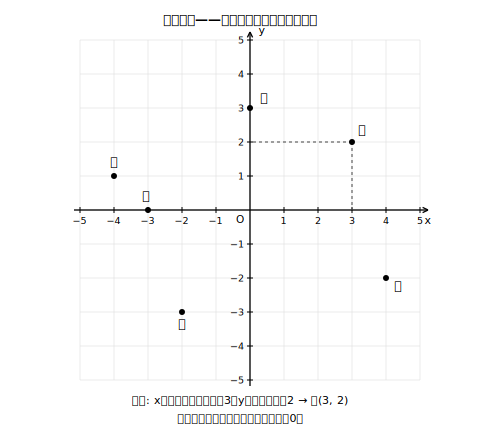
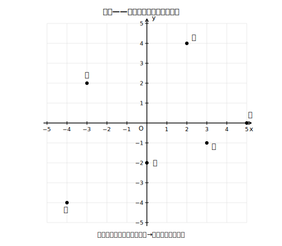

# L04 平面の住所——座標

## ねらい

- 直交する2本の数直線を使って、平面上の点を**2つの数の組でただ一つに**表す方法（**座標**）を身につける。
- 座標から点をとる・点から座標を読む、の両方向ができるようになる。

## 主概念：2本の数直線で、平面のどの点にも「住所」がつく

数直線の上なら、点の位置は数1つで表せた。では、平面の上の点はどう表そう。

数直線を2本用意して、**0の点で垂直に交わる**ように重ねる。横の数直線を**x軸（エックスじく）**、たての数直線を**y軸**（ワイじく）といい、あわせて**座標軸**（ざひょうじく）という。交わった点は**原点**（げんてん）といい、記号Ｏで表す。

> 【ことば】**座標（ざひょう）**
> 平面上の点Ｐの位置は、Ｐからx軸・y軸それぞれに垂直に下ろして読んだ2つの数の組で、**ただ一つ**に表せる。x軸で読んだ数を**x座標**、y軸で読んだ数を**y座標**といい、組にして
> **Ｐ(3, 2)**
> のように書く。この組を点Ｐの**座標**という。座標軸の引かれた平面を**座標平面**（ざひょうへいめん）という。

書く順序は**xが先、yが後**の約束。(3, 2)と(2, 3)は別の点だ。

<!-- figure-spec: 意図=読み方の手順（垂直に下ろす）と、軸上の点（Ｅ・Ｆ）は座標の一方が0になることを示す。主要数値=Ａ(3, 2)・Ｂ(−4, 1)・Ｃ(−2, −3)・Ｄ(4, −2)・Ｅ(0, 3)・Ｆ(−3, 0)。再現説明=破線は点Ａのみ・他の点は黒丸とラベルだけ。生成方法=assets_provenance/generate_figures.py のパラメトリックSVG（全6点の軸範囲内・Ｅ Ｆの軸上をassert検算） -->

負の数のおかげで、右にも左にも、上にも下にも住所がつけられる。x座標が負なら原点より**左**、y座標が負なら原点より**下**。たとえば(−2, −3)は「左へ2、下へ3」の点だ。

軸の上の点にも注意しよう。x軸の上にある点はy座標が0（たとえば(−3, 0)）、y軸の上にある点はx座標が0（たとえば(0, 3)）。原点Ｏの座標は(0, 0)だ。

:::zatsudan
たった2本の数直線を直角に組んだだけで、平面のどの点にも、もれなく・重なりなく、数の組の「住所」がつく。逆に、数の組を1つ言えば点が1つに決まる。点と数の組がぴったり一対一——この仕組みのおかげで、次のレッスンからは「関係」を「絵」として見られるようになる。図形の世界と数の世界をつなぐ、小さくて強い発明だ。
:::

:::guide
**(3, 2)と(2, 3)の取りちがえを防ぐ**

座標の誤りの定番のひとつが、順序の取りちがえだ。防ぎ方は「**横→たて**の順」を体の動きで覚えること。点をとるときは必ず「原点から横にx、そこからたてにy」の2段階で指を動かす。読むときも同じ順で読む。アルファベット順（xが先、yが後）と対応していることも覚える助けになる。
:::

:::guide
**「ただ一つ」がここでも主役**

L01の関数で「ただ一つ決まる」が主役だったように、座標の価値も「点⇔数の組」が**ただ一つに**対応することにある。もし1つの点に2通りの座標がついたり、1つの座標が2つの点を指したりしたら、住所として使いものにならない。垂直に下ろすという手順が、この一意性を保証している。次のレッスンでグラフを「点の集合」として定義できるのは、この一対一対応があるからだ。
:::

## 練習

1. 下の図の点Ａ〜Ｆの座標をそれぞれ読もう。

   
   <!-- figure-spec: 意図=座標読み取りの練習（座標値のラベルは図に付けない＝答えのため）。主要数値=Ａ(2, 4)・Ｂ(−3, 2)・Ｃ(−4, −4)・Ｄ(3, −1)・Ｅ(0, −2)・Ｆ(5, 0)（図中非表示・answer_key対応）。再現説明=黒丸と名前ラベルのみ。生成方法=assets_provenance/generate_figures.py のパラメトリックSVG（全点の軸範囲内・相異なりをassert検算・答え漏れの機械検査つき） -->
2. 次の点を座標平面にとろう（図はノートにかく）。
   Ｐ(4, 3)　Ｑ(−2, 5)　Ｒ(−5, −2)　Ｓ(1, −4)　Ｔ(0, 4)　Ｕ(−3, 0)
3. 次の文が正しければ○、正しくなければ×を付けて、×は正しく直そう。
   (1) 点(2, 3)と点(3, 2)は同じ点である。
   (2) x軸の上にある点は、y座標が0である。
   (3) 原点Ｏの座標は(0, 0)である。
4. 点(a, b)がy軸の上にあるとき、aとbについて分かることを書こう。

:::stretch
**S1** 点Ａ(3, 2)に対して、x軸をはさんでちょうど反対側（x軸について対称な位置）にある点Ｂの座標を考えよう。同じように、y軸をはさんで反対側の点Ｃ、原点をはさんで反対側の点Ｄの座標も求め、符号の変わり方の規則を1文でまとめてみよう。
:::

---

対応解答: answer_key_L01-04.md

<!-- gen_nav:nav:start（自動生成・手編集しない） -->

---

[← 前のレッスン](lesson_03.md)｜[単元の目次](README.md)｜[解答](answer_key_L01-04.md)｜[次のレッスン →](lesson_05.md)

<!-- gen_nav:nav:end -->
