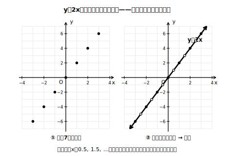
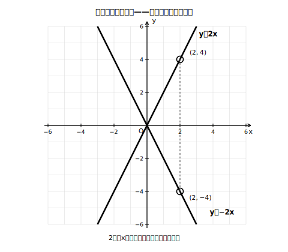
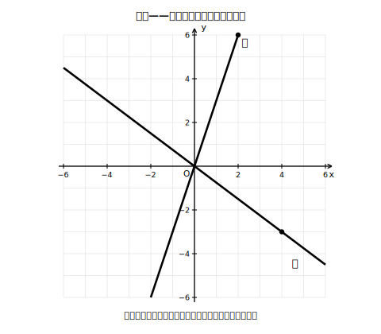

# L05 比例のグラフ——原点を通る直線

## ねらい

- 比例 y＝ax の**グラフ**を、式を満たす点の集合として理解し、**原点を通る直線**になることをつかむ。
- 比例定数の符号（正・負）でグラフの向きがどう変わるかを、**符号だけ変えた2つの式**の比較で確かめる。
- 原点ともう1点でグラフをかき、グラフから値を読めるようになる。

## 主概念1：式を満たす点をぜんぶ集めると、直線になる

y＝2x を考えよう。この式を満たす(x, y)の組を表にして、座標平面に点をとってみる。

| x | −3 | −2 | −1 | 0 | 1 | 2 | 3 |
|---|---|---|---|---|---|---|---|
| y | −6 | −4 | −2 | 0 | 2 | 4 | 6 |

7つの点は、一直線にならぶ。でもxは整数だけではない。x＝0.5ならy＝1、x＝1.5ならy＝3、x＝−2.5ならy＝−5……。間の値をどんどんとっていくと、点と点のすき間がうまっていき、ついには**切れ目のない1本の直線**になる。

> 【ことば】**グラフ**
> 式を満たす(x, y)の組を座標とする**点の全体**（点の集合）を、その式の**グラフ**という。比例 y＝ax のグラフは、**原点を通る直線**になる。

<!-- figure-spec: 意図=「グラフ＝点の集合」→点を増やすと直線、の過程を見せる（比例で一度この経験を作っておくと、反比例の曲線でも同じ手順が使える）。主要数値=(1, 2)・(3, 6)・(−2, −4)など表の点。再現説明=両コマとも軸はx＝−4〜4・y＝−7〜7（表の点(±3, ±6)が枠内に収まる範囲・E裁定適用）、右コマの直線は両端に矢印（どこまでものびる）。生成方法=assets_provenance/generate_figures.py のパラメトリックSVG（全点y=2x上・軸範囲内をassert検算） -->

原点を通ることは式からも分かる。x＝0を代入するとy＝0。つまり(0, 0)は必ずグラフの上にある（L03のguideで見た「x＝0ならy＝0」がグラフの姿になった）。

なお、場面によってxの変域が決められているときは、グラフはこの直線のうち**変域に対応する部分**（線分など）になる（練習3で扱う）。もし0が変域に入っていない場面なら、その部分に原点はふくまれない。

## 主概念2：符号だけ変えると、グラフはどうなる？

y＝2x と、比例定数の符号だけ変えた y＝−2x。2つの表を並べてみよう。

| x | −3 | −2 | −1 | 0 | 1 | 2 | 3 |
|---|---|---|---|---|---|---|---|
| y＝2xのy | −6 | −4 | −2 | 0 | 2 | 4 | 6 |
| y＝−2xのy | 6 | 4 | 2 | 0 | −2 | −4 | −6 |

同じxに対して、yの値は符号だけが反対。グラフにすると、y＝2xは**右上がり**（xが増えるとyも増える）、y＝−2xは**右下がり**（xが増えるとyは減る）の直線になり、2本はx軸をはさんで対称に映り合う。

<!-- figure-spec: 意図=比例定数の符号がグラフの向き（右上がり／右下がり）を決めることと、負の比例定数のグラフもごくふつうの比例のグラフであることを示す。主要数値=a＝2と−2、対応点(2, 4)・(2, −4)。再現説明=軸の目盛りは−6〜6。生成方法=assets_provenance/generate_figures.py のパラメトリックSVG（全整数xでの符号対称・対応点の直線上と軸範囲内をassert検算） -->

まとめると:

- **a＞0のとき**: 右上がりの直線（原点から右上と左下へ）
- **a＜0のとき**: 右下がりの直線（原点から右下と左上へ）

どちらも堂々とした比例のグラフだ。「右下がりだから比例ではない」とはならない。

## かき方の型：原点と、もう1点

直線は2点が決まればただ1本に決まる。比例のグラフは必ず原点を通るから、**あとは通る点を1つ**見つければかける。

**例**: y＝(2/3)x のグラフ。x＝3のときy＝2（分数を避けたければ、xに分母の数を入れるときれいな点が見つかる）。原点Ｏと点(3, 2)を通る直線を引けば完成。かき終えたら、直線上の別の点（たとえば(−3, −2)）が式を満たすか代入して確かめよう（(2/3)×(−3)＝−2 ✓）。

:::zatsudan
表の点をポツ、ポツと打っていたら、いつのまにか1本の直線が浮かび上がる。無数にある(x, y)の組は、書き並べたら一生かかっても終わらない量の情報だ。それが、たった1本の線としてまるごと目に見える。グラフのいいところは、この「全体をひと目で」にある。表・式と合わせて、使い分けはL06でじっくり考えよう。
:::

:::guide
**「グラフは点の集合」を最初に体験しておく意味**

y＝axのグラフを「原点と1点を結ぶ直線」という手順だけで覚えると、なぜ直線を引いてよいのかが抜け落ちる。表の点を実際に打ち、間の点がうまっていく過程を一度自分の手で経験しておくことが、この単元の背骨になる。特に3節の反比例では「式から曲線をかく」初めての経験が待っており、そこでは手順の丸暗記が通用しない。点を多くとる→ようすを見る→なめらかに結ぶ、という進み方の原型をここで作っておく。
:::

:::guide
**急なグラフ・ゆるやかなグラフ**

y＝3xとy＝(1/2)xを同じ座標平面にかくと、y＝3xの方が急に、y＝(1/2)xの方がゆるやかに上がっていく。x＝1のときのyの値（3と0.5）を比べれば理由が見える。比例定数の絶対値が大きいほどグラフは急になる、という観察は、グラフから式を推測するとき（L06）の手がかりになる。
:::

## 練習

1. 次の比例のグラフを、原点ともう1点を使ってかこう（かいたら別の1点で代入検算をすること）。
   (1) y ＝ 3x　(2) y ＝ −x　(3) y ＝ (1/2)x　(4) y ＝ −(3/2)x
2. 下の図の直線ア・イはそれぞれ比例のグラフである。通る点（黒丸）の座標を読み取り、それぞれの式を求めよう。

   
   <!-- figure-spec: 意図=グラフ→式の読み取り練習（式・傾きは図に書かない＝答えのため）。主要数値=ア＝点(2, 6)を通る右上がり／イ＝点(4, −3)を通る右下がり。再現説明=原点を通る2直線＋通る格子点の黒丸のみ。生成方法=assets_provenance/generate_figures.py のパラメトリックSVG（通る点の直線上・軸範囲内をassert検算・answer_keyの式の漏えい検査つき） -->
3. y ＝ −2x について、xの変域を −1 ≦ x ≦ 3 とするとき、グラフはどの部分になるか（ノートにかこう）。また、yの変域を求めよう。
4. 次の文が正しければ○、正しくなければ×を付けて、×は正しく直そう。
   (1) 比例のグラフは、比例定数が負の数でも原点を通る。
   (2) y＝−4xのグラフは右上がりの直線である。

:::stretch
**S1** 点(6, 4)を通る比例のグラフがある。この直線は点(−9, −6)を通るだろうか。式を求めてから代入で判定しよう。また、点(9, 7)は通るだろうか。
:::

---

対応解答: answer_key_L05-08.md

<!-- gen_nav:nav:start（自動生成・手編集しない） -->

---

[← 前のレッスン](lesson_04.md)｜[単元の目次](README.md)｜[解答](answer_key_L05-08.md)｜[次のレッスン →](lesson_06.md)

<!-- gen_nav:nav:end -->
