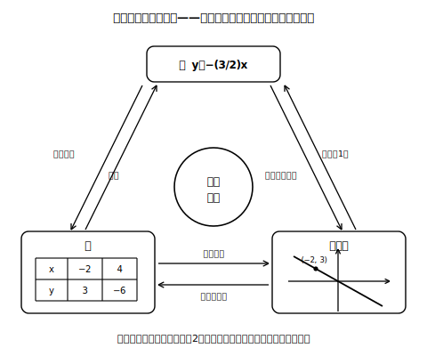
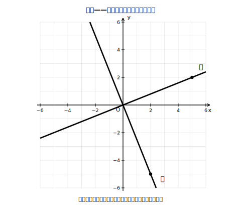

# L06 式を求める——表・式・グラフの往復

## ねらい

- 「yはxに比例する」と分かっているとき、**xの値が0でない1組**（x≠0のx, yの値の組）から比例定数を決めて式を求められるようになる。
- 表・式・グラフの**三つの表現**を行き来し、たがいの検算に使えるようになる。

## 主概念1：1組の値が、式を丸ごと決める

yはxに比例していて、x＝4のときy＝−10だと分かっているとしよう。式はどう求める？

比例なら y＝ax と書ける。ここにx＝4、y＝−10を代入すると、

> −10 ＝ a × 4　→　a ＝ −10/4 ＝ **−5/2**

だから式は **y ＝ −(5/2)x**。検算しよう。x＝4を入れると −(5/2)×4＝−10 ✓。

比例と分かっていれば、**xの値が0でない組がたった1組**で式全体が決まる。これは比例のいちばん強力な性質だ。x＝100でもx＝−0.3でも、どんなxのyの値でも、この式ひとつで計算できるようになった。

ただし、ひとつだけ効かない組がある。**(0, 0)だ**。比例のグラフはどれも原点を通るから、「x＝0のときy＝0」はどの比例にも当てはまり、aを絞りこむ力がない（0＝a×0はどんなaでも成り立つ）。式を決めたいときは、**x≠0の組**を使おう。

:::guide
**「1組で決まる」の条件を正確に**

「1組の値が分かれば式が決まる」と丸暗記すると、(0, 0)の例外を踏む。正確には「**比例だと分かっていて**、**x≠0の1組**が分かれば決まる」。前半の条件も大事で、比例かどうか不明な表にこの技を使うことはできない（まず商一定で比例の判定をしてから）。条件つきの主張は、条件ごと覚える。これが数学の主張を安全に使うコツだ。
:::

## 主概念2：グラフから式・表から式

**グラフから**。グラフが原点を通る直線なら比例だ。式を求めるには、グラフ上の**座標が読み取りやすい点**（目盛りの交点にのっている点）を1つ探す。たとえば直線が点(4, 3)を通っていれば、3＝a×4 から a＝3/4、式は y＝(3/4)x。読み取った点とは**別の点**（たとえば(−4, −3)）がグラフ上にあるか、式に代入して確かめると安心だ（(3/4)×(−4)＝−3 ✓）。

**表から**。表なら商 y÷x を1列計算すればaが出る。ほかの列でも商が同じことを確かめれば、比例の判定と式の決定が同時に終わる。

| x | −6 | −2 | 4 | 10 |
|---|---|---|---|---|
| y | 9 | 3 | −6 | −15 |

9÷(−6)＝−3/2、3÷(−2)＝−3/2、(−6)÷4＝−3/2、(−15)÷10＝−3/2。商はどの列も同じなので、 y＝−(3/2)x。

<!-- figure-spec: 意図=三表現が同じ関係の別の顔であり、どの向きの変換にも手順があることの一覧化。主要数値=a＝−3/2、点(−2, 3)。再現説明=矢印の操作名は「表→式=商を計算／式→表=代入／式→グラフ=原点と1点／グラフ→式=通る点を読む／表→グラフ=点を打つ／グラフ→表=座標を読む」の6つをそのまま使用。生成方法=assets_provenance/generate_figures.py のパラメトリックSVG（表の全列とラベル点がy=−(3/2)xを満たすことをassert検算） -->

## 三つの表現の使い分け

- **表**: 実際の値の記録に強い。とびとびの値を確かめるのに向く。
- **式**: 短くて正確。どんなxの値でも計算できる。
- **グラフ**: 全体のようすがひと目で分かる。増減や急さが見える。

そして、比例（や反比例）と分かっている関係なら、どれか一つから残りの二つが作れる。作ったら別の表現で検算する。この往復が、4節（活用）で問題を解くときの武器一式になる。

:::zatsudan
表・グラフ・式は、いわば同じ関係を語る「三つの言葉」だ。表はとびとびの記録が得意、グラフは全体のようすをひと目で見せてくれて、式は短いのに厳密。人間の言葉なら翻訳のたびに少しニュアンスが変わるけれど、同じ比例の関係を表しているかぎり、この三つの言葉の間の翻訳は意味が崩れない。だからこそ、翻訳して戻せば検算になる。
:::

:::guide
**「読み取りやすい点」を選ぶ技術**

グラフから式を求めるとき、目盛りの交点にぴったりのっていない点を無理に読むと、a が不正確になる。①格子（こうし）の交点を通る場所を探す ②見つからなければ2マス・3マス先まで目でたどる ③読み取ったら必ず別の点で代入検算、の3手順を型にしたい。練習2のような「(2, 6)を通る」型の問題は、この読み取りの練習でもある。
:::

## 練習

1. yはxに比例している。次のそれぞれで式を求め、指定された値を計算しよう（求めた式は代入検算をすること）。
   (1) x＝6のときy＝15。式と、x＝−4のときのyの値。
   (2) x＝−3のときy＝12。式と、y＝−20になるときのxの値。
2. 下の図の座標平面に、原点を通る2直線ア・イがある。通る点（黒丸）を読み取り、ア・イの式をそれぞれ求めよう。

   
   <!-- figure-spec: 意図=グラフ→式（傾きが分数になる場合）の読み取り練習（式は図に書かない＝答えのため）。主要数値=ア＝点(5, 2)を通る右上がり／イ＝点(2, −5)を通る右下がり。再現説明=原点を通る2直線＋通る格子点の黒丸のみ。生成方法=assets_provenance/generate_figures.py のパラメトリックSVG（通る点の直線上・軸範囲内をassert検算・answer_keyの式の漏えい検査つき） -->
3. 次の表で、yはxに比例している。表を完成させ、式を求めよう。

   | x | −4 | −1 | 2 |  |
   |---|---|---|---|---|
   | y |  | 3 |  | −18 |

4. 次の文が正しければ○、正しくなければ×を付けて、×は正しく直そう。
   (1) yがxに比例するとき、x＝0・y＝0の組が分かれば比例定数が求められる。
   (2) yがxに比例し、x＝2のときy＝7ならば、y＝(7/2)xである。

:::stretch
**S1** yはxに比例し、xの変域が −2 ≦ x ≦ 6 のとき、yの変域は −9 ≦ y ≦ 3 になるという。比例定数は正だろうか、負だろうか。理由をつけて答え、式を求めてみよう（ヒント: xの変域の端とyの変域の端がどう対応するかを、a＞0の場合とa＜0の場合で考える）。
:::

---

対応解答: answer_key_L05-08.md

<!-- gen_nav:nav:start（自動生成・手編集しない） -->

---

[← 前のレッスン](lesson_05.md)｜[単元の目次](README.md)｜[解答](answer_key_L05-08.md)｜[次のレッスン →](lesson_07.md)

<!-- gen_nav:nav:end -->
