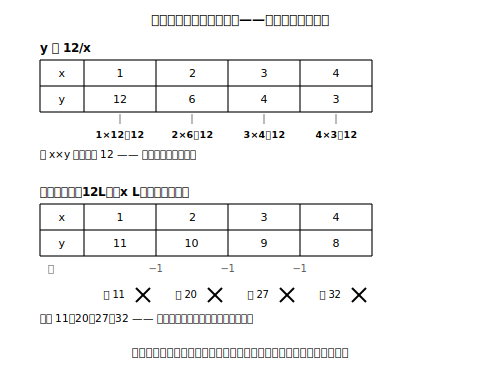

# L07 反比例を捉え直す——積が一定

## ねらい

- 小学校で学んだ反比例を、文字式の道具で**捉え直し**、y＝a/x の形と**積一定**（xy＝a）で表せるようになる。
- 反比例と「一定の数から減っていく関係」を、表の計算（積か、差か）で区別できるようになる。
- 変域と比例定数の2方向で、反比例も負の数の世界へ広げる。

## 主概念1：積がいつも同じ数——反比例をy＝a/xで捉え直す

面積が12cm²の長方形を、いろいろな形で作る。横の長さをx cm、たての長さをy cmとすると、

| x（cm） | 1 | 2 | 3 | 4 | 6 | 12 |
|---|---|---|---|---|---|---|
| y（cm） | 12 | 6 | 4 | 3 | 2 | 1 |

xが2倍、3倍……になると、yは1/2、1/3……になる。小6で学んだ**反比例**だ。表をたてに見ると、今度は商ではなく**積**が主役になる。1×12＝12、2×6＝12、3×4＝12。**どの列でも積は12**だ。「たて×横＝面積」なのだから当然だが、この「積がいつも一定」こそ反比例の正体だ。式では、xy＝12 の両辺をxでわって、

> **y ＝ 12/x**

> 【ことば】**反比例（はんぴれい）**
> yがxの関数で、aを**0でない**一定の数として
> **y ＝ a/x**
> と表されるとき、**yはxに反比例する**といい、aを**比例定数**という。このとき積 xy はいつもaに等しい（xy＝a）。

反比例の判定は「**積 x×y を何列か計算して、いつも同じ数になるか**」。比例が商一定だったのと対になっている。そして反比例でも、係数aを**比例定数**と呼ぶ（「反比例定数」とは言わない）。

## 主概念2：「12から減っていく」のではない

y＝12/x の表で、xが増えるとyは減っていく。ここで、同じく「減っていく」表と見比べてみよう。**残り**の関係（12Lのジュースからx Lを飲んだ残りy L）の表だ。

| x | 1 | 2 | 3 | 4 |
|---|---|---|---|---|
| y＝12/x のy | 12 | 6 | 4 | 3 |
| 残り（12−x）のy | 11 | 10 | 9 | 8 |

どちらも減っていくが、減り方がまるでちがう。下の段は**差**がいつも一定（1ずつ減る）。積を計算すると 1×11＝11、2×10＝20、3×9＝27。一定にならないから、**反比例ではない**。逆に上の段は積がいつも12で、差は 6, 2, 1 と縮んでいく。

<!-- figure-spec: 意図=「減っていく」見た目が同じでも、積一定かどうかで反比例が判定できることを示す（増減の向きで判定しない、の反比例版）。主要数値=積12（上段）／積11・20・27・32（下段・不一致）。再現説明=×印は下段の積の書きこみにだけ付ける。生成方法=assets_provenance/generate_figures.py のパラメトリックSVG（両表の値・積・差をすべて再計算してassert検算） -->

「減っていれば反比例」という覚え方は、ここで手放そう。判定はいつも計算で行う。**商一定なら比例、積一定なら反比例**。増減の向きは判定に使わない。

**負の数への拡張**も比例と同じ2方向でできる。y＝12/x のxに負の数を入れると、x＝−2ならy＝12÷(−2)＝−6、x＝−4ならy＝−3。積は (−2)×(−6)＝12、(−4)×(−3)＝12で、負の側でも積はやはり12だ（長方形の場面ではxは正の範囲しか動けないが、式の世界では変域を広げられる。場面と式の変域のちがいはL02のguideで見たとおり）。比例定数が負の反比例 y＝−12/x もある。x＝1ならy＝−12、x＝2ならy＝−6と、**xが正の範囲では**xが増えるとyが**増える**反比例だ。

:::zatsudan
積がいつも一定、と聞いて思い出してほしい図形がある。正多角形だ。正三角形・正方形・正五角形……の「頂点の数」と「1つの外角の大きさ」をかけ算すると、3×120＝360、4×90＝360、5×72＝360。いつも360になる。頂点の数をx、外角をy度とすれば xy＝360、まさに反比例の関係。図形の世界のあちこちに、積一定はひそんでいる。
:::

:::guide
**「y＝ax の形に引き戻される」誤り**

反比例の式を求める場面で、比例の手順が体に残っていて y＝ax に代入してしまう、という考え方が見られる。修正の入口は、式を書く**前**に「これは商一定か、積一定か」を表や場面で判定する一手間を置くこと。積一定と判定できたら、書くべき式は xy＝a（または y＝a/x）。「判定→式の形の選択→代入」の順を型にすると、引き戻しが起こりにくい。L09の対比表でこの型を完成させる。
:::

:::guide
**比例定数の求め方は「商か積か」で切りかわる**

比例では a＝y÷x（商）、反比例では a＝x×y（積）。ここを混同して、反比例なのに商で求めたり、差（y−x）で求めたりする誤りが見られる。「比例＝わる、反比例＝かける」と対で覚え、求めたaは必ず別の列で検算する（積一定なら、どの列のx×yも同じaになるはず）。
:::

## 練習

1. 次の表のうち、yがxに反比例するものを選び、比例定数を答えよう（判定は積で確かめること）。
   ア

   | x | 1 | 2 | 3 | 6 |
   |---|---|---|---|---|
   | y | 18 | 9 | 6 | 3 |

   イ

   | x | 1 | 2 | 3 | 4 |
   |---|---|---|---|---|
   | y | 9 | 8 | 7 | 6 |

   ウ

   | x | −4 | −2 | 2 | 4 |
   |---|---|---|---|---|
   | y | 6 | 12 | −12 | −6 |

2. y ＝ −24/x について、次の表を完成させよう。

   | x | −6 | −3 | −1 | 2 | 4 | 8 |
   |---|---|---|---|---|---|---|
   | y |  |  |  |  |  |  |

3. 次のそれぞれで、yはxに反比例するといえるか。いえる場合は比例定数を答えよう。
   (1) xy ＝ −15　(2) y ＝ x/6　(3) 面積が20cm²の長方形の、横x cmとたてy cm
4. yはxに反比例し、x＝3のときy＝−8である。式を求め、x＝−6のときのyの値を計算しよう（積の検算をつけること）。

:::stretch
**S1** y＝12/x で、xの値を2倍にすると、yの値はどうなるだろうか。x＝2→4、x＝3→6 などいくつかの列で確かめ、比例（y＝ax でxを2倍にするとyも2倍）との違いを1文でまとめてみよう。
:::

---

対応解答: answer_key_L05-08.md

<!-- gen_nav:nav:start（自動生成・手編集しない） -->

---

[← 前のレッスン](lesson_06.md)｜[単元の目次](README.md)｜[解答](answer_key_L05-08.md)｜[次のレッスン →](lesson_08.md)

<!-- gen_nav:nav:end -->
