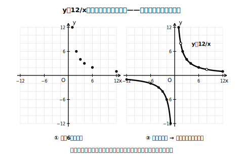
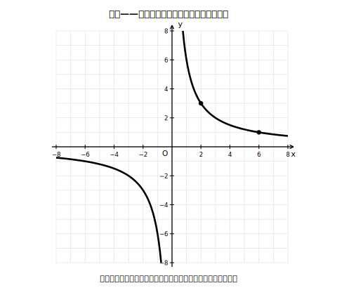

# L08 曲線をかく初めて——反比例のグラフ

## ねらい

- 反比例 y＝a/x のグラフを、**点を多くとる→ようすを見る→滑らかな曲線で結ぶ**の手順でかけるようになる。
- 反比例のグラフが**座標軸と交わらない**こと、**原点を通らない二本の曲線**になることを、式と結びつけて説明できるようになる。

## 主概念1：直線ではない——点を多くとって、ようすを見る

y＝12/x のグラフをかこう。比例のときのように表を作って点を打つ。

| x | 1 | 2 | 3 | 4 | 6 | 12 |
|---|---|---|---|---|---|---|
| y | 12 | 6 | 4 | 3 | 2 | 1 |

点を打つと、今度は一直線にならばない。ゆるやかに曲がって落ちていく。こういうときこそL05の原型の出番だ。**間の点をもっとたくさんとろう**。x＝1.5ならy＝8、x＝0.5ならy＝24、x＝8ならy＝1.5、x＝24ならy＝0.5。積で検算すると 1.5×8＝12、0.5×24＝12 ✓。

点がふえるほど、ようすがはっきりしてくる。xが正の側では、xが0に近づくとyはぐんぐん大きくなり、xが大きくなるとyは0にじわじわ近づく。定規は使えない。**滑らかなひと続きの曲線**で、点のならびを結ぼう。

xが負の側も忘れずに。x＝−1ならy＝−12、x＝−2ならy＝−6、x＝−12ならy＝−1……。負の側にも、同じ形の曲線が原点の反対側にもう1本現れる。

<!-- figure-spec: 意図=「点を多くとる→滑らかに結ぶ」の手順と、曲線が二本に分かれることを見せる。主要数値=(1, 12)・(2, 6)・(3, 4)・(−2, −6)など（(0.5, 24)・(24, 0.5)などは軸範囲の外にあるため図中には打たず、曲線が枠の縁で切れることの説明に使う・E裁定適用）。再現説明=軸は−12〜12、曲線の端は軸に近づきながら図の縁で切れる（軸には触れない）。生成方法=assets_provenance/generate_figures.py のパラメトリックSVG（全点の積=12・軸範囲内・範囲外点の除外をassert検算・曲線は多点サンプリング） -->

## 主概念2：座標軸とは決して交わらない

かき上がった曲線をよく見ると、比例のグラフと決定的にちがう点が2つある。

**その1：原点を通らない二本の曲線になる。** 比例のグラフは原点を通る1本の直線だったが、反比例のグラフは、右上と左下（aが正のとき）に分かれた**二本の曲線**だ。

**その2：座標軸と交わらない。** これは式から説明できる。
- **x軸と交わらない**: 交わるならy＝0になるxがあるはず。でも 12/x が0になることはない（12を何でわっても0にはならない）。
- **y軸と交わらない**: 交わるならx＝0のyの値があるはず。でも y＝12/x にx＝0は代入できない（0でわることは考えない）。つまりx＝0は、この関数の変域に入っていない。

曲線は軸に**限りなく近づいていくのに、決して触れない**。x＝100ならy＝0.12、x＝1000ならy＝0.012……。いくらでも0に近づくが、0そのものにはならない。

この「原点を通らない二本の曲線」には、**双曲線**（そうきょくせん）という名前がついている（名前だけ紹介しておこう）。比例定数が負の場合（たとえば y＝−12/x）のグラフは、左上と右下に分かれた二本の曲線になる（x＝2ならy＝−6で右下側、x＝−2ならy＝6で左上側）。

## 電卓・AIで点を増やす

反比例の値の計算は、わり算が続いて手間がかかる。細かい点をたくさんとりたいとき、電卓やAIに計算だけ任せるのは賢い使い方だ。たとえばAIチャットにこう頼んでみよう。

> 「y＝12/x について、x＝0.5から6まで0.5きざみのyの値の表を作ってください。」

出てきた表は、**何列か自分で積の検算をしてから**使おう（x×yが12になっているか）。ただし、かくのは自分の手で。曲線の感覚は、手を動かした人にしか残らない。

:::zatsudan
「限りなく近づくのに、決して触れない」——右上の曲線の上を右へ右へと進んでいくと、x軸との距離はどこまでも縮んでいくのに、ゼロにはならない。表の数字だけ見ていたら気づけない、グラフにして初めて見えてくる光景だ。無限に続く追いかけっこを1枚の絵の中に収めてしまえるのも、グラフという言葉の力である。
:::

:::guide
**「式から曲線をかく」はここが初めて**

比例のグラフは2点を直線で結べばかけたが、反比例では「どんな形になるか」を先に知らないままかき始めることになる。ここでの指針は手順そのものだ。①点を多めにとる（負の側・0に近い側・大きい側をまんべんなく）②ならびのようすを見る ③定規を使わず滑らかに結ぶ ④軸と交わっていないか見直す。とくに②を飛ばして隣の点を折れ線でつなぐと、カクカクした「多角形グラフ」になりがちだ。曲線をかく経験はこの先の数学でも繰り返し登場するので、この4手順を最初の成功体験にしたい。
:::

:::guide
**「二本で一つのグラフ」への違和感に**

「グラフが二本に分かれているのに、一つの式のグラフなの？」という疑問はもっともで、よい着眼だ。グラフとは「式を満たす点の全体」（L05の定義）だから、点の集まりが二カ所に分かれていても、全体で一つのグラフである。x＞0の部分とx＜0の部分の間にはx＝0の壁（変域に入らない値）があるため、つながりようがない、と説明できる。定義に戻ると違和感が解ける好例だ。
:::

## 練習

1. y ＝ 6/x について、次の表を完成させ、グラフをかこう（負の側もかくこと）。

   | x | −6 | −3 | −2 | −1 | 1 | 2 | 3 | 6 |
   |---|---|---|---|---|---|---|---|---|
   | y |  |  |  |  |  |  |  |  |

2. y ＝ −8/x のグラフをかこう。二本の曲線は、座標平面のどのあたり（右上・右下・左上・左下）に現れるだろうか。かく前に予想してから、表を作って確かめよう。
3. 下の図の反比例のグラフの式を求めよう（曲線が通る点〔黒丸〕を読み取り、積で比例定数を決め、もう1点で検算すること）。

   
   <!-- figure-spec: 意図=グラフ→式（積で比例定数）の読み取り練習（式・比例定数は図に書かない＝答えのため）。主要数値=曲線は点(2, 3)と点(6, 1)を通る。再現説明=二本曲線＋通る格子点の黒丸のみ。生成方法=assets_provenance/generate_figures.py のパラメトリックSVG（2点の積の一致・軸範囲内・曲線サンプル点の枠内をassert検算・answer_keyの式の漏えい検査つき） -->
4. 次の文が正しければ○、正しくなければ×を付けて、×は正しく直そう。
   (1) 反比例のグラフは、xの値を十分大きくすればx軸と交わる。
   (2) y＝5/x のグラフは原点を通る。
5. y ＝ 12/x について、xの変域が 2 ≦ x ≦ 6 のときのyの変域を求めよう（x＞0の側の曲線で、xが増えるとyがどう変わるかを考えてから求めること）。

:::stretch
**S1** y＝12/x のグラフとy＝6/x のグラフを同じ座標平面にかくと、どちらが「外側」（原点から遠い側）を通るだろうか。x＝2のときのyの値を比べて予想し、x＝1、x＝6でも確かめてみよう。比例定数の大きさとグラフの位置の関係を1文でまとめよう。
:::

---

対応解答: answer_key_L05-08.md

<!-- gen_nav:nav:start（自動生成・手編集しない） -->

---

[← 前のレッスン](lesson_07.md)｜[単元の目次](README.md)｜[解答](answer_key_L05-08.md)｜[次のレッスン →](lesson_09.md)

<!-- gen_nav:nav:end -->
