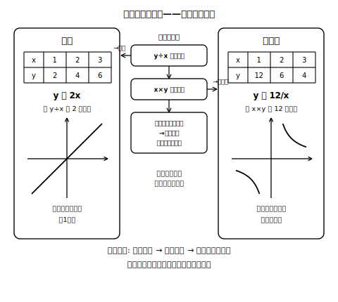

# L09 比例か反比例か——商一定・積一定の対比

## ねらい

- 比例と反比例を**対比表**で整理し、表・式・グラフのどの表現からでも判定できるようになる。
- 比例定数の求め方（**商か積か**）を関係の種類に応じて正しく選べるようになる。
- 「比例でも反比例でもない」関係を、落ち着いて見分けられるようになる。

## 対比表——2つの関係を並べて見る

| 見る場所 | 比例 | 反比例 |
|---|---|---|
| 表の判定 | 商 y÷x がいつも一定 | 積 x×y がいつも一定 |
| 式の形 | y ＝ ax | y ＝ a/x（xy ＝ a） |
| 比例定数の求め方 | a ＝ y÷x（1組の商） | a ＝ x×y（1組の積） |
| グラフ | 原点を通る**直線**（1本） | 原点を通らない**二本の曲線** |
| x＝0のとき | y＝0（原点を通る） | x＝0は変域に入らない |
| xを2倍にすると | yも2倍 | yは1/2倍 |

<!-- figure-spec: 意図=判定を増減の向きでなく計算（商・積）で行う型の一枚化。主要数値=a＝2（左）・a＝12（右）。再現説明=フローチャートの分岐は上から商→積→どちらでもない、の順。生成方法=assets_provenance/generate_figures.py のパラメトリックSVG（両ミニ表の商・積をassert検算） -->

この表に**増減の向きの行がない**ことに注意しよう。「増えるか減るか」は、比例定数の符号しだいでどちらの関係でも起こる（右下がりの比例 y＝−2x、xが正の範囲ではxが増えるとyが増える反比例 y＝−12/x）。だから判定の道具にならない。判定はいつも**商か積の計算**で行う。

## 判定の実戦——3つの可能性を全部調べる

表を見たら、①商一定か ②積一定か を順に計算する。どちらも一定でなければ、③**比例でも反比例でもない**。3つ目の答えも、堂々とした正解だ。

**例**: 30kmの道のりを、x km進んだときの残りy km。

| x | 5 | 10 | 15 | 20 |
|---|---|---|---|---|
| y | 25 | 20 | 15 | 10 |

減っていく表だが、判定は計算で。商は 25÷5＝5、20÷10＝2で不一致。積は 5×25＝125、10×20＝200で不一致。よって**比例でも反比例でもない**（差 y−xでもなく、和 x＋yが30で一定の「残り」の関係だ）。「減っているから反比例」と飛びつくと、この型でまちがえる。

:::guide
**「残り」の型はなぜ反比例と混同されやすいか**

「全体が決まっていて、使った分だけ残りが減る」関係は、日常で最もよく出会う「減る関係」だ。一方、反比例のイメージも「減る」で覚えていると、この2つが頭の中で同じ引き出しに入ってしまう。区別の決め手は表の計算しかない。「残り」の型は**和が一定**（x＋y＝全体）、反比例は**積が一定**。判定練習では「減る表」を最低1つは混ぜて、計算せずに答えると失点する経験を安全な場所（練習）で積んでおくのがよい。
:::

:::guide
**商・積・差の混同への処方箋**

比例定数を求めるとき、比例なのに積を、反比例なのに商を、あるいはどちらでもy−xの差を計算してしまう誤りがある。処方箋は語呂ではなく理屈で覚えること。比例は y＝ax を変形すると a＝y/x（**わり算**）、反比例は y＝a/x を変形すると a＝xy（**かけ算**）。式の変形から求め方が出てくることを一度自分の手で確かめておくと、混同がぐっと減る。差 y−x は比例定数を与えない。対比表の2つの例（y＝2x・y＝12/x）で計算すると、列ごとに値が変わってしまうことが確かめられる（比例 y＝x のように差がいつも0になる特別な例もあるが、その場合の0も比例定数ではない——差は、どちらの関係でも判定や比例定数の道具にならない）。
:::

:::zatsudan
比例と反比例、名前は「反」の一字ちがいだけれど、こうして並べてみると、直線と曲線、商とかけ算、1本と2本——なにもかも対照的だ。それでいて、どちらも「比例定数」というたった1つの数で関係全体が決まってしまうところだけは、そっくり同じ。ちがいと共通点を同時に見るのが、対比表のいちばんおいしい使い方だ。
:::

## 練習

1. 次の表のそれぞれについて、「比例」「反比例」「どちらでもない」を判定し、比例・反比例の場合は式を求めよう（判定に使った計算を書き残すこと）。
   ア

   | x | 2 | 4 | 5 | 10 |
   |---|---|---|---|---|
   | y | 10 | 5 | 4 | 2 |

   イ

   | x | 2 | 4 | 5 | 10 |
   |---|---|---|---|---|
   | y | −6 | −12 | −15 | −30 |

   ウ

   | x | 2 | 4 | 5 | 10 |
   |---|---|---|---|---|
   | y | 18 | 16 | 15 | 10 |

2. 次の式で表される関係のそれぞれについて、「比例」「反比例」「どちらでもない」を判定し、比例・反比例の場合は比例定数を答えよう。
   (1) y ＝ 7x　(2) y ＝ 7/x　(3) y ＝ x/7　(4) xy ＝ −5　(5) y ＝ 7 − x
3. 次のそれぞれの場面で、yはxに比例するか、反比例するか、どちらでもないかを判定し、式に表せるものは表そう。
   (1) 1本90円のペンをx本買ったときの代金y円
   (2) 24kmの道のりを、時速x kmで進むときにかかる時間y時間
   (3) 500円玉で90円のペンをx本買ったときのおつりy円
4. yはxに反比例し、x＝−4のときy＝9である。式を求め、y＝6になるときのxの値を計算しよう（積の検算をつけること）。

:::stretch
**S1** グラフだけを見て判定することもできる。「原点を通る直線」なら比例、「原点を通らない二本の曲線」なら反比例だった。では、「原点を通らない直線」のグラフがあったら、比例・反比例のどちらでもないと言い切ってよいだろうか。対比表のグラフの行を根拠に、理由をつけて答えてみよう。
:::

---

対応解答: answer_key_L09-12.md

<!-- gen_nav:nav:start（自動生成・手編集しない） -->

---

[← 前のレッスン](lesson_08.md)｜[単元の目次](README.md)｜[解答](answer_key_L09-12.md)｜[次のレッスン →](lesson_10.md)

<!-- gen_nav:nav:end -->
