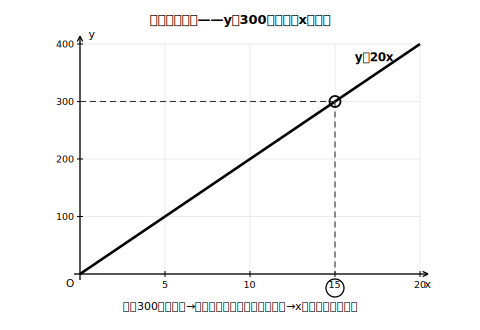
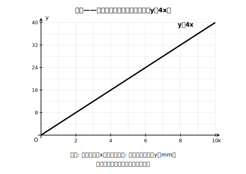

# L10 式とグラフで問題を解く

## ねらい

- 比例・反比例で表される場面で、求めたい値にたどり着く**3つのルート**（式・グラフ・表）を使い分けられるようになる。
- 求め方を説明するときに、**「何を用いるか」＋「どう用いるか**」の2部品で書けるようになる。

## 主概念1：同じ答えへ、3つのルート

同じ規格のリボンがある。1mあたりの重さは20gで、長さx mのリボンの重さy gは y＝20x の比例とみなせる場面を考えよう（長さは何mでも切り出せるとする。xの変域は x ≧ 0）。

**問題**: 巻いてあるリボン全体の重さを量ったら300gだった。リボンは何mあるだろうか。

**ルート1：式で解く。** y＝20x に y＝300 を代入して、300＝20x。方程式として解くと x＝15。**15m**だ。検算: 20×15＝300 ✓。

**ルート2：グラフで読む。** y＝20x のグラフをかき、**y＝300のときのx座標を読む**。高さ300のところで横に線をたどり、グラフとぶつかった点から真下に下りると、x＝15。

<!-- figure-spec: 意図=「グラフで解く」の実際の手つき（指定のyに対するx座標を読む）を1枚にする。主要数値=交点(15, 300)・目盛りはx=5きざみ・y=100きざみ。再現説明=補助線は破線・交点のみ丸印・読み取り値15をx軸側に強調表示。生成方法=assets_provenance/generate_figures.py のパラメトリックSVG（交点がy=20x上・軸範囲内をassert検算） -->

**ルート3：表・数値で求める。** 1mが20gなのだから、300gは 300÷20＝15（m）。割合の考えそのままだ。

3つのルートは、どこから登っても同じ頂上に着く。テストや実生活では、**手元にある表現**（式が与えられているか、グラフが目の前にあるか）から一番近いルートを選べばいい。

## 主概念2：説明は「用いるもの＋用い方」の2部品で

「求め方を説明しよう」と言われたら、答えの数値だけでも、「グラフを使う」だけでも足りない。**①何を用いるか ②どう用いるか**の2部品をそろえて、初めて説明になる。

> **よい説明の例（ルート2の場合）**:
> 「**グラフを用いる。**（←部品①）
> **y＝20xのグラフで、y＝300のときのx座標を読み取る。**（←部品②）」

> **足りない説明の例**: 「グラフを使って求める。」これでは部品②（どう用いるか）がないので、この説明を読んだ人は手を動かせない。

部品②の書き方はルートごとに型がある。式なら「y＝◯を代入してxの方程式を解く」、グラフなら「y＝◯のときのx座標を読む」、表なら「1あたりの量で◯をわる」。**読んだ人がそのとおりに手を動かせるか**が、説明の合格ラインだ。

**反比例の場面でも同じ型**が使える。かみ合う2つの歯車（はぐるま）では、（歯数）×（1秒あたりの回転数）が両方の歯車で等しい。歯数24の歯車Ａが毎秒3回転しているとき、かみ合う歯車Ｂの歯数をx、毎秒の回転数をyとすると、xy＝24×3＝72、つまり y＝72/x（x, yは正）。歯数18の歯車Ｂの回転数を求めるなら、「**式を用いる。y＝72/x に x＝18 を代入して y＝4 を求める**」。検算: 18×4＝72 ✓。

:::zatsudan
比例のありがたみは、「少ない情報から全体が分かる」ことに尽きる。リボンの場面で実際に量ったのは、1mあたりの重さと全体の重さのたった2つ。それだけで、巻いたまま一度もほどかずに長さが分かってしまった。関係が1つ分かれば、測りにくいものを測りやすいもので置きかえられる——それが比例・反比例という道具の力だ。
:::

:::guide
**「説明問題」への抵抗感を下げる**

方法の説明を求められると、何をどこまで書けばよいか分からず、白紙にしてしまうことが少なくない。2部品の型は、この「どこまで書くか」を先に決めてしまう道具だ。部品①は式・グラフ・表の三択（L06の三つの言葉）だから、まず選ぶだけでよい。部品②は選んだものごとの定型がある。「型に当てはめれば説明は書ける」という経験を、この2時間で最低2回は積んでおこう。
:::

:::guide
**「どの文字の値が答えか」の吟味**

歯車の例で、求めたいのは「歯数18の歯車の**回転数**」だった。x（歯数）とy（回転数）のどちらに18を入れ、どちらの値を答えるのか——ここを取り違えると、正しい式から誤った答えが出る。解く前に「求めたいのはx？　y？」と一言宣言してから代入する習慣を、練習問題の解答様式（answer_key）にも組み込んである。
:::

## 練習

1. 1個の重さがどれも同じクリップがある。50個の重さは30gだった。クリップx個の重さをy gとする。
   (1) yをxの式で表そう。
   (2) このクリップ720g分は何個か、**式を用いて**求めよう。
   (3) (2)の求め方を、「用いるもの＋用い方」の2部品で説明しよう。
2. 満水で360Lの浴そうに、毎分x Lずつ水を入れると、満水までy分かかる。
   (1) yをxの式で表そう（x, yは正とする）。
   (2) 毎分24Lで入れると何分かかるだろうか。
   (3) 12分でいっぱいにしたいとき、毎分何Lずつ入れればよいか。また、その求め方を2部品で説明しよう。
3. 下の図はy＝4xのグラフで、あるろうそくが燃えてx分間に短くなる長さy mmの関係を表している。y＝28になるときのxの値をグラフから読み取ろう。また、その読み取りの手順を2部品で説明しよう。

   
   <!-- figure-spec: 意図=グラフ読み取りの練習（補助線・交点・読み取り値は図に入れない＝答えのため）。主要数値=y＝4x・x軸0〜10・y軸0〜40（目盛りラベルはx=2きざみ・y=8きざみで答えの値を先出ししない）。再現説明=方眼つきの第1象限グラフ1本のみ。生成方法=assets_provenance/generate_figures.py のパラメトリックSVG（読み取り点がy=4x上・軸範囲内で読めることをassert検算・answer_keyの読み取り値の漏えい検査つき） -->
4. 次の説明の足りないところを指摘して、書き直そう。
   「問題: y＝72/x の歯車の場面で、毎秒6回転させたい。歯車Ｂの歯数を求める方法を説明しなさい。」
   「答案: 式を使えば求められる。」

:::stretch
**S1** リボンの問題（y＝20x・全体300g）を、3つのルートすべてで解いて、答えが一致することを確かめよう。そのうえで、「もし手元に式がなく、グラフの印刷だけがあったら」「もし電卓しかなかったら」どのルートを選ぶか、理由つきで考えてみよう。
:::

---

対応解答: answer_key_L09-12.md

<!-- gen_nav:nav:start（自動生成・手編集しない） -->

---

[← 前のレッスン](lesson_09.md)｜[単元の目次](README.md)｜[解答](answer_key_L09-12.md)｜[次のレッスン →](lesson_11.md)

<!-- gen_nav:nav:end -->
