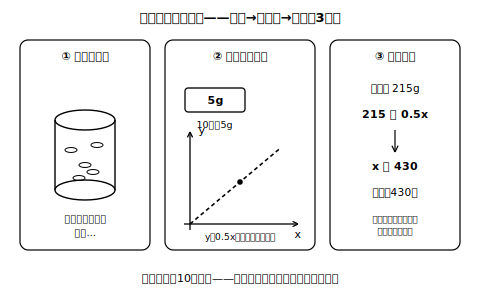

# L11 「比例とみなす」——予測とその限界

## ねらい

- 厳密には比例でない数量の関係を、**比例とみなして**見積もり・予測ができるようになる。
- 「みなしてよいか」を検討し、**適用できる範囲に制約が生じる**ことまでセットで説明できるようになる。

## 主概念：「みなす」は強力、ただし但し書きつき

びんいっぱいのクリップが何個あるか、数えずに知りたい。全部数えるのは大変だ。そこで、こう考える。

**手順1：一部を実測する。** クリップを10個取り出して重さを量ったら、5gだった。

**手順2：比例とみなす。** クリップ1個1個の重さは、厳密にはわずかにばらつく。それでも「どれもほぼ同じ重さ」なら、個数x個と重さy gの関係は、**比例とみなして** y＝0.5x と表せる（5÷10＝0.5g）。

**手順3：式で予測する。** びんの中身全体の重さを量ったら215gだった。y＝0.5x に y＝215 を代入して、215＝0.5x、x＝430。**およそ430個**と見積もれる。検算: 0.5×430＝215 ✓。

数えたのはたった10個なのに、430個分の見当がついた。これが「みなす」の力だ。

<!-- figure-spec: 意図=実測→みなし→予測の3手順の流れを1枚で示す。主要数値=(10, 5)・215g・430個。再現説明=コマ2の直線は破線（「みなした」直線であることを実線と区別）。生成方法=assets_provenance/generate_figures.py のパラメトリックSVG（0.5=5÷10・215=0.5×430をassert検算） -->

## 但し書き：みなしには「使える範囲」がある

ここで立ち止まって考えたいことが2つある。

**その1：みなしてよかったか。** クリップが全部同じ規格だったから、比例とみなせた。もし大きいクリップと小さいクリップが混ざっていたら、1個あたりの重さが場所によって変わってしまい、y＝0.5x は成り立たない。**「1個あたりがほぼ一定」と言える根拠**があって、はじめてみなしてよい。

**その2：答えは「およそ」。** ばらつきがある以上、430個ぴったりとは限らない。厳密には比例ではない関係を比例とみなしたのだから、**適用できる範囲には一定の制約が生じる**。見積もった値は「およそ430個」と、みなしの但し書きごと報告するのが誠実だ。

**変域にも場面の制約がつく**。クリップの個数xは0以上の整数だし、負の個数や負の重さは現実には存在しない。L02で見た「式が許す範囲」と「場面が許す範囲」の区別が、実際の場面ではいつも効いてくる。

:::zatsudan
「厳密にはちがうけれど、そうみなす」というのは、いいかげんな妥協ではなくて、実はとても大人な判断だ。何を無視してよいか（クリップ1個ごとの小さなばらつき）と、何を無視してはいけないか（大小のクリップが混ざっていること）を切り分けて、無視した分だけ答えに「およそ」と幅を持たせる。単純にした自覚があるからこそ、答えの使いどころも正しく言える。
:::

:::guide
**「みなす」の説明も2部品＋但し書きで**

L10の説明の型（用いるもの＋用い方）に、みなしの場面では但し書きが1つ加わる。「①比例とみなす（根拠: 1個あたりの重さがほぼ一定だから）②式y＝0.5xを用い、y＝215を代入してxを求める ③ただし、みなした分だけ答えはおよその値になる」。この③まで書けたら、説明として一段上の完成度だ。逆に、根拠の検討なしに何でも比例とみなすと、「比例とみなせば何でも予測できる」という過信になる——みなす前の検討と、みなした後の但し書きは、必ず対にして使おう。
:::

:::guide
**実測とのずれをどう扱うか**

見積もり430個に対して、実際に数えたら427個だった、というようなずれは、みなしの手法では起こるのが自然だ。ずれ＝失敗ではなく、「みなしがどのくらい良かったか」の情報として扱おう。ずれが大きすぎたときに初めて「みなしの前提（同じ規格・ほぼ一定）がくずれていないか」を疑う、という順番も、予測を道具として使うときの基本の構えになる。
:::

## 練習

1. 同じ規格のねじがたくさんある。20個の重さを量ったら48gだった。
   (1) ねじの個数x個と重さy gの関係を、比例とみなして式に表そう。
   (2) 全体の重さが600gのとき、ねじはおよそ何個と見積もれるか。
   (3) この見積もりが大きく外れるのは、どんな場合だろうか。一つ考えて書こう。
2. あるコピー用紙は、100枚の厚さが9mmだった。枚数x枚と厚さy mmの関係を比例とみなして、厚さ63mmの束はおよそ何枚と見積もれるか。式・代入・検算の3点を書いて求めよう。
3. 次の主張の問題点を指摘しよう。
   「クリップ10個で5gだったから y＝0.5x。この式にx＝−40を代入すればy＝−20。つまりクリップ−40個の重さは−20gだ。」
4. 「一部を実測して、比例とみなして、全体を見積もる」方法が役に立ちそうな場面を、身の回りから一つ考えて、手順1〜3の形で書いてみよう（実際に量らなくてよい。計画だけでよい）。

:::stretch
**S1** クリップの見積もりでは10個の実測から出発した。もし30個・50個と実測の個数を増やしたら、見積もりの信頼度はどう変わると考えられるだろうか。「ばらつき」という言葉を使って、自分の考えを2〜3文で書いてみよう。
:::

---

対応解答: answer_key_L09-12.md

<!-- gen_nav:nav:start（自動生成・手編集しない） -->

---

[← 前のレッスン](lesson_10.md)｜[単元の目次](README.md)｜[解答](answer_key_L09-12.md)｜[次のレッスン →](lesson_12.md)

<!-- gen_nav:nav:end -->
