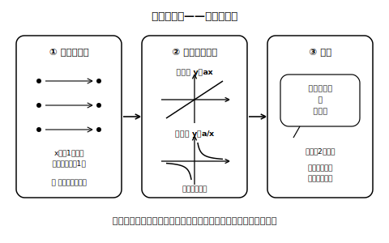

# L12 章末まとめ——三つの部屋をふり返る

## ねらい

- 単元全体を「①関数の意味 ②比例と反比例 ③使う」の三つの部屋に整理し、自分の言葉で説明できる状態を確かめる。
- 総合演習で、判定・式・グラフ・説明のすべての型を1回ずつ使う。

## 三つの部屋の自己チェック

次の問いに、ノートに自分の言葉で答えてみよう。答えられなかった部屋だけ、該当レッスンに戻ればよい。

**部屋1：関数の意味（L01〜L02）**
- 「yはxの関数である」とはどういうことか、「ただ一つ」という言葉を使って説明できるか。
- 「yはxの関数」でも「xはyの関数」とは限らない例を、1つあげられるか。
- 変域を不等号で表せるか（以上・以下と、より大きい・未満の区別）。

**部屋2：比例と反比例（L03〜L09）**
- 比例の判定（商一定）と反比例の判定（積一定）を、表を見て実行できるか。
- 「xが増えるとyが減る比例」の例を、式で1つ書けるか。
- 比例のグラフ（原点を通る直線）と反比例のグラフ（原点を通らない二本の曲線）を、それぞれかけるか。
- 1組の値から式を求め、代入で検算できるか。

**部屋3：使う（L10〜L11）**
- 求め方の説明を「用いるもの＋用い方」の2部品で書けるか。
- 「比例とみなす」見積もりを、但し書き（およその値・使える範囲）つきで説明できるか。

<!-- figure-spec: 意図=単元全体の構造を1枚で見渡し、自己チェックの部屋と対応させる。主要数値=なし（構造図）。再現説明=L09_fig1の対比の縮小版を②に流用可。生成方法=assets_provenance/generate_figures.py のパラメトリックSVG（札数3・矢印2・ミニグラフの構造をassert検算） -->

## 総合演習

1. **（関数の意味）** 「自然数xを3でわった余りをyとする」という対応を考える。
   (1) yはxの関数といえるか。
   (2) xはyの関数といえるか。y＝1になるxをあげて考えよう。
2. **（比例）** yはxに比例し、x＝−8のときy＝6である。
   (1) 式を求めよう（代入検算つき）。
   (2) x＝12のときのyの値を求めよう。
   (3) このグラフは右上がり・右下がりのどちらか、比例定数の符号を根拠に答えよう。
3. **（反比例）** グラフが点(−3, 5)を通る反比例がある。
   (1) 式を求めよう（積の検算つき）。
   (2) x＝5のときのyの値を求めよう。
   (3) このグラフの二本の曲線は、座標平面のどのあたりに現れるか。
4. **（判定）** 次の表について、「比例」「反比例」「どちらでもない」を判定し、判定に使った計算を書こう。

   | x | 1 | 2 | 4 | 8 |
   |---|---|---|---|---|
   | y | 16 | 8 | 4 | 2 |

5. **（説明）** 1mあたり15gの針金がある。針金の束全体の重さは690gだった。束の長さの求め方を、「用いるもの＋用い方」の2部品で説明し、実際に求めよう。

:::zatsudan
比例に出会うのは、実はこれで3回目だ。小5で出会い、小6でy＝axの形を知り、そして今回、負の数・座標・関数という新しい道具でまるごと捉え直した。同じ相手に、道具を変えて何度も出会い直す——数学の学びはらせん階段のようにできていて、一周まわるたびに同じ景色が少し高いところから見える。この単元で手に入れた「表・式・グラフの三つの言葉」は、この先の数学のあちこちで、また働いてくれる。
:::

:::guide
**自己チェックの使い方**

三つの部屋は、この単元の評価の観点ともほぼ対応している（意味の理解・表現の技能・活用）。大事なのは、部屋2の計算ができることと、部屋1の意味が言えることを**別々に**確かめる設計にしてあることだ。計算が全部できても、「関数とはどういうことか」で手が止まるなら部屋1に戻る価値がある。逆もまたしかり。どの部屋から埋めても構わないが、最後は三部屋そろっているかで仕上がりを判定したい。
:::

:::guide
**この先へつなぐ一言**

本単元で作った「表・式・グラフを行き来する」「判定は計算で行う」「説明は型で書く」の3つの構えは、単元を越えて使い回せる汎用の道具として身につけておこう。図形の学習でも、たとえばおうぎ形では中心角と弧の長さの間に比例の見方が使われる場面があり、「比例のメガネ」は数と式の外でも役に立つ。
:::

---

対応解答: answer_key_L09-12.md

<!-- gen_nav:nav:start（自動生成・手編集しない） -->

---

[← 前のレッスン](lesson_11.md)｜[単元の目次](README.md)｜[解答](answer_key_L09-12.md)

<!-- gen_nav:nav:end -->
