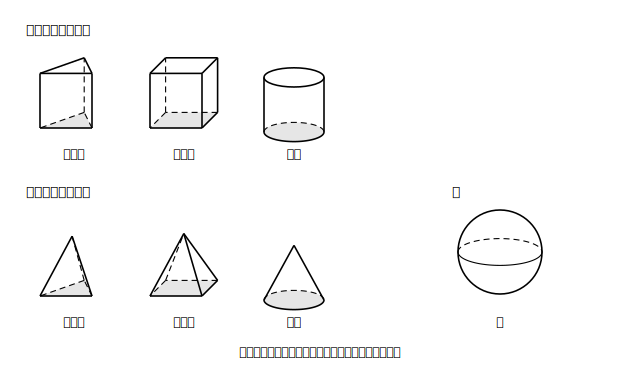
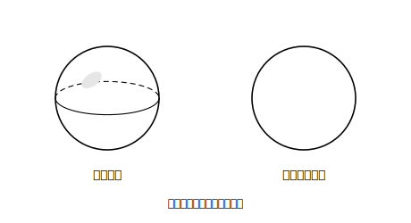

# L01 いろいろな立体〜名前と特徴

## ねらい

- 角柱・円柱に加えて、**角錐（かくすい）・円錐（えんすい）・球**という立体に出会い、名前と形の対応を自分の言葉で言えるようになる。
- この章全体で使う構え「**相手はだれ？チェック**」（いま話しているのは辺か面か、立体か平面図形か）を身につける。

## 準備運動：小学校の道具箱の点検（前提診断）

1. 三角柱には、面がいくつあるだろう。数えてみよう。
2. 円柱を思いうかべよう。底の面はどんな形か。側面はどうなっているか。
3. サイコロの形（立方体）の辺の数はいくつだろう。

3問とも答えられたら準備OK。あやしかったら、身の回りの箱や缶をひとつ手に取って、面・辺・頂点を指でなぞって数え直してから進もう。

## 主概念1：立体の名前は「底の形＋立ち方」でできている

この章の主役たちを一度に並べてみよう。

<!-- figure-spec: 意図=本単元で扱う立体の全体像の提示。要素=7つの立体の見取図を「柱の仲間」「錐の仲間」「球」の3グループに分けて配置し、それぞれに名前ラベル。柱グループと錐グループは底面を薄い同系色で塗る。alt=三角柱・四角柱・円柱、三角錐・四角錐・円錐、球の見取図一覧。描かないもの=投影図・展開図（後のレッスンで扱う）。生成方法=パラメトリックSVG（見取図は奥行き線を破線で）。 -->

まず**柱の仲間**。底面が三角形なら三角柱、四角形なら四角柱、円なら円柱。底面の形がそのまま名前になっている。柱の仲間をまとめて**柱体**（ちゅうたい）とよぶ。

次が**錐の仲間**。この形に名前をつけて調べるのは、中学が初めてだ。

> 【ことば】**角錐・円錐**
> 底面が1つで、そこから先が1つの点（頂点）に向かってとがっていく立体を考える。底面が三角形なら**三角錐**、四角形なら**四角錐**、円なら**円錐**という。角錐・円錐の仲間をまとめて**錐体**（すいたい）とよぶ。

そして**球（きゅう）**。ボールのように、どこから見ても丸い立体だ。中心から表面までの距離（半径）がどこでも等しい、という性質で決まる。

立体の名前を見たら「底の形は何か」「柱のようにまっすぐ立つか、点に向かってとがるか」を読み取ってみよう。名前が形の設計図になっている。

## 主概念2：相手はだれ？チェック

ここで、この章ぜんぶで使う構えをひとつ導入する。

> 【ことば】**相手はだれ？チェック**
> 設問に答える前に、いま問われている「相手」を確認する。
> ①**辺（線）の話か、面の話か**
> ②**立体の話か、平面図形の話か**
> ③（計量のレッスンから）**長さか、面積か、体積か**

たとえば「円錐の底面はどんな図形か」と聞かれたら、相手は**平面図形**だから答えは「円」。「円錐という立体そのもの」を答えてはいけない。逆に「どこから見ても丸く見える**立体**は何か」の答えは「球」であって「円」ではない——円は平面図形、球は立体。似ているのに相手が違う、この区別がこの章では何度も効いてくる。

<!-- figure-spec: 意図=立体と平面図形の区別の視覚化。要素=左に球の見取図（陰影つき）と「球＝立体」のラベル、右に円（輪郭のみの平面図形）と「円＝平面図形」のラベル、中央に「にているけど相手がちがう」の注記。alt=球は立体、円は平面図形という対比。描かないもの=投影図の記法。生成方法=SVG。 -->

:::guide
**「名前を覚える」レッスンではない**

L01の仕事は暗記ではなく、①名前と形の対応ルール（底の形＋立ち方）を手に入れること ②「相手はだれ？」という問い直しの習慣を始めることの2つ。とくに②は、このあとの位置関係（辺と面の話が入り交じる）や計量（面積と体積が入り交じる）でのつまずきに「相手の取り違え」という共通の型がある、という設計判断で全編に常設している。答え合わせのときも「どの相手を取り違えたか」まで戻って確認すると効果が大きい。
:::

:::guide
**「空間図形」という言い方**

この章の題名は「立体」ではなく「空間図形」。空間図形とは、**空間における線や面の一部を組み合わせたもの**。つまり、立体をひとかたまりの物体として見るだけでなく、「どんな面と線が、どう組み合わさってできているか」に分解して見る、という視点の宣言だ。次のL02からは、立体をいったん「点・直線・平面」にほどいて調べていく。
:::

:::zatsudan
「柱」と「錐」、漢字をながめてみよう。柱は建物のはしらで、上から下まで同じ太さでまっすぐ。錐は「きり」、つまり板に穴をあける先のとがった工具のことだ。三角柱・円錐という名前は、じつは形の説明文になっている。新しい用語に出会ったら漢字を分解して読んでみると、覚える量がぐっと減るよ。
:::

## 練習

1. 次の立体の名前を答えよう。
   (1) 底面が五角形の柱体　(2) 底面が円で、頂点に向かってとがる立体　(3) 底面が三角形の錐体
2. 四角錐について、面の数・辺の数・頂点の数をそれぞれ数えよう（見取図を自分でかいてから数えること）。
3. 相手はだれ？チェックの練習。次の各問いの答えが「立体」なのか「平面図形」なのかをまず言ってから、答えを書こう。
   (1) 円柱の底面はどんな図形か。
   (2) どこから見ても丸く見える立体は何か。
   (3) 三角柱の側面は、どんな図形が何枚あるか。
4. 「円錐と三角錐は、どちらも錐体の仲間である」。この文が正しい理由を、錐体という言葉の意味にもどって一言で説明してみよう。

:::stretch
**S1** すべての面が合同な正三角形でできた三角錐を**正四面体**（せいしめんたい）という。正四面体の面・辺・頂点の数を数えてみよう。また、「すべての面が合同な正多角形で、どの頂点にも同じ数の面が集まる立体」は正四面体のほかにもある。興味がわいたら「**正多面体　種類**」で調べてみよう（この先の本文では使わない、寄り道の知識だ）。
:::

---

対応解答: answer_key_L01-04.md

<!-- gen_nav:nav:start（自動生成・手編集しない） -->

---

[単元の目次](README.md)｜[解答](answer_key_L01-04.md)｜[次のレッスン →](lesson_02.md)

<!-- gen_nav:nav:end -->
