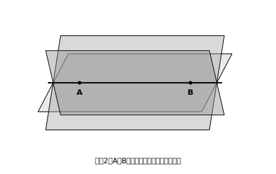
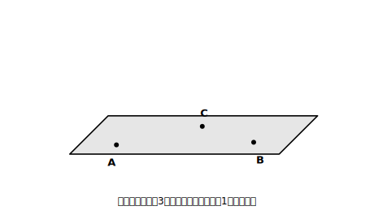

# L02 平面はいつ決まるか

## ねらい

- 「平面が**決まる**」＝ただ1つに定まる、という言い方の意味をつかむ。
- **2点では平面は決まらない**こと、**一直線上にない3点**で平面がただ1つに決まることを、反例を通して納得する。

## 準備運動：直線はいつ決まる？

平面の前に、既に知っている直線で「決まる」の感覚を確かめよう。

1. 点Aが1つだけ与えられたとき、Aを通る直線は何本ひけるだろう。
2. 2点A・Bが与えられたとき、AとBの両方を通る直線は何本ひけるだろう。

答えは 1が「いくらでもひける」、2が「**ただ1本**」。この「いくらでもある」と「ただ1つ」の違いが、今日の主役だ。2点を決めると直線が1本に**決まる**。数学で「決まる」はこの意味で使う。

## 主概念1：2点では、平面は決まらない

平面とは、どこまでも平らに広がる面のこと（紙や下じきは、その一部を切り取ったものと考える）。では平面は、点をいくつ決めれば1つに決まるだろうか。

直線が2点で決まったのだから、平面も2点で……と予想したくなる。実験してみよう。

**紙上実験**: ノートや下じきを1枚用意しよう（なければ、開いた本の1ページを平面だと思って想像でやってみよう）。机の上に鉛筆を1本置き、その両端を点A・Bと考える。下じきの縁をこの鉛筆に当てたまま、下じきをくるくると回してみる。鉛筆（2点AとB）に触れたままでも、下じきは**いくらでも傾きを変えられる**。

<!-- figure-spec: 意図=「2点で平面が決まる」という誤概念への反例の視覚化。要素=直線AB（2点A・Bを通る軸）と、その直線を軸として傾きの違う3枚の平面（板）が扇のように回転している見取図。「同じ2点を通る平面はいくらでもある」の注記。alt=2点を通る平面は軸のまわりに無数にあることを示す図。描かないもの=3点目（次の図で追加する）。生成方法=SVG（平面は半透明の平行四辺形で3枚重ねる）。 -->

つまり、**2点を通る平面は無数にある**。2点では平面は決まらない——直線と同じ調子で考えると、ここで足をすくわれる。

では3点ならどうか。さっきの実験の続きだ。机の上の鉛筆に下じきを当てたまま、鉛筆から離れた場所に消しゴムを1つ置いて、下じきをその角にも触れさせてみよう。3点目に触れたとたん、下じきの傾きは**ぴたりと止まる**。

> 【ことば】**平面の決定**
> **一直線上にない3点**を決めると、その3点を通る平面は**ただ1つに決まる**。

<!-- figure-spec: 意図=平面の決定条件の視覚化。要素=一直線上にない3点A・B・Cと、それを通るただ1枚の平面（平行四辺形で表す）。L02-1と対になるレイアウト。alt=一直線上にない3点を通る平面はただ1つ。描かないもの=余分な平面。生成方法=SVG。 -->

## 主概念2：「一直線上にない」を落とすと、話が崩れる

決定条件には「一直線上にない」という但し書きがついている。飾りではない。もし3点A・B・Cが**一直線上に並んでいたら**、その3点はまとめて1本の直線とみなせる。そして主概念1で見たとおり、1本の直線（2点）を通る平面は無数にある。だから一直線上の3点では、平面はやっぱり決まらない。

「3点」という数だけ覚えると、この但し書きが抜け落ちる。**数ではなく、傾きを止められるかどうか**で考えよう。

なお、この決定条件は言いかえの形でも使われる。「1つの直線と、その直線上にない1点」「交わる2直線」でも平面はただ1つに決まる。どちらも、一直線上にない3点を選び直せることを確かめてみよう（練習4）。

:::guide
**なぜ最初に「平面の決定」をやるのか**

空間の学習は、辺や面の平行・垂直の判定（L03・L04）から始めることもできる。それでも本書が決定条件を先頭に置くのは、「決まる／決まらない」の感覚が空間の話ぜんぶの土台になるからだ。空間では「見た目でそう見える」が平面図形以上に当てにならない。「無数にあるのか、ただ1つなのか」を言葉で確定させる経験を先にしておくと、この後の位置関係の判定も「見た目」でなく「条件」で答える構えに切り替わる。
:::

:::guide
**よくある考え方とその修正**

「2点で決まる」と考えるのは、直線の決定（2点で1本）からの自然な類推で、筋は通っている。修正のしかたは、暗記ではなく**反例を自分の手で再現する**こと。鉛筆と下じきの実験で「まだ回る」を一度体感すれば、2点説は自分の中で棄却できる。「一直線上の3点で決まる」も同じで、3点が1本の軸に化けてしまい「まだ回る」ことを確かめればよい。誤りを消すのは正解の暗記ではなく、自分で見つけた反例だ。
:::

:::zatsudan
カメラの三脚（さんきゃく）って、なぜ脚が3本なんだろう。3本の脚の先端は「一直線上にない3点」——今日の条件どおり、この3点を通る平面がただ1つに決まる。つまり脚先の3つは、長さがふぞろいでも必ず同じ1つの平面の上にのる。4本脚のように「1本だけ浮いてガタつく」ことが、原理的に起こらないわけだ。今日の内容は、じつは撮影機材の設計にちゃっかり入りこんでいる。
:::

## 練習

1. 次の各場合について、平面が「ただ1つに決まる」か「決まらない（無数にある）」かを答え、理由を一言そえよう。
   (1) 異なる2点を通る平面
   (2) 一直線上にない3点を通る平面
   (3) 一直線上に並んだ3点を通る平面
2. 「平面は3点で決まる」という言い方には、大事な条件が抜けている。抜けている条件を補って、正しい文に直そう。
3. 4本脚のイスは、脚の長さがわずかにふぞろいだと、平らな床の上でもガタつくことがある。3本脚のイスは、脚の長さがふぞろいでも、平らな床の上ではガタつかない。この違いを、今日の決定条件を使って説明してみよう（ヒント: 4点は、いつでも同じ1つの平面の上にあるとは限らない）。
4. 「交わる2直線を通る平面はただ1つに決まる」。交わる2直線の上から、一直線上にない3点をどう選べばよいか、図をかいて示そう。

:::stretch
**S1** 空間に4点があって、そのうちどの3点も一直線上にないとする。この4点のうち3点を選んで決まる平面は、選び方ぜんぶで最大何枚できるだろうか。数え上げてみよう。また「4点が最初から同じ1つの平面の上にある」特別な場合には何枚になるかも考えてみよう。
:::

---

対応解答: answer_key_L01-04.md

<!-- gen_nav:nav:start（自動生成・手編集しない） -->

---

[← 前のレッスン](lesson_01.md)｜[単元の目次](README.md)｜[解答](answer_key_L01-04.md)｜[次のレッスン →](lesson_03.md)

<!-- gen_nav:nav:end -->
