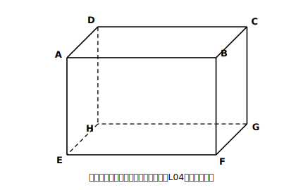
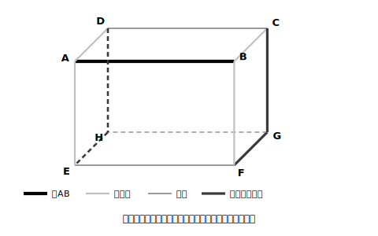

# L03 空間の2直線〜ねじれの位置

## ねらい

- 空間にある2つの直線の位置関係を「交わる／平行／**ねじれの位置**」の3つに分類できるようになる。
- ねじれの位置を「**交わらない かつ 平行でない**」の**2条件チェック**で判定する型を身につける。

## 準備運動：平面の上ではどうだった？

同じ平面の上にある2直線の位置関係を思い出そう。

1. 同じ平面上の2直線の位置関係は、次の2つのどちらかだった。（　）を埋めよう。
   「（　交わる　）」か「（　　　　）」
2. 平行な2直線は、どこまで延ばしても交わらない。では逆に、同じ平面上で「どこまで延ばしても交わらない2直線」は、必ず平行と言ってよいだろうか。

平面の上では「交わらないなら平行」で話が済んでいた。ところが空間に出ると、この2択が崩れる。今日の主役はその第3の関係だ。

## 主概念1：交わらないのに、平行でもない

直方体の箱をひとつ思いうかべよう（実物があれば手に取って、辺を指でなぞりながら読むと早い）。頂点にA〜Hの名前をつける。上の面がABCD、下の面がEFGH、AはEの真上にあるとする。

<!-- figure-spec: 意図=以後L04まで共通で使う判定練習の舞台。要素=直方体の見取図・頂点ラベルA〜H（上面ABCD・下面EFGH・AがEの真上）・見えない辺は破線。alt=頂点にAからHの名前がついた直方体の見取図。描かないもの=対角線。生成方法=SVG（このレッスン以降の図と頂点配置を必ず一致させる）。 -->

辺ABと辺EFの関係を見ると、これは**平行**だ。同じ面ABFEの上にあって、どこまで延ばしても交わらない。

辺ABと辺BFは、点Bで**交わる**。

では、辺ABと辺FGはどうだろう。延長しても交わらない（高さが違う）。かといって平行にも見えない（向きが直角に違う）。交わらない、でも平行でもない——平面の上にはなかった関係だ。これに名前がつく。

> 【ことば】**ねじれの位置**
> 空間にある2つの直線が、**交わらず、平行でもない**とき、この2直線は**ねじれの位置**にあるという。

ねじれの位置にある2直線は、同じ1つの平面の上に乗せることができない。平行な2直線や交わる2直線は1つの平面の上に乗る（L02の決定条件で確かめられる）から、「同一平面上にあるか」で言い分けることもできる。

## 主概念2：2条件チェック〜片方の確認だけで答えない

ねじれの位置の定義は「交わらない **かつ** 平行でない」。条件が2つある。判定のときは、**2つとも**確かめてから答えよう。

> 【ことば】**2条件チェック**
> ねじれの位置と答える前に、
> ①**交わらないか？**（延長しても交わらないか）
> ②**平行でないか？**（同じ面に乗せて平行になっていないか）
> の両方に「はい」を確認する。

なぜ2つともか。①だけで答えると、平行な2直線（交わらないが、ねじれではない）を巻きこんでしまう。②だけで答えると、交わる2直線を巻きこんでしまう。どちらか片方の確認では、答えが必ず膨らみすぎる。

さっそく直方体で運用してみよう。**辺ABとねじれの位置にある辺**を全部探す。

- まず①で消す: ABと交わる辺（AD・AE・BC・BF）を除外。
- 次に②で消す: ABと平行な辺（DC・EF・HG）を除外。
- 残ったものが答え: **辺CG・DH・EH・FG**の4本。

「交わる・平行を先に消して、残りがねじれ」。この消去の順番は、数えもれを防ぐ実戦的な手順としても使える。

<!-- figure-spec: 意図=消去法による判定手順の視覚化。要素=L03-1と同じ直方体で、辺ABを太線、交わる4辺・平行な3辺・ねじれの4辺を3色で塗り分け、凡例つき。alt=辺ABに対して交わる辺・平行な辺・ねじれの位置の辺を色分けした直方体。描かないもの=辺ラベル以外の注記。生成方法=SVG（L03-1と同一の頂点配置）。 -->

:::guide
**「見た目」から「条件」への切り替え**

見取図の上では、ねじれの位置の2直線が「交わっているように見える」ことがある（線どうしが紙の上で交差して描かれるため）。ここで効くのが、判定の根拠を見た目でなく条件に置く構えだ。「紙の上で線が交差している」ことと「空間で実際に交わる」ことは別物。交わるとは、共有する点が本当にあるということ。あやしいときは、2直線がそれぞれどの面に属しているか・高さが同じかを言葉で確かめる。L06で見取図の限界として、もう一度この話に戻ってくる。
:::

:::guide
**よくある考え方とその修正**

「交わらないから、ねじれの位置」。①だけで即答してしまう——2条件のうち片方が抜ける、警戒したいつまずき方だ。この答え方だと平行な2直線もねじれに分類されてしまう。修正は、定義を「交わらない」だけで覚え直すのではなく、**3分類の全体図**（交わる／平行／ねじれ。空間の**異なる**2直線は、この3つで全部）を1枚の絵として持つこと。「平行の可能性をまだ消していない」と自分に問い直せれば、2条件チェックは自然に回る。
:::

:::zatsudan
「ねじれの位置」という名前、ちょっと変わった響きだと思わないだろうか。2本の直線をそれぞれ棒だと思って、片方をつかんでくるりとひねる。すると、平行だった2本が、交わらないまま向きだけ食い違う。「ねじれ」という言葉から、あの「ひねった感じ」を連想できる（名前の由来の説明ではなく、あくまで覚えるための連想だ）。定義の2条件（交わらない・平行でない）を思い出す取っ手として、この連想は案外役に立つよ。
:::

## 練習

判定の設問では、必ず2条件チェック（①交わらないか ②平行でないか）を書きそえること。

1. L03-1の直方体で、辺AEとの位置関係を答えよう。
   (1) 辺BF　(2) 辺AB　(3) 辺FG　(4) 辺HG
2. 同じ直方体で、**辺BFとねじれの位置にある辺**をすべて挙げよう（消去の順番: 交わる辺→平行な辺→残り）。
3. 次の文の誤りを見つけて直そう。
   「辺ADと辺FGは、どこまで延長しても交わらない。だから、この2辺はねじれの位置にある。」
4. 三角柱ABC-DEF（上の面がABC、下の面がDEF、AがDの真上）を自分で見取図にかき、辺ABとねじれの位置にある辺をすべて挙げよう。
5. 相手はだれ？チェックの練習。「辺ABと**面**EFGHの関係」を問われたとき、今日の3分類（交わる・平行・ねじれ）をそのまま使ってよいだろうか。使えないとしたら、それはなぜか（答えはL04で確かめる）。

:::stretch
**S1** 空間の異なる2直線の位置関係は「交わる・平行・ねじれの位置」の3つで全部だと本文で述べた（重なり合う場合＝同じ直線どうしは考えない）。これを、L02の「同一平面上にあるか・ないか」→（あるなら）「交わるか・交わらないか」という2段の場合分けの木にかき直して、3分類にもれも重なりもないことを確かめてみよう。
:::

---

対応解答: answer_key_L01-04.md

<!-- gen_nav:nav:start（自動生成・手編集しない） -->

---

[← 前のレッスン](lesson_02.md)｜[単元の目次](README.md)｜[解答](answer_key_L01-04.md)｜[次のレッスン →](lesson_04.md)

<!-- gen_nav:nav:end -->
