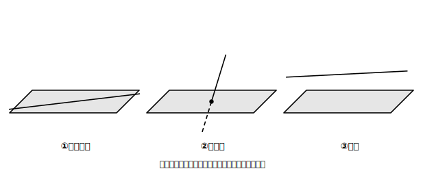
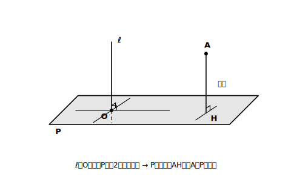

# L04 直線と平面・2つの平面

## ねらい

- 直線と平面、2つの平面の位置関係を分類し、直方体で判定できるようになる。
- 直線と平面の**垂直**・点と平面の**距離**をつかむ（あとの「高さ」の土台になる）。
- 平面の上の常識が空間では「**とは限らない**」に変わる例を体験する。

## 準備運動：前回の道具の確認

L03-1と同じ直方体ABCD-EFGH（上面ABCD・下面EFGH・AはEの真上）を使う。

1. 辺ABと辺HGの位置関係は？（2条件チェックを添えて）
2. 相手はだれ？チェック: 「辺」と「面」の話が今日から入り交じる。L03の3分類（交わる・平行・ねじれ）は、何と何の間の関係だったか。

L03の3分類は「**直線と直線**」の関係だった。今日は相手を「直線と平面」「平面と平面」に広げる。相手が変わると分類も変わる。チェックの出番だ。

## 主概念1：直線と平面〜含まれる・交わる・平行

直線と平面の位置関係は、次の3つに分かれる。

> 【ことば】**直線と平面の位置関係**
> ①直線が平面に**含まれる**（直線が丸ごと平面の上に乗っている）
> ②直線が平面と**交わる**（共有する点が1つ）
> ③直線と平面が**平行**（どこまで延ばしても共有する点がない）

<!-- figure-spec: 意図=3分類の一覧視覚化。要素=平面（平行四辺形）と直線の組を3つ並べる: 含まれる（直線が平面内）・交わる（1点を強調）・平行（浮いている）。各パターンに①②③のラベル。alt=直線が平面に含まれる・交わる・平行の3つの場合の図。描かないもの=垂直の記号（次の図で扱う）。生成方法=SVG。 -->

注意したいのは①と③の区別だ。直方体で「辺EFと面EFGH」は、EFが面の中に丸ごと乗っているから「**含まれる**」。「辺ABと面EFGH」は、共有点がないから「**平行**」。含まれるは共有点だらけ、平行は共有点ゼロ。正反対なのに、見取図の上ではどちらも「面の近くにある線」に見えて混同しやすい。**共有する点があるか・いくつあるか**で言い分けよう。

②の交わり方の中で、特別なものに名前がある。

> 【ことば】**直線と平面の垂直・点と平面の距離**
> 直線ℓが平面Pと点Oで交わり、**Oを通るP上のどの直線とも垂直**であるとき、ℓはPに**垂直**であるといい、ℓをPの**垂線**（すいせん）という。
> 点Aから平面Pにひいた垂線とPの交点をHとするとき、線分AHの長さを**点Aと平面Pとの距離**という。

「どの直線とも」を全部確かめるのは大変そうだが、実は**交点Oを通るP上の2つの直線と垂直**であることを確かめれば、Pに垂直だと言える（交わる2直線が平面を決める、というL02の決定条件がここで働いている）。

この「点と平面の距離」が、のちのち錐体の**高さ**（頂点と底面をふくむ平面との距離）の正体になる。

<!-- figure-spec: 意図=垂直の定義と距離の視覚化。要素=平面P・点Oで交わる垂線ℓ・O を通るP上の2直線との直角マーク2つ・平面外の点Aから垂線の足Hへの線分AH（距離のラベル）。alt=平面に垂直な直線と、点から平面までの距離を示す図。描かないもの=数値。生成方法=SVG。 -->

## 主概念2：2つの平面〜交わるか、平行か

異なる2つの平面の位置関係は、じつは2つしかない。

> 【ことば】**2平面の位置関係**
> 異なる2つの平面は、**交わる**（交わりは1本の直線になる）か、**平行**（共有する点がない）かのどちらかである。

2平面が交わるとき、その交わりは点ではなく**直線**になる。直方体の面ABCDと面ABFEの交わりが辺AB（の直線）であることを、図でなぞって確かめよう。また、交わってできる角が直角のとき、2平面は**垂直**であるという（直方体のとなり合う面どうしがその例だ）。

平行な2平面のあいだの距離は、一方の平面上の点からもう一方の平面までの距離で測る。柱体の**高さ**（2つの底面のあいだの距離）の正体はこれだ。

## 主概念3：空間では「とは限らない」が増える

平面図形で学んだ「1つの直線に垂直な2つの直線は平行」——空間でも成り立つだろうか。

直方体の点Aに集まる3つの辺AB・AD・AEを見てみよう。ABとADは、どちらも辺AEに垂直だ。では、ABとADは平行だろうか。答えは、点Aで**交わっている**。平行どころではない。

つまり、**1つの直線に垂直な2つの直線は、空間では平行とは限らない**。平面の上で当たり前だったことが、空間では但し書きつきに変わる。「平面で成り立ったから空間でも成り立つはず」と決めつけず、直方体でひとつ試してから答える——この用心が空間図形の作法だ。

:::guide
**分類の数を相手ごとに整理しておく**

直線どうし=3分類（交わる・平行・ねじれ）、直線と平面=3分類（含まれる・交わる・平行）、平面どうし=2分類（交わる・平行）。「ねじれ」は直線どうし専用で、平面がからむ関係には現れない（平面はどこまでも広がるので、共有点がなければ必ず平行になってしまう）。L03練習5の答えがこれだ。相手はだれ？チェック→その相手用の分類表を開く、という2段構えを型にしたい。
:::

:::guide
**よくある考え方とその修正**

「辺EFと面EFGHは平行」。含まれる関係を平行と答えてしまうこの混同は、平行を「交わっていないように見える」という見た目の印象で運用していると起こる。修正の軸は共有点の個数: 含まれる=無数・交わる=1つ・平行=0。判定に迷ったら「共有する点はいくつ？」と自問する一手を挟めば、この混同はその場で自分で検出できる。
:::

:::zatsudan
1つの平面は、空間全体を2つの部分に分ける。たとえば水平な平面なら、その上側と下側に。直線が平面を2つに分けるのと同じ構図が、1つ次元を上げてそのまま現れるわけだ。平面での常識が空間で崩れる例（今日の「とは限らない」）もあれば、こうしてきれいに持ち上がる例もある。どちらに転ぶかを確かめること自体が、空間の学習の面白がりどころだと思う。
:::

## 練習

L03-1の直方体ABCD-EFGHで答える。判定には理由（共有点の個数など）を一言そえること。なお、辺と面の判定では、辺は**それをふくむ直線**として（必要なら延長して）考える。

1. 次の関係を「含まれる・交わる・平行」から選ぼう。
   (1) 辺ABと面EFGH　(2) 辺ABと面ABCD　(3) 辺AEと面EFGH　(4) 辺CGと面ABFE
2. 面ABCDと平行な面、垂直な面をそれぞれすべて挙げよう。
3. 辺AEは面EFGHに垂直である。このことを使って、点Aと面EFGHとの距離はどの線分の長さで測ればよいか答えよう。
4. 次の文の誤りを直そう。「辺EFは面EFGHと共有する点をもつが交わってはいない。よって辺EFと面EFGHは平行である。」
5. 「1つの平面に垂直な2つの直線は、平行と**言ってよい**だろうか、それとも**とは限らない**だろうか」。直方体の辺で例を探して、自分の答えを決めよう（答えの理由まで書けたら上出来だ）。

:::stretch
**S1** 直方体の辺AB（をふくむ直線）とねじれの位置にある辺のうち、辺ABと**垂直**なものがある（例: 辺CG）。交わっていないのに垂直と言えるのはなぜか。「辺CGを平行に移動して辺BFに重ねると、ABと直角に交わる」という考え方を図にかいて説明してみよう。空間の垂直は「交わって直角」だけでなく、こうした平行移動ごしの直角も含めて使われる。
:::

---

対応解答: answer_key_L01-04.md

<!-- gen_nav:nav:start（自動生成・手編集しない） -->

---

[← 前のレッスン](lesson_03.md)｜[単元の目次](README.md)｜[解答](answer_key_L01-04.md)｜[次のレッスン →](lesson_05.md)

<!-- gen_nav:nav:end -->
