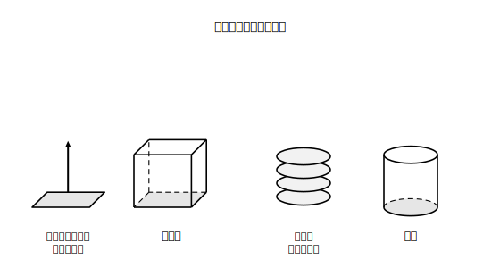
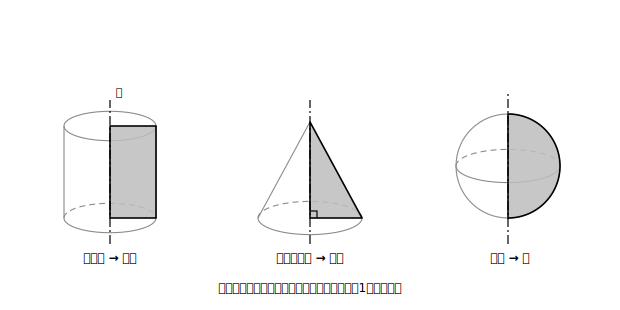

# L05 動かしてできる立体〜回転体

## ねらい

- 立体を「平面図形を**動かしてできた跡**」として見る見方を手に入れる。
- 平面図形を1つの直線のまわりに回転させてできる**回転体（かいてんたい）**を知り、どの図形を回すと円柱・円錐・球ができるかを言えるようになる。

## 準備運動：動かした跡

1. 点を1つ、まっすぐ動かすと、動いた跡は何になるだろう。
2. では、線分を（その線分と垂直な向きに）まっすぐ動かすと、跡は何になるだろう。

答えは 1が「線」、2が「面（長方形）」。点を動かすと線、線を動かすと面。この調子でもう1段いくと、**面を動かすと立体**ができる。今日はこの「動かしてつくる」見方で、L01の立体たちをもう一度ながめ直す。

## 主概念1：面をまっすぐ動かすと、柱体ができる

長方形のカードを机に置き、その真上にまっすぐ持ち上げることを想像しよう。カードが通り過ぎた空間の跡は——四角柱だ。実際、**同じ形のカードやブロックを何枚も積み重ねる**と柱の形ができる。円いコースターを積み重ねれば円柱。つまり、

**柱体は、底面の図形を、底面に垂直な方向に一定の距離だけ平行に動かしてできた立体**と見ることができる。

<!-- figure-spec: 意図=「動かした跡」としての柱体の視覚化。要素=左に長方形カードを上へ動かす矢印つきの図と、できる四角柱。右に円板の積み重ねと円柱。「面を動かした跡＝立体」の注記。alt=長方形を上に動かすと四角柱、円を動かすと円柱ができる図。描かないもの=錐体（平行移動ではできない）。生成方法=SVG。 -->

この見方には、うれしい副産物が2つある。①角柱の側面がなぜ底面に垂直なのか、柱体の高さがなぜ「2つの底面の距離」（L04）なのかが、動かし方そのものから読み取れる。②あとで体積を考えるとき（L09）、「底面を高さのぶんだけ積み上げた量」という直観の土台になる。

## 主概念2：回すと、回転体ができる

動かし方を「平行移動」から「回転」に替えてみよう。

> 【ことば】**回転体**
> 平面図形を、1つの直線のまわりに1回転させてできる立体を**回転体**という。軸にした直線を**回転の軸**という。

代表選手を3つ、手元で確かめよう（紙と割りばし・鉛筆があれば、図形を切り抜いて軸に貼り、実際に回して残像を見るのがいちばん早い。道具がなければ、図を見ながら頭の中でゆっくり回そう）。

- **長方形**を、1辺を軸に1回転 → **円柱**
- **直角三角形**を、直角をはさむ1辺を軸に1回転 → **円錐**
- **半円**を、直径を軸に1回転 → **球**

<!-- figure-spec: 意図=回転体の生成の視覚化。要素=3組を横に並べる: (1)長方形と軸→円柱 (2)直角三角形と軸→円錐 (3)半円と直径の軸→球。各組で、もとの平面図形は塗りつぶし・軸は一点鎖線・できる立体は薄い見取図で重ねる。alt=長方形から円柱、直角三角形から円錐、半円から球ができる回転の図。描かないもの=軸から離れた図形の回転（本章では扱わない）。生成方法=SVG。 -->

回転体の側面には、名前のついた線がある。

> 【ことば】**母線（ぼせん）**
> 円柱や円錐のような回転体で、側面をえがく**線分**（円柱なら長方形の軸と反対側の辺、円錐なら直角三角形の斜辺〈しゃへん・直角の向かいのいちばん長い辺〉）を**母線**という。円柱・円錐の側面は、母線が軸のまわりを1周した跡である。
> ※球のように、**曲線**（半円の弧）が面をえがく回転体もある。そちらには母線という言い方は使わない。

円錐の母線は、頂点から底面の円周上の点まで側面を通る線分でもある。この長さは、表面積の計算（L08）で主役になるから、ここで顔を覚えておこう。

逆向きの問いも大事だ。「この回転体は、どんな図形をどの軸で回した跡か」。これは回転体を**回転の軸をふくむ平面で半分に割った形**を想像すると、もとの図形（の2枚分）が見えてくる。円柱を縦にまっぷたつにすれば長方形、円錐なら二等辺三角形。その半分がもとの図形だ。

:::guide
**「観察する立体」から「つくられ方で見る立体」へ**

L01では立体を出来上がった形として観察した。L05の見方はそれと直交する。同じ円柱を「底面の円を持ち上げた跡」とも「長方形を回した跡」とも見る。1つの立体に複数の見方を重ねられることが、この単元の到達点のひとつだ。回転体の理解は見取図が回せるかどうかにかかっているので、練習では「頭の中で回す→図に描く→答え合わせ」の順を崩さないでほしい。描いた図が正確でなくても、輪郭の対称性（回転体は軸をふくむ平面で割ると左右対称）が押さえられていれば前進している。
:::

:::guide
**「母線」という言葉の格**

母線は教科書で広く使われる言い方だが、学習指導要領やその解説に載っている用語ではない。だからテストや本によっては「頂点から底面の円周までの線分」のように言い換えられていることもある。本書では便利さを取って母線を使うが、**言葉より先に「側面をえがく線分」という中身**で覚えておくと、言い換えに出会っても迷わない。
:::

:::zatsudan
陶芸の「ろくろ」を見たことがあるだろうか。回転する台の上で粘土の器がみるみる形になっていく、あれだ。ろくろで作った陶器は、断面の曲線が軸のまわりを回ってできた立体——つまり回転体そのものだ。湯のみやお椀の輪郭が美しく整って見えるのは、回転体ならではの対称性のせいでもある。食器棚は、今日の内容の展示室だったわけだ。
:::

## 練習

1. 次の平面図形を、示した軸のまわりに1回転させると、どんな立体ができるか答えよう（見取図もかいてみよう）。
   (1) 長方形（1辺が軸）　(2) 直角三角形（直角をはさむ1辺が軸）　(3) 半円（直径が軸）
2. 底面の半径が3cm、高さが5cmの円柱は、どんな図形をどの軸で1回転させたものか。もとの図形の名前と辺の長さを答えよう。
3. 円錐の母線とは、もとの直角三角形のどの辺のことか。また、円柱の母線と円錐の母線では「軸との関係」がどう違うか（平行か・傾いているか）を答えよう。
4. 台形（平行な2辺〈上底と下底〉が軸に垂直で、その両方と垂直な脚が軸に重なるように置いたもの）を回すと、どんな立体ができるだろうか。言葉で難しければ、「上下2つの円の大きさが違う、バケツのような立体」になる台形の置き方を、図をかいて探してみよう。
5. 相手はだれ？チェック: 「半円を直径のまわりに回転させると球ができる」。このとき、回している**半円**は平面図形か立体か。できた**球**はどちらか。それぞれ答えよう。

:::stretch
**S1** **この章で出てくる回転体**（円柱・円錐・球のように、図形のふち——長方形・直角三角形なら辺、半円なら直径——が軸にぴったり重なる図形を回したもの）を、**回転の軸に垂直な平面**で切ると、切り口は円になる（軸をふくむ平面で切ると、もとの図形2枚分の左右対称な形になる）。円柱・円錐それぞれについて、2通りの切り方の切り口を図にかいて確かめてみよう。切り口の話をもっと知りたければ「**回転体　切り口**」で調べてみよう（切断のくわしい考察はこの章の本線では扱わない）。
:::

---

対応解答: answer_key_L05-08.md

<!-- gen_nav:nav:start（自動生成・手編集しない） -->

---

[← 前のレッスン](lesson_04.md)｜[単元の目次](README.md)｜[解答](answer_key_L05-08.md)｜[次のレッスン →](lesson_06.md)

<!-- gen_nav:nav:end -->
