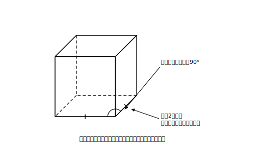
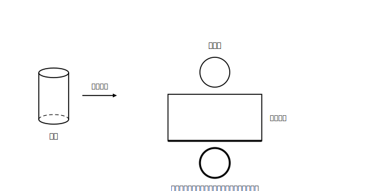
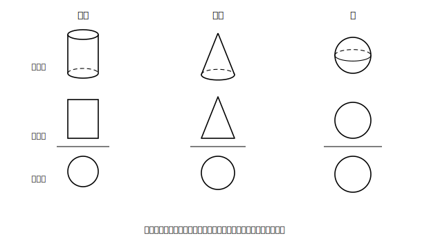

# L06 平面の上に写し取る〜見取図・展開図・投影図

## ねらい

- 立体を平面の上に表す3つの方法、**見取図・展開図・投影図（とうえいず）**の得意と不得意を知り、たがいに照合できるようになる。
- 見取図では**実際の長さや角がそのまま見えるとは限らない**ことを、具体の場所で指摘できるようになる。

## 準備運動：小学校からの2つの道具

見取図と展開図は、小学校4年生からのつき合いだ。

1. 立方体の見取図をかいてみよう（見えない辺は破線で）。
2. 立方体の展開図を1つかいてみよう。

かけただろうか。今日はこの2つの道具を点検し直したうえで、**中学で初登場**の3つ目の道具・投影図を仲間に加える。

## 主概念1：見取図は便利で、そして正直ではない

見取図は、立体の全体の形をひと目で伝える絵だ。ただし、平らな紙に奥行きを押しこんでいる以上、**犠牲にしているもの**がある。

いまかいた立方体の見取図をよく見てみよう。立方体の面はぜんぶ合同な正方形のはずだ。ところが見取図では、正面の面だけが正方形で、奥行き方向の面は**平行四辺形につぶれて**いる。実際には等しい12本の辺も、紙の上では長さがまちまちだ。直角のはずの角が、直角に見えない場所もある。

**見取図の約束**: 実際には平行な辺は、図でも平行にかく。見えない辺は破線でかく。——守られているのはこのあたりまでで、**長さと角の実際の大きさは、見取図から直接読み取ってはいけない**。

<!-- figure-spec: 意図=見取図の限界の明示。要素=立方体の見取図。実際は等しい2辺（正面の辺と奥行きの辺）に印をつけ「実際はどちらも同じ長さ」の注記、直角なのに直角に見えない角に印と「実際は90°」の注記。alt=立方体の見取図では辺の長さや角の大きさが実際のとおりに見えないことを示す図。描かないもの=投影図。生成方法=SVG。 -->

L03で「ねじれの位置の2直線が、見取図では交わって見えることがある」と述べたのも同じ事情だ。見取図は**形の雰囲気を運ぶ道具**であって、長さ・角度・交わりの証拠にはならない。証拠がほしいときは、次の2つの道具の出番になる。

## 主概念2：展開図〜面の「ほんとうの形」を運ぶ

**展開図**は、立体の表面を切り開いて平面に広げた図だ。広げてしまえばすべての面が紙の上にぺたりと乗るから、**各面の実際の形と大きさがそのまま現れる**。見取図で犠牲になった情報を、展開図が回収してくれる。

そのかわり、立体としての全体の形は失われる。組み立てたときにどの辺とどの辺が重なるか。それを追う力が展開図を読む力だ。

**紙上実験**: 円柱の展開図を予想してみよう。底面の円2つと、側面。側面は曲面だが、切り開くと——**長方形**になる（缶のラベルをはがして広げる場面を想像しよう）。この長方形の横の長さは、底面の円周とぴったり等しい。巻き戻すときに円周に沿って貼りつくのだから。この「側面の横の長さ＝底面の円周」は、表面積（L08）の急所になる。

<!-- figure-spec: 意図=円柱の展開図と対応関係の明示。要素=円柱の見取図と、その展開図（円2つ＋長方形）。長方形の横の辺と底面円の円周を同色で強調し「長さが等しい」の注記。alt=円柱の展開図。側面の長方形の横の長さは底面の円周に等しい。描かないもの=数値・円錐の展開図（L08で扱う）。生成方法=SVG。 -->

## 主概念3：投影図〜真正面と真上から

3つ目の道具は、中学の数学で初めて学ぶ。

> 【ことば】**投影図・立面図・平面図**
> 立体を**真正面から見た図**を**立面図（りつめんず）**、**真上から見た図**を**平面図（へいめんず）**といい、この2つを上下に組にして表した図を**投影図**という。ふつう、上に立面図・下に平面図をかき、間を横線で仕切る。

投影図の強みは、決まった方向から**まっすぐ写す**ことにある。真正面から見た幅と高さ、真上から見た底面の形は、**実際の大きさのまま**図に現れる（見取図のようにつぶれない）。ただし、何もかもが実寸になるわけではない。**写す方向に対して斜めに傾いた線分は、実際より短く写る**（練習5の正四角錐の辺で確かめられる）。

代表的な立体で照合してみよう。

- **円柱**（立てて置く）: 立面図は**長方形**・平面図は**円**
- **円錐**（底面を下に）: 立面図は**三角形**・平面図は**円**
- **球**: 立面図も平面図も**円**
- **四角柱**（立てて置く）: 立面図は長方形・平面図は四角形

<!-- figure-spec: 意図=投影図の型の提示と照合訓練。要素=3つの立体（円柱・円錐・球）それぞれについて「見取図」と「投影図（上=立面図・下=平面図・仕切り横線）」を対にして並べる。alt=円柱は長方形と円、円錐は三角形と円、球は円と円の投影図になることを示す図。描かないもの=矢印以外の装飾。生成方法=SVG。 -->

ここで面白いのは、円柱・円錐・球の**平面図がぜんぶ円**だということ。平面図だけでは3つを区別できない。立面図と**組で読む**から立体が決まる。逆に、投影図から立体を当てる遊び（練習3）は、頭の中で立体を組み上げる最高のトレーニングになる。

ひとつ注意。円錐の立面図（三角形）の**横の辺の長さは底面の直径**であって、母線の長さではない……と言いたいところだが、実は立面図の三角形の**斜めの辺**がちょうど母線の実際の長さを表す（真正面から見ると、いちばん外側の母線は傾きがそのまま見えるからだ）。どの長さが実際のまま現れて、どの長さがそうでないか。図の種類ごとに問い直す癖をつけよう。

:::guide
**3つの道具の分担表**

見取図=全体の形の雰囲気（長さ・角は信用しない）／展開図=面の実形と表面のつながり（全体の形は失う）／投影図=写した方向の幅・高さの実寸（斜めに傾いた線は短く写る。奥行きは2枚の組で復元）。この分担を意識すると「いま知りたい情報はどの図に写っているか」から逆算して図を選べるようになる。計量の子単元では、表面積=展開図・体積や高さ=立面図寄り、という使い分けが自然に現れる。
:::

:::guide
**よくある考え方とその修正**

投影図の読みで起こりやすいのは、立面図と平面図の役割の取り違え。たとえば円錐で「円が見えたから立面図は円」としてしまう形だ。円が見えるのは**真上から**（平面図）。修正には、判定の最初に「いまどちらの方向から見ているか」を声に出して固定するのが効く。相手はだれ？チェックの投影図版として「**どっちから見た図？チェック**」を練習3・4で運用してみてほしい。
:::

:::zatsudan
「投影」という言葉、漢字どおりに読めば「影を投げる」。立体に真正面から光を当てて、後ろの壁にできた影の輪郭をなぞる。それが立面図の正体だと思うと、名前がいきなり具体的になる。晴れた日の自分の影が、時間帯によって長くなったり縮んだりするのも、光の向きが変わると投影のされ方が変わるからだ。
:::

## 練習

1. 立方体の見取図（準備運動1でかいたもの）について、「実際には等しいのに、図の上では長さが違って見える2辺」の組を1つ指摘しよう。また「実際には直角なのに、直角に見えない角」を1つ指摘しよう。
2. 三角柱（底面が直角三角形）を机に立てて置いた。展開図をかいてみよう（長方形が3枚と三角形が2枚。どの長方形の横の長さが底面のどの辺と等しいか、対応も書きこむこと）。
3. 次の投影図はどの立体か。「立面図が長方形・平面図が円」「立面図が三角形・平面図が円」「立面図も平面図も円」をそれぞれ答えよう（どっちから見た図？チェックを声に出してから）。
4. 底面の半径が等しい円柱と円錐がある。**平面図だけ**を見て2つを区別することはできるだろうか。できないとしたら、どの図を見れば区別できるか。
5. 正四角錐（底面が正方形で、頂点が底面の中央の真上にある四角錐）を、底面を下にして置いた。投影図（立面図と平面図）を予想してかいてみよう。平面図には、頂点から見えている4本の辺がどう写るかも考えること。

:::stretch
**S1** 立方体を1つの平面で切ると、切り口にはいろいろな形が現れる。角を浅く切り落とせば三角形。では、切り口が**長方形**になる切り方を1つ、図をかいて示してみよう。もっと変わった形（五角形や六角形）が出るかどうか、気になったら「**立方体　切り口　六角形**」で調べてみよう。切断の系統的な考察はこの章の範囲の外だが、投影図と同じく「立体を平面で捉える」遊びとして一級品だ。
:::

---

対応解答: answer_key_L05-08.md

<!-- gen_nav:nav:start（自動生成・手編集しない） -->

---

[← 前のレッスン](lesson_05.md)｜[単元の目次](README.md)｜[解答](answer_key_L05-08.md)｜[次のレッスン →](lesson_07.md)

<!-- gen_nav:nav:end -->
