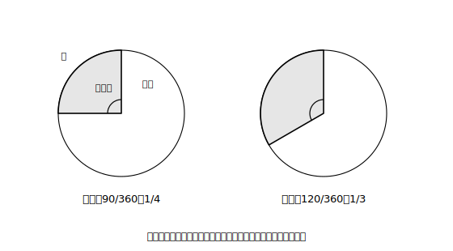

# L07 円をもう一度〜πと扇形

## ねらい

- 円周率を文字**π（パイ）**で表し、円周・円の面積をπを使った式で正しく書けるようになる。
- **πの検算**の習慣を導入する（この章の計量ぜんぶで使う）。
- **扇形（おうぎがた）**の弧の長さ・面積が**中心角に比例する**ことを使って計算できるようになる。

## 準備運動：円の求積の学び直し

ここから計量の子単元に入る。最初の仕事は、小学校の円の公式の**総点検**だ。あいまいなまま先へ進むと、表面積・体積の計算がぜんぶぐらつく。

1. 半径5cmの円の、円周の長さを求めよう（円周率は3.14として）。
2. 同じ円の面積を求めよう。
3. 「円周＝直径×円周率」と「面積＝半径×半径×円周率」。この2つの式で、**直径**を使うのはどちらだったか。

3が即答できなかった人は、ここで完全に固めよう。**円周は直径×円周率、面積は半径×半径×円周率**。円周と面積で「直径か半径か」が違う——ここが混線の名所だ。

## 主概念1：円周率をπとよぶ

円周率3.14159……は、どこまでも続いて終わらない数だ。3.14はその近似にすぎない。そこで中学からは、四捨五入した数の代わりに**文字**で表す。

> 【ことば】**円周率π**
> 円周率を、文字**π（パイ）**で表す。半径rの円について、
> **円周 ℓ＝2πr　　面積 S＝πr²**

πを使った式の書き方の約束: πは数と文字の**間**に書く（例: 2πr・6π cm²）。「6π cm²」は「6×3.14…cm²」という**正確な値そのもの**であって、計算のやり残しではない。むしろ3.14で計算した18.84cm²のほうが丸めた近似値だ。πのまま答える方が正確。この感覚の切り替えが中学流になる。

なお「円周＝直径×円周率」は、直径＝2rだから ℓ＝2r×π＝2πr。同じ式の着替えにすぎない。

## 主概念2：πの検算

πの式の計算で起こる事故は、だいたい2種類に決まっている。①面積のつもりで「半径×半径」だけ計算してπを落とす ②円周と面積の式を取り違える。そこで、答えを書いたら毎回この確認を通そう。

> 【ことば】**πの検算**
> 計量の答えを書いたら、最後に確認する。
> ①**πはついているか**（円がからむ長さ・面積・体積の正確な値には、ふつうπが残る）
> ②**次数は合っているか**（長さならrが1つ・面積ならr²・体積ならr³の形）
> ③**単位は相手に合っているか**（長さcm・面積cm²・体積cm³）

たとえば半径4cmの円の面積を「16cm²」と書いてしまったら、①でπが無いことに気づける。「8π cm²」と書いたら（2πr と πr² の取り違え）、②で「面積なのにrが1つしかない」ことに気づける。検算は3秒で済む。この3秒を、この章の計量の全設問で通す。

## 主概念3：扇形は「円の一部」〜中心角に比例

> 【ことば】**扇形**
> 円の2つの半径と弧（こ）で囲まれた図形を**扇形**という。2つの半径がつくる角を**中心角（ちゅうしんかく）**という。

扇形は、円をケーキのように切り分けた1切れだ。だから話の軸は「**円全体の何分のいくつか**」。1回転は360°だから、中心角a°の扇形は円全体のa/360にあたる。書き方をひとつ——この本では分数を a/360 のように1行で書くが、**ノートでは横線を引いて上下に重ねて書こう**（横線の上にa・下に360。教科書と同じ縦の形）。縦に書くほうが、約分の線も引きやすい。そして、

**同じ半径の扇形では、弧の長さも面積も、中心角に比例する。**

中心角が2倍なら弧も面積も2倍。切り分けの絵を思えば自然に納得できる。式にすると:

> 【公式】**扇形の弧の長さと面積**（半径r・中心角a°）
> **弧の長さ ℓ＝2πr × a/360　　面積 S＝πr² × a/360**

<!-- figure-spec: 意図=比例の見方の視覚化。要素=円を中心角90°・120°の扇形に切り分けた2例。それぞれに「全体の90/360＝1/4」「全体の120/360＝1/3」のラベル。半径・弧・中心角の名称ラベル。alt=扇形は円全体の中心角/360にあたることを示す図。描かないもの=数値の長さ。生成方法=SVG。 -->

**例題**: 半径6cm・中心角120°の扇形の弧の長さと面積を求めよう。

120/360＝1/3 だから、
- 弧の長さ ℓ＝2π×6×1/3＝**4π（cm）**
- 面積 S＝π×6²×1/3＝36π×1/3＝**12π（cm²）**

πの検算をすると、①πついている ②弧はrが1つ・面積はr²由来 ③cmとcm² ✓。

逆向きの問いにも慣れておこう。「半径9cmの扇形で、弧の長さが6πcmのとき、中心角は？」——円全体の円周は2π×9＝18π。弧はその 6π/18π＝1/3 にあたるから、中心角は 360°×1/3＝**120°**。**弧の長さから中心角を割り出す**このやり方は、円錐の側面（L08）でそのまま主役になる。

:::guide
**なぜ計量の前に円をやり直すのか**

表面積・体積の計算は、円の求積を部品として何度も呼び出す。部品がぐらついたままだと、立体の考え方が合っていても答えが崩れ、学習者は「立体が苦手」と誤診してしまう。円の処理でのつまずきが立体の理解の問題に見えてしまう——この誤診を先回りして防ぐ設計判断で、本書は円の学び直しを計量の入口に1コマ分置いた。πの検算はその再発防止装置。答案の事故を「間違えたら直す」でなく「書いた直後に自分で検出する」に変えるのが狙いだ。
:::

:::guide
**a/360を先に約分する**

扇形の計算は「a/360を先に約分して、円全体の何分のいくつかを出してから掛ける」と圧倒的に軽くなる（120°→1/3、90°→1/4、60°→1/6、45°→1/8、30°→1/12）。この分数は「切り分けの絵」と直結しているので、式の丸暗記より忘れにくく、検算にもなる。中心角に比例するという見方は、あとの学年で出会う関数の見方（一方が2倍なら他方も2倍）の練習台でもある。
:::

:::zatsudan
扇形の「扇」は、あおぐ道具の扇（おうぎ）、折りたたみのあの扇子（せんす）だ。開いた扇子の形がそのまま名前になっている。ついでに言うと、扇子は閉じれば1本の棒。開く角度を変えれば、同じ半径のまま弧の長さだけが変わる。中心角に比例する、を体現した道具でもある。名前をつけた人は、たぶんこの形が好きだったんだと思う。
:::

## 練習

すべての答えでπの検算（①π ②次数 ③単位）を通すこと。

1. 半径7cmの円の、円周の長さと面積を求めよう。
2. 半径4cm・中心角90°の扇形の、弧の長さと面積を求めよう。
3. 半径8cm・中心角45°の扇形の、弧の長さと面積を求めよう。
4. 半径3cmの扇形で、弧の長さが2πcmのとき、中心角を求めよう。
5. 誤り探し。次の答案の誤りを、πの検算のどの項目で検出できるか指摘し、正しい答えに直そう。
   「半径5cmの円の面積: 5×5＝25（cm²）」

:::stretch
**S1** 半径r・弧の長さℓの扇形の面積は **S＝(1/2)ℓr** と書けることが知られている。半径6cm・中心角120°の扇形（例題）で、この式が本文の答え12πcm²と一致することを確かめてみよう。さらに、S＝πr²×a/360 と ℓ＝2πr×a/360 から S＝(1/2)ℓr を文字の計算で導いてみよう（a/360を消すのがコツだ）。
:::

---

対応解答: answer_key_L05-08.md

<!-- gen_nav:nav:start（自動生成・手編集しない） -->

---

[← 前のレッスン](lesson_06.md)｜[単元の目次](README.md)｜[解答](answer_key_L05-08.md)｜[次のレッスン →](lesson_08.md)

<!-- gen_nav:nav:end -->
