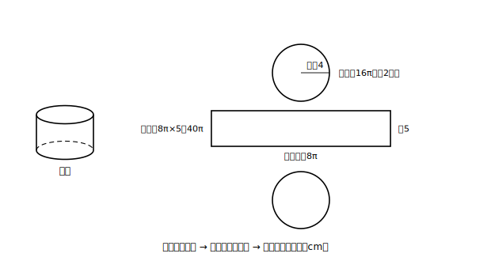
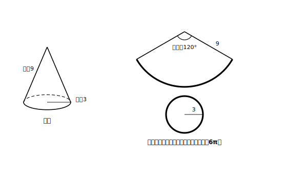

# L08 表面積〜展開図で平面にもどす

## ねらい

- **表面積**を「展開図の面積」として計算する型を身につける。
- 円錐の側面（扇形）の中心角を、**底面の円周と弧の長さが一致する**ことから「逆向きに」求められるようになる。

## 準備運動：部品の確認

1. 半径3cmの円の円周と面積を、πを使って答えよう。
2. 半径9cm・中心角120°の扇形の面積を求めよう。
3. 円柱の展開図で、側面の長方形の横の長さは何と等しかったか（L06）。

3の答えは**底面の円周**。今日はこの一致が2回、決定的な仕事をする。

## 主概念1：表面積は、面積の問題

> 【ことば】**表面積**
> 立体のすべての面の面積の合計を**表面積（ひょうめんせき）**という。そのうち側面全体の面積を**側面積（そくめんせき）**、1つの底面の面積を**底面積（ていめんせき）**という。

相手はだれ？チェックの③でいえば、表面積の相手は**面積**だ。立体の問題の顔をしているが、展開図に開いてしまえば、やることは平面図形の求積だけ。だから型はいつも同じ。

**表面積の型: 展開図をかく（想像する）→ 部品ごとに面積を求める → 合計する**

**例題1（角柱）**: 底面が縦3cm・横4cmの長方形で、高さ5cmの四角柱。展開図の部品は、底面2枚＋側面の長方形4枚。側面は「横の長さが底面の周・縦が高さの1枚の長方形」とまとめて考えるのが速い。
- 底面積＝3×4＝12（cm²）が2枚 → 24
- 底面の周＝(3＋4)×2＝14（cm）→ 側面積＝14×5＝70（cm²）
- 表面積＝24＋70＝**94（cm²）**

**例題2（円柱）**: 底面の半径4cm・高さ5cmの円柱。
- 底面積＝π×4²＝16π（cm²）が2枚 → 32π
- 側面の長方形: 横＝底面の円周＝2π×4＝8π・縦＝5 → 側面積＝8π×5＝40π（cm²）
- 表面積＝32π＋40π＝**72π（cm²）**　（πの検算: π✓・面積の次数✓・cm²✓）

<!-- figure-spec: 意図=表面積の型（展開→部品→合計）の視覚化。要素=例題2の円柱見取図と展開図。展開図の円に「半径4」、長方形に「縦5」「横＝円周8π」の寸法。部品ごとの面積の吹き出し。alt=底面の半径4cm高さ5cmの円柱の展開図と各部品の面積。描かないもの=円錐（次の図）。生成方法=SVG。 -->

## 主概念2：角錐の表面積〜三角形の高さは「側面の上」で測る

**例題3（正四角錐）**: 底面が1辺6cmの正方形で、側面が合同な二等辺三角形4枚。三角形の高さ（頂点から底辺までの、**側面の面の上で測った**長さ）を5cmとする。
- 底面積＝6×6＝36（cm²）
- 側面積＝(1/2×6×5)×4＝15×4＝60（cm²）
- 表面積＝36＋60＝**96（cm²）**

注意がひとつ。側面の三角形の高さ5cmは、**錐体としての高さ**（頂点から底面までの距離・L04）とは別物だ。展開図の三角形の上で測る長さと、立体の中で垂直に測る長さ。同じ「高さ」という言葉が2つの相手を指す。問題文がどちらを与えているか、必ず確かめてから使おう（本書の問題では、表面積の計算に必要な長さは側面上の長さとして与える）。

## 主概念3：円錐の側面〜中心角を逆向きに求める

円錐の展開図は、底面の**円**1枚と、側面の**扇形**1枚。扇形の半径は**母線の長さ**になる（側面をえがいた線分がそのまま開かれるからだ・L05）。

問題は扇形の**中心角**——展開図のどこにも書いていない。ここで、円柱のときと同じ一致が効く。

**側面の扇形の弧は、組み立てると底面の円周にぴったり貼りつく。だから、弧の長さ＝底面の円周。**

弧の長さが分かれば、中心角はL07の「逆向き」の手順で割り出せる。

**例題4（円錐）**: 底面の半径3cm・母線の長さ9cmの円錐の表面積を求めよう。
1. 底面の円周＝2π×3＝6π（cm）。これが側面の扇形の弧の長さ。
2. 扇形の半径は母線の9cm。半径9cmの円全体の円周は 2π×9＝18π（cm）。
3. 弧はその 6π/18π＝**1/3** にあたる → 中心角＝360°×1/3＝**120°**
4. 側面積＝π×9²×1/3＝81π/3＝**27π（cm²）**
5. 底面積＝π×3²＝9π（cm²）
6. 表面積＝27π＋9π＝**36π（cm²）**　（πの検算 ✓）

<!-- figure-spec: 意図=「逆向きに考える」型の視覚化。要素=例題4の円錐見取図と展開図（半径9の扇形＋半径3の円）。扇形の弧と底面円の円周を同色太線にし「どちらも6π」の注記。中心角120°のラベル。alt=円錐の展開図。側面の扇形の弧の長さは底面の円周と等しい。描かないもの=母線から高さを求める計算（この章では扱わない）。生成方法=SVG。 -->

手順を言葉にしておこう——**求めたい中心角から出発せず、先に分かる「底面の円周」から逆向きにたどる**。①底面の円周を出す ②母線の円全体の円周と比べて「何分のいくつ」かを出す ③中心角・側面積に翻訳する。この「分かる端から逆にたどる」考え方は、数学のあちこちで再登場する大物だ。

:::guide
**「1/3」を持ち回すと速くて安全**

例題4で出た1/3（＝弧/円周＝中心角/360）は、**底面の半径/母線**（3/9）とも一致する。ℓ＝2πr が半径に比例するからだ。慣れてきたら「側面積＝母線の円の面積×(底面の半径/母線)」で一気に出してよい（π×9²×3/9＝27π）。ただし最初のうちは、例題4の6ステップを言葉つきでなぞる方が、なぜ成り立つかが残る。速さは理解のあとからついてくる。
:::

:::guide
**よくある考え方とその修正**

円錐の側面積で起こりやすいのは、扇形の半径に母線でなく**底面の半径**を入れてしまう混同だ。修正の起点は展開図を毎回手でかくこと。扇形の半径が「頂点から底面の円周までの長さ（母線）」であることは、図をかけば取り違えようがない。表面積の設問は、式から入らず**展開図から入る**。この順番を守ることが、いちばんの事故防止になる。
:::

:::zatsudan
表面積の計算をしていると、気づくことがある。立体の問題のはずなのに、やっている作業は長方形・三角形・円・扇形と、ぜんぶ平面図形の面積だ。立体の「表面」は、厚みのない面でできているから、開いてしまえば平面の世界に帰ってくる。難しそうな相手を、よく知っている世界に持ちこんで料理する。数学の常とう手段が、ここでも動いているわけだ。
:::

## 練習

すべての答えでπの検算を通すこと。円錐は展開図をかいてから式を立てること。

1. 底面が1辺5cmの正方形で、高さ8cmの四角柱の表面積を求めよう。
2. 底面の半径3cm・高さ7cmの円柱の表面積を求めよう。
3. 底面が1辺8cmの正方形、側面の二等辺三角形の高さ（側面上で測った長さ）が6cmの正四角錐の表面積を求めよう。
4. 底面の半径2cm・母線の長さ6cmの円錐について、
   (1) 側面の扇形の中心角を求めよう。
   (2) 表面積を求めよう。
5. 誤り探し。「底面の半径4cm・母線の長さ8cmの円錐の側面積: π×4²×(180/360)＝8π（cm²）」について、扇形の半径の取り違えを直し、正しい側面積を求めよう（中心角も求め直すこと）。

:::stretch
**S1** 底面の半径r・母線の長さℓの円錐について、例題4の手順を文字のまま実行し、側面積が **πℓ²×(r/ℓ)＝πrℓ** となることを導いてみよう（途中で出る「何分のいくつ」がr/ℓになるところが山場だ）。導けたら、練習4(2)をこの式で検算してみよう。
:::

---

対応解答: answer_key_L05-08.md

<!-- gen_nav:nav:start（自動生成・手編集しない） -->

---

[← 前のレッスン](lesson_07.md)｜[単元の目次](README.md)｜[解答](answer_key_L05-08.md)｜[次のレッスン →](lesson_09.md)

<!-- gen_nav:nav:end -->
