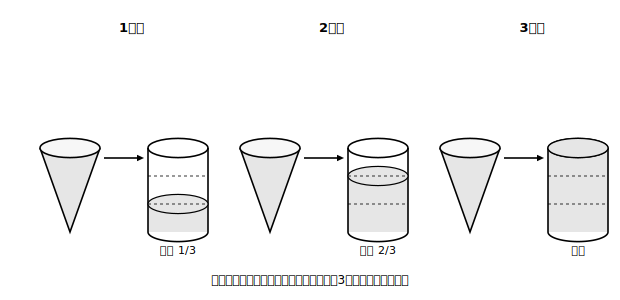

# L09 体積〜柱体と錐体

## ねらい

- 柱体の体積**V＝Sh**（底面積×高さ）を、角柱・円柱で使えるようになる。
- 錐体の体積が同じ底面・同じ高さの柱体の**ちょうど1/3**であることを「予想→実験」の流れで受け入れ、**V＝(1/3)Sh**を使えるようになる。

## 準備運動：小学校の体積

1. 縦4cm・横5cm・高さ3cmの直方体の体積を求めよう。
2. 底面積が12cm²・高さ5cmの四角柱の体積は？
3. 相手はだれ？チェック③: 体積の単位は何だったか。面積の単位とどう違うか。

直方体の体積＝縦×横×高さは、「縦×横」を底面積とまとめれば**底面積×高さ**と読み直せる。今日はこの読み直しが出発点だ。

## 主概念1：柱体の体積は、底面積×高さ

> 【公式】**柱体の体積**
> 底面積S・高さhの柱体（角柱・円柱）の体積は　**V＝Sh**

なぜこの形か。L05で見たとおり、柱体は**底面を高さの方向にまっすぐ動かした跡**だった。底面積Sの板を高さhのぶんだけ積み上げた量。だから底面の形が三角形だろうと円だろうと、**底面積さえ分かれば同じ式**で済む。

**例題1**: 底面の半径3cm・高さ7cmの円柱の体積。
- 底面積 S＝π×3²＝9π（cm²）
- V＝9π×7＝**63π（cm³）**　（πの検算: π✓・体積の次数（r²×高さ）✓・cm³✓）

## 主概念2：錐体は、同じ柱体のちょうど1/3

底面も高さも同じ円柱と円錐を並べる。円錐の体積は、円柱の何分のいくつだろう。

**先に、自分の予想を書いてみよう**（半分？ 3分の1? 4分の1?）　予想: ＿＿＿＿

実験で確かめる。円錐の容器に水をすりきりまで入れ、同じ底面・同じ高さの円柱の容器に移す。1杯めで1/3くらいの高さ。2杯め、3杯め——**ちょうど3杯で、ぴったり満杯**になる。角錐と角柱でやっても同じく3杯。

<!-- figure-spec: 意図=「予想→実験で1/3を認める」導入の紙上再現。要素=同じ底面・同じ高さの円錐容器と円柱容器。3コマ漫画形式で、1杯め（水位1/3）・2杯め（2/3）・3杯め（満杯）。各コマに水位線と分数ラベル。alt=円錐3杯分の水で同じ底面と高さの円柱がちょうど満杯になる実験。描かないもの=証明めいた図式。生成方法=SVG。 -->

> 【公式】**錐体の体積**
> 底面積S・高さhの錐体（角錐・円錐）の体積は　**V＝(1/3)Sh**（同じ底面・高さの柱体の**1/3**）

正直に言っておこう。この実験は「ちょうど1/3らしい」と強く納得させてくれるが、**どんな錐体でも必ずぴったり1/3になることの証明ではない**（それを言い切る道具は、ずっと先の学習で手に入る）。中学のいまは、実験で確かめた事実として**認めて使う**。「認めたものは認めたと分かって使う」のも、数学の誠実さのうちだ。

**例題2**: 底面が1辺6cmの正方形で、高さ5cmの正四角錐の体積。
- 底面積 S＝6×6＝36（cm²）
- V＝(1/3)×36×5＝**60（cm³）**

**例題3**: 底面の半径3cm・高さ4cmの円錐の体積。
- V＝(1/3)×π×3²×4＝(1/3)×36π＝**12π（cm³）**

高さの確認をひとつ。錐体の高さは、**頂点から底面をふくむ平面までの距離**（L04）であって、側面の上で測った長さ（L08の三角形の高さや母線）ではない。体積の式に入れてよいのは、垂直に測ったこの距離だけだ。

:::guide
**1/2と答えたくなる気持ちの出どころ**

錐体の体積を「柱体の半分」と予想したくなるのは、平面図形で三角形が長方形の半分だった記憶（底辺×高さ÷2）からの類推だ。類推としては筋がいい——だが実験は1/3を返してくる。「平面で1/2だったものが、空間では1/3になる」という結果そのものを、次元がひとつ上がると割合も変わる例として覚えておくと、混同がむしろ記憶の取っ手に変わる。予想を書いてから実験結果を見る、という本文の順番は、この「予想が外れた驚き」を記憶の接着剤にするための設計だ。
:::

:::guide
**「×1/3」を最後に回さない**

(1/3)×36×5 のような計算は、**先に3で割れる数を探して約分する**と軽い（36÷3＝12→12×5＝60）。円錐でも (1/3)×9π×4 は 9÷3＝3 を先に片づける。1/3を最後に回すと、割り切れない小数に突っこんで事故が起こりやすい。「錐体を見たら、まず3で割れる相手を探す」を計算の癖にしたい。
:::

:::zatsudan
柱体の体積が「底面積×高さ」で済む理由を、カードの束で考えてみよう。1枚1枚は薄っぺらな長方形でも、束ねて積み上げれば立派な四角柱になる。体積は「底面という薄い層を、高さのぶんだけ重ねた量」。そう思うと、V＝Shは公式というより、積み重ねの様子をそのまま式に書き取っただけ、という顔に見えてくる。
:::

## 練習

すべての答えでπの検算を通すこと。

1. 底面積が15cm²・高さ6cmの三角柱の体積を求めよう。
2. 底面の半径5cm・高さ8cmの円柱の体積を求めよう。
3. 底面が1辺9cmの正方形で、高さ4cmの正四角錐の体積を求めよう。
4. 底面の半径6cm・高さ5cmの円錐の体積を求めよう。
5. 誤り探し。「底面の半径3cm・高さ4cmの円錐の体積: π×3²×4×(1/2)＝18π（cm³）」の誤りを指摘し、正しい体積に直そう。
6. 同じ底面・同じ高さの円柱と円錐がある。円柱の体積が45πcm³のとき、円錐の体積を求めよう（計算はひと桁で済むはずだ）。

:::stretch
**S1** 立方体（1辺6cm）の1つの面を底面とし、向かい合う面の中央の真上……ではなく、立方体の**中心**を頂点とする正四角錐を考える（底面は立方体の1つの面・高さは3cm）。この角錐の体積を求め、同じ角錐が立方体の6つの面それぞれから作れることを使って、「6個分の体積の合計」が立方体の体積と一致することを確かめてみよう。1/3の式が、パズルの側からも支持されている。そんな手ざわりが得られるはずだ。
:::

---

対応解答: answer_key_L09-11.md

<!-- gen_nav:nav:start（自動生成・手編集しない） -->

---

[← 前のレッスン](lesson_08.md)｜[単元の目次](README.md)｜[解答](answer_key_L09-11.md)｜[次のレッスン →](lesson_10.md)

<!-- gen_nav:nav:end -->
