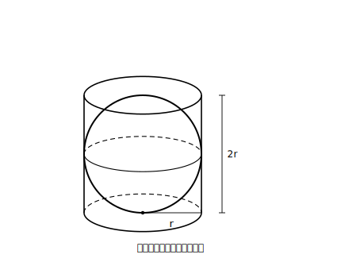

# L10 球の表面積と体積

## ねらい

- 半径rの球の体積 **V＝(4/3)πr³**・表面積 **S＝4πr²** を、「ぴったり入る円柱との比較」を足がかりに使えるようになる。
- **r²とr³の見分け検算**（面積はr²・体積はr³）で、2つの公式の混同を自分で検出できるようになる。

## 準備運動：比較の相手をつくる

半径rの球が、円柱の容器に**ぴったり入っている**とする（横にも上下にもすき間なし）。

1. この円柱の底面の半径は、rを使って表すといくらか。
2. この円柱の高さは、rを使って表すといくらか。
3. この円柱の体積を、rを使って表そう（L09の公式で）。

答え: 底面の半径r・高さ2r（球の直径ぶん）・体積 V＝πr²×2r＝**2πr³**。この円柱が、今日の測定の「ものさし」になる。

<!-- figure-spec: 意図=比較の土台の視覚化。要素=円柱の見取図の中に内接する球。底面の半径r・高さ2rの寸法線。「横にも上下にもすき間なし」の注記。alt=半径rの球が底面の半径r高さ2rの円柱にぴったり入っている図。描かないもの=数値。生成方法=SVG。 -->

## 主概念1：球の体積は、ぴったり入る円柱の2/3

球の体積は、円柱のものさしの何分のいくつだろう。**まず予想を書こう**。予想: ＿＿＿＿

実験で確かめる。球の形の容器（半球の容器2つでもよい）に水を満たし、ぴったりサイズの円柱の容器に移す。水位は円柱の**ちょうど2/3**の高さで止まる。L09の円錐実験の続きでいえば、同じ円柱を、円錐は1/3、球は2/3で満たす。

> 【公式】**球の体積**
> 半径rの球の体積は、ぴったり入る円柱の体積の**2/3**。
> **V＝(2/3)×2πr³＝(4/3)πr³**

計算を確かめよう: 円柱2πr³の2/3は (2/3)×2πr³＝4πr³/3。たしかに**(4/3)πr³**だ。

これもL09と同じで、実験で「認めて使う」段階の事実だ（ぴったり2/3であることの説明は、先の学習の楽しみに取っておこう）。

**例題1**: 半径3cmの球の体積。
- V＝(4/3)×π×3³＝(4/3)×27π＝**36π（cm³）**（27÷3＝9を先に→9×4＝36）

## 主概念2：球の表面積は4πr²

> 【公式】**球の表面積**
> 半径rの球の表面積は　**S＝4πr²**

これは「半径rの円（球をまっぷたつにしたときに現れる円）の面積πr²の、ちょうど**4枚分**」と読める。ついでに気づいてほしい一致がある。ぴったり入る円柱の**側面積**は 2πr×2r＝4πr²。**球の表面積は、その円柱の側面積と同じ値**になっている。覚えるときの取っ手にしよう（この一致も、いまは事実として認めて使う）。

**例題2**: 半径3cmの球の表面積。
- S＝4×π×3²＝**36π（cm²）**

例題1と2で、半径3cmの球は体積36πcm³・表面積36πcm²——数字がそろった。これは半径3cmだけの偶然（r³とr²に3を入れるとそろう）で、半径が変われば当然ずれる。だからこそ、**単位（cm³とcm²）まで書いて相手を区別する**習慣が効く。

> 【ことば】**r²とr³の見分け検算**
> 球の2つの公式は形が似ていて、混同しやすいと言われる（よく知られた注意であって、調査データの話ではない）。書いた式を必ずこう見直そう。
> **表面積（面積）→ r²の式・係数4／体積 → r³の式・係数4/3**
> 「面積は長さ×長さ、体積は長さ×長さ×長さ」。次数が相手を教えてくれる。

:::guide
**2つの公式の置き場所**

球はこの章で唯一「展開図がかけない」立体だ（表面が曲がっていて、切り開いても平面にぴたりと広がらない）。だから表面積をL08の型（展開図→部品→合計）で出すことができず、公式を認めて使う形になる。その分、公式の**受け皿**を用意したい。体積は「円柱の2/3」という比較で、表面積は「まっぷたつにしてできる円の4枚分」「ぴったり円柱の側面積と同じ」という一致で持つ。裸の文字列として暗記するより、比較・一致のセットで持つ方が、取り違えへの耐性がはるかに高い。
:::

:::guide
**半球の扱い**

半球（球をまっぷたつにした立体）の体積は球の半分でよいが、**表面積は「球の表面積の半分」では終わらない**。まっぷたつにしたときに現れる平らな円の面（πr²）が、新しい表面として加わる。半球の表面積＝2πr²＋πr²＝3πr²。「切ると表面が増える」は立体の面白い性質で、相手はだれ？チェック（どの面が表面か）を働かせる好例だ。練習4で試そう。
:::

:::zatsudan
完全な球を平らな面の上に置くと、触れ合うのは——面でもなく線でもなく、たった**1点**だ。球は表面のどこにも平らな部分がないので、平面とは1点でしか接することができない。現実のボールは自分の重みや材質でわずかにつぶれて小さな面で触れるけれど、数学の球はどこまでも硬い理想の球——そう思って見ると、球という図形の徹底ぶりがちょっと恐ろしくなってくる。
:::

## 練習

すべての答えで、r²とr³の見分け検算とπの検算を通すこと。

1. 半径6cmの球の体積と表面積を求めよう。
2. 半径2cmの球の体積と表面積を求めよう。
3. 直径10cmの球の体積を求めよう（半径に直してから）。
4. 半径3cmの半球について、
   (1) 体積を求めよう。
   (2) 表面積を求めよう（曲面と、まっぷたつの面の平らな円の合計）。
5. 誤り探し。「半径4cmの球の体積: 4×π×4²＝64π（cm³）」について、どの公式と混同したか指摘し、正しい体積に直そう。
6. 半径3cmの球と、その球がぴったり入る円柱（底面の半径3cm・高さ6cm）について、円柱の体積を求め、球の体積（例題1）がその2/3になっていることを確かめよう。

:::stretch
**S1** 半径rの球がぴったり入る円柱について、円錐（底面の半径r・高さ2r）・球・円柱の体積を3つともrの式で表し、その比が **1 : 2 : 3** になることを確かめてみよう（円錐＝(1/3)πr²×2r から始める）。1/3と2/3という2つの実験結果が、1つのきれいな比に合流する。この章の計量の見事なまとめになっている。
:::

---

対応解答: answer_key_L09-11.md

<!-- gen_nav:nav:start（自動生成・手編集しない） -->

---

[← 前のレッスン](lesson_09.md)｜[単元の目次](README.md)｜[解答](answer_key_L09-11.md)｜[次のレッスン →](lesson_11.md)

<!-- gen_nav:nav:end -->
