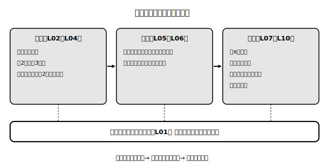

# L11 単元まとめ〜見る道具と測る道具の棚卸し

## ねらい

- この章で手に入れた道具を一覧に棚卸しし、**どの場面でどれを取り出すか**を自分で言えるようにする。
- 回転体→投影図→計量、と道具を**連結して使う**総合演習をやりきる。

## 棚卸し表〜この章の道具一覧

自分の言葉で右の列を埋めながら読み返そう（埋められない行が、復習すべき場所の地図になる）。

| 道具 | どこで | ひとことで言うと（自分の言葉で） |
|---|---|---|
| 相手はだれ？チェック | L01 | 辺か面か・立体か平面図形か・長さか面積か体積か |
| 平面の決定 | L02 | 一直線上にない3点でただ1つ |
| 2直線の3分類と2条件チェック | L03 | 交わる／平行／ねじれ（交わらない**かつ**平行でない） |
| 直線と平面・2平面の分類 | L04 | 含まれる・交わる・平行／交わる・平行。距離＝垂線で測る |
| 動かしてつくる見方・回転体・母線 | L05 | 平行移動→柱体・回転→回転体 |
| 見取図・展開図・投影図 | L06 | 雰囲気／面の実形／真正面・真上の幅と高さは実寸（斜めは短く写る） |
| πと扇形・πの検算 | L07 | 中心角に比例・π/次数/単位の3点見直し |
| 表面積の型・逆向きに考える | L08 | 展開図→部品→合計。弧＝底面の円周 |
| 柱体・錐体の体積 | L09 | V＝Sh・V＝(1/3)Sh（1/3は実験で認めた） |
| 球の公式と見分け検算 | L10 | (4/3)πr³とr³・4πr²とr²。円柱の2/3 |

<!-- figure-spec: 意図=単元全体の構造の一覧化。要素=「見る（位置関係L02-L04）」「表す（L05-L06）」「測る（L07-L10）」の3ブロックを矢印でつなぎ、各ブロックに道具名を列挙。中央に「相手はだれ？チェック」を全ブロック共通の帯として配置。alt=この単元の道具を見る・表す・測るの3グループに整理した関係図。描かないもの=学習時間・進度情報。生成方法=SVG。 -->

ひとつ立ち止まって見てほしいのは、認め方の違いだ。平面の決定やねじれの位置は**定義と条件**で決めた。錐体の1/3や球の2/3は**実験**で認めた。同じ「使ってよい事実」でも、手に入れ方が違う——どの道具をどう認めたのかを言えることは、公式を言えることと同じくらい価値がある。

## 総合演習〜道具を連結する

**例題（見る→表す→測るの連結）**: 直角をはさむ2辺が3cmと4cm、残りの辺が5cmの直角三角形を、4cmの辺を軸として1回転させる。
(1) できる立体の名前を答えよう。
(2) この立体の投影図（立面図・平面図）の形を答えよう。
(3) 体積を求めよう。
(4) 表面積を求めよう。

**解きほぐし**:
(1) 直角三角形を直角をはさむ辺の軸で回転させると**円錐**（L05）。底面の半径は軸でない方の3cm、高さは軸の4cm、母線は斜めの辺の5cm。
(2) 立面図は**三角形**・平面図は**円**（L06）。
(3) V＝(1/3)×π×3²×4＝**12π（cm³）**（L09。πの検算✓）
(4) 展開図から（L08）。底面の円周＝2π×3＝6π。母線5cmの円全体の円周＝10π。何分のいくつ＝6π/10π＝3/5。側面積＝π×5²×3/5＝15π。底面積＝9π。表面積＝15π＋9π＝**24π（cm²）**

1つの立体に、この章の道具がぜんぶ刺さった。回転体として**見て**、投影図で**表して**、展開図と公式で**測る**——3つの見方を行き来できることが、この章の到達点だ。

:::guide
**まとめ方の提案「間違いの博物館」**

総仕上げとして、この章の練習で自分が実際に間違えた問題を3つ選び、「どの相手を取り違えたか（辺と面？ 平行と含まれる？ r²とr³？）」の一言つきでノートに並べる方法を勧めたい。誤りの型はこの章の場合ほぼ数種類に集約されるので、自分の3つを言語化するだけで、単元全体の弱点マップがほぼ完成する。自分の書いた説明に不安があれば、AIチャットに「中1の空間図形の答案です。考え方の抜けがあれば指摘してください: （答案を貼る）」と壁打ちを頼むのも、独習では有効な一手だ。
:::

:::guide
**この先の風景（予告ではなく地続きの話）**

この章の道具は、この章の外でもそのまま使える。πの検算と次数の見方は文字式の計算全般の検算に、「分かる端から逆向きにたどる」（L08）は方程式や作図の発想に、「予想→実験→認めて使う」はデータの活用の構えに、それぞれ通じている。単元の壁より道具の寿命の方がずっと長い。棚卸し表は捨てずに、次の単元のノートの1ページ目に貼っておく価値がある。
:::

:::zatsudan
この章のあいだ、ずっと平らな紙の上で立体の話をしてきた。考えてみれば不思議な芸当だ。紙は完全な平面なのに、見取図・展開図・投影図という3つの「写し方」を発明したおかげで、人間は紙の上で空間を自由に持ち運べるようになった。設計図も、組み立て説明書も、ぜんぶこの発明の子孫。ノート1冊が、実は空間輸送装置だったわけだ。
:::

## 練習

1. 棚卸し表の「ひとことで言うと」の列を、本文を見ずに自分の言葉で3行以上書き直してみよう（書けなかった行のレッスンに戻って復習しよう）。
2. 直方体ABCD-EFGH（L03-1）で、次を答えよう。
   (1) 辺DHとねじれの位置にある辺をすべて挙げよう（2条件チェックつき）。
   (2) 面AEHDと平行な辺をすべて挙げよう。
3. 1辺4cmの正方形を、1辺を軸として1回転させる。
   (1) できる立体の名前と、底面の半径・高さを答えよう。
   (2) 体積と表面積を求めよう。
4. 底面の半径6cm・母線の長さ10cmの円錐について、側面の扇形の中心角と表面積を求めよう。
5. 半径6cmの半球の体積と表面積を求めよう。
6. 誤り探し（総集編）。次の各答案の誤りを、この章のどのチェックで検出できるか指摘し、直そう。
   (1) 「辺ABと辺CGは交わらないから平行である」
   (2) 「半径3cmの球の表面積: (4/3)×π×3³＝36π（cm³）」
   (3) 「半径4cm・中心角90°の扇形の面積: 2π×4×(90/360)＝2π（cm²）」

:::stretch
**S1** 立方体の8つの頂点のうち、1つの面の対角の2頂点と、反対の面の（ねじれた位置にある）対角の2頂点、計4点を結ぶと、すべての面が合同な正三角形の三角錐（正四面体）が現れる。1辺6cmの立方体で実際に見取図をかき、この正四面体の辺が立方体のどの面の対角線になっているかを確かめてみよう。うまく見えたら「**立方体　正四面体　切り出し**」で調べて、残った部分がどんな立体かも見てみよう。
:::

---

対応解答: answer_key_L09-11.md

<!-- gen_nav:nav:start（自動生成・手編集しない） -->

---

[← 前のレッスン](lesson_10.md)｜[単元の目次](README.md)｜[解答](answer_key_L09-11.md)

<!-- gen_nav:nav:end -->
