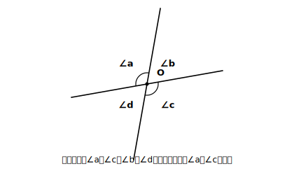
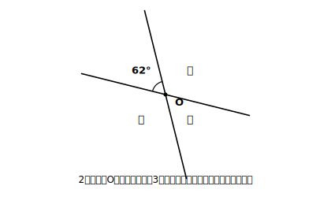

# L01 根拠を言葉にする〜対頂角

## ねらい

- 2直線が交わってできる**対頂角**を知り、対頂角が等しいことを「測ったから」ではなく**根拠を言って**導けるようになる。
- この章全体の進み方（「いつでも成り立つ」と言い切るには根拠が要る）を体験する。

## 準備運動：道具箱の点検（前提診断）

この章では「角」をたくさん扱う。次の3問で道具を点検しよう。

1. 一直線の上に点Oをとり、Oから半直線を1本ひいて2つの角に分けた。一方の角が115°のとき、もう一方は何度だろう。
2. ∠AOBという書き方は、どの角を指しているか。自分の言葉で説明しよう。
3. 直角は何度か。また、一回転の角は何度か。

1がすぐ出た人は準備OK。**「一直線の角は180°」**。この当たり前に見える事実が、この章の最初の「根拠」として大活躍する。

## 主概念1：2直線が交わると、角が4つ生まれる

2本の直線が1点で交わるところを思いうかべてほしい。交点のまわりに角が4つできる。

<!-- figure-spec: 意図=対頂角の定義図。要素=直線2本が点Oで交わる・4つの角に時計回りで∠a（左上）∠b（右上）∠c（右下）∠d（左下）のラベル・向かい合う∠aと∠cを同系の弧マークで示す。alt=2直線の交点のまわりの4つの角。描かないもの=角度の具体値（数値は本文の練習で与える）。生成方法=パラメトリックSVG（交差角は70°程度の斜め交差にし、直角に見えないようにする）。 -->

このうち、∠aと∠cのように**向かい合っている2つの角を、対頂角という**。∠bと∠dも対頂角どうしだ。

紙にかいて分度器で測ってみると、対頂角はいつも等しくなる……ように見える。でも、ここで立ち止まりたい。

**あなたが測ったのは、あなたがかいたその1枚の図だけだ。** 交わり方は無限にある。少し傾きを変えたら？ うんと細い交わり方なら？ 全部を測って回ることはできない。

## 主概念2：測らずに「いつでも等しい」と言い切る

そこで、測る代わりに**理由（根拠）を言葉にして**確かめてみる。使うのは準備運動1の事実だけだ。

図で、∠aと∠bは合わせて一直線の角になっているから、

- ∠a＋∠b＝180° …（i）　【根拠: 一直線の角は180°】

同じように、∠bと∠cも一直線に並んでいるから、

- ∠b＋∠c＝180° …（ii）　【根拠: 一直線の角は180°】

（i）と（ii）はどちらも「＝180°」だから、∠a＋∠b＝∠b＋∠c。両方から∠bを取り除くと、

- **∠a＝∠c**

これで、分度器を1回も使わずに「対頂角は等しい」が出た。しかもこの説明は、角の値を一度も決めていない。つまり**どんな交わり方の2直線にも、そのまま通用する**。1枚の図しか測れない実測と違い、言葉の説明は無限の場合を一気に片づけられる——これが、この章でこれから磨いていく武器だ。

:::guide
**「当たり前のことを、わざわざ？」と思ったら**

「対頂角が等しいなんて見ればわかる」と感じた人は、感覚が健全だ。実際、見ればだいたいわかる。でもいま手に入れたのは「等しい」という結果ではなく、**「なぜ等しいか」を、認められた事実（一直線の角は180°）につなぐ言い方**のほうだ。この「つなぐ言い方」は、見ただけではわからないこと（たとえばこの章の後半に出てくる複雑な図形の性質）を調べるときに、そのまま使える。当たり前の題材で武器の使い方を練習している、と思ってほしい。
:::

:::guide
**【根拠: …】という書き方**

この章では、「〜だから…が成り立つ」の「〜だから」の部分を【根拠: …】と明示する練習を続ける。根拠に使ってよいのは、**すでに正しいと認められていること**（一直線の角は180°、など）と、**問題文で与えられていること**だけ。「そう見えるから」は根拠にならない——ここがこの章の一番大事な約束だ。
:::

:::zatsudan
「対頂角」という名前、ながめてみると「頂（頂点）を対にはさむ角」と読める。交点＝頂点をはさんで向かい合う角、という位置関係がそのまま名前になっているわけだ。数学の用語は漢字の並びが定義のヒントになっていることが多いから、新しい用語に出会ったら一度分解して読んでみると覚えやすいよ。
:::

## 練習

1. 図のように2直線が交わり、1つの角が62°のとき、残りの3つの角の大きさをそれぞれ求めよう。求めるたびに【根拠: …】を一言そえること。

<!-- figure-spec: 意図=対頂角・一直線の角の適用練習。要素=2直線の交点・左上の角にのみ「62°」・残り3角に「？」。alt=2直線が交わり1つの角が62度、残る3つの角は未知。描かないもの=答えとなる3つの角度値。生成方法=パラメトリックSVG（交差角62°を厳密に反映）。 -->

2. 3本の直線が1点Oで交わっている。このときできる角のうち、∠AOB（となり合う2本がつくる角の1つ）の対頂角はどれか、図をかいて示そう。
3. 次の説明のまちがいを1か所見つけて直そう。
   「∠aと∠cは対頂角である。分度器で測ったら両方とも54°だった。だから、すべての対頂角は等しい。」
4. 主概念2の説明を、図を新しくかき直して（角の記号も自分で付け直して）、何も見ずに再現してみよう。

:::stretch
**S1** 2直線が交わってできる4つの角のうち、**1つの角の大きさを決めると残り3つがすべて決まる**。その理由を、【根拠: …】を付けながら説明してみよう。また、4つの角の和が360°になることはどう説明できるだろうか。
:::

---

対応解答: answer_key_L01-04.md

<!-- gen_nav:nav:start（自動生成・手編集しない） -->

---

[単元の目次](README.md)｜[解答](answer_key_L01-04.md)｜[次のレッスン →](lesson_02.md)

<!-- gen_nav:nav:end -->
