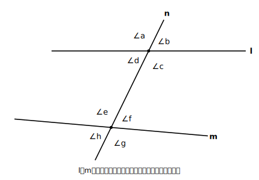

# L02 平行線と角〜同位角・錯角

## ねらい

- 2直線に1直線が交わってできる**同位角・錯角**の位置関係を見分けられるようになる。
- 平行線の**性質**（平行ならば同位角・錯角が等しい）と、平行線になるための**条件**（同位角・錯角が等しければ平行）を、**向きを区別して**使えるようになる。

## 主概念1：同じ「位置取り」の角〜同位角と錯角

2本の直線 l、m に、もう1本の直線 n が交わっている図を考える。交点は2つ、角は全部で8つできる。

<!-- figure-spec: 意図=同位角・錯角の定義図。要素=横向きの直線l（上）とm（下）・斜めに横切る直線n・上の交点まわりに∠a（左上）∠b（右上）∠c（右下）∠d（左下）、下の交点まわりに∠e（左上）∠f（右上）∠g（右下）∠h（左下）。lとmはこの図ではあえて平行にしない（定義は平行と無関係であることを示すため、わずかに非平行に描く）。alt=2直線に1本の直線が交わり8つの角ができている図。描かないもの=角度値・平行記号。生成方法=パラメトリックSVG。 -->

- ∠aと∠eのように、2つの交点で**同じ位置**にある角どうしを**同位角**という（∠bと∠f、∠cと∠g、∠dと∠hも同位角）。
- ∠cと∠eのように、2直線の**内側で、斜めに向かい合う**角どうしを**錯角（さっかく）**という（∠dと∠fも錯角）。

大事な注意をひとつ。**同位角・錯角は「位置取り」の名前であって、「等しい角」という意味ではない。** 上の図の l と m は平行ではないので、同位角∠aと∠eは等しくない。「同位角だから等しい」と言えるのは、次の性質が使える場面、すなわち**2直線が平行なとき**だけだ。

## 主概念2：平行線の性質〜この章の「認める土台」

l//m のとき、同位角はどうなるか。直線 l を、n との交点にそって m の位置まで**平行にすべらせる**場面を想像すると、交わりの形はそのままスライドして、∠aは∠eにぴったり重なりそうだ。実際、次のことが知られている。

> **【ことば】平行線の性質: 平行な2直線に1つの直線が交わるとき、同位角は等しい。**

この性質は、この章では**証明せずに、正しいと認めて使う土台**とする。すべてを根拠から導こうとすると、どこかに「これはもう認めよう」という出発点が必要になる。平行線の性質はその出発点の代表だ（どこまでさかのぼって出発点を選ぶかは、実は数学の大きなテーマ。L07の雑談で少しだけ触れる）。

では**錯角**は？ こちらは認める必要がない。**いま認めた性質とL01の対頂角から導ける**。

l//m のとき、錯角∠cと∠eが等しいことを示そう。

- ∠a＝∠e　【根拠: l//m だから同位角は等しい】
- ∠a＝∠c　【根拠: 対頂角は等しい（L01で導いた）】
- したがって ∠c＝∠e　【∠aを仲立ちにした】

> **【ことば】平行線の性質（続き）: 平行な2直線に1つの直線が交わるとき、錯角は等しい。**

L01で自分たちが導いた「対頂角は等しい」が、さっそく**根拠のリスト入り**して働いたことに注目してほしい。一度きちんと導いたことは、以後は道具として使ってよい——根拠のリストはこうやって増えていく。

## 主概念3：逆向きに使う〜平行線になるための条件

ここまでは「**平行ならば**、角が等しい」だった。今度は矢印の向きを逆にする。「**角が等しいならば**、平行」は言えるだろうか。

> **【ことば】平行線になるための条件: 2直線に1つの直線が交わるとき、同位角（または錯角）が等しければ、その2直線は平行である。**

このうち**同位角の側**を、性質と同じく、この章では正しいと認めて使う出発点にする。錯角の側は認める必要がない——錯角が等しければ、対頂角（L01）によって同位角も等しくなるから、同位角の条件で平行が導ける（性質のときと同じ筋道だ）。つまり平行線と角の関係は**両方向に**使える。ただし、いま自分がどちらの向きで使っているかは、いつも意識する必要がある。

- 平行だとわかっている → 角が等しいと言える（**性質**として使う）
- 角が等しいとわかった → 平行だと言える（**条件**として使う）

この「向き」の区別は、章の後半（平行四辺形）で勝敗を分ける急所になる。いまのうちに言葉にしておこう。

:::guide
**錯角の見つけ方〜「Z」をさがす**

錯角は、2つの交点を結ぶ線分を真ん中の棒にした**Z形（または逆Z形）のかどの2つ**として現れる。図が複雑になったら、まずZをなぞる。同位角は「F形」のかど。ただし、図を回転すればZもFも向きが変わるから、形はあくまで探すための目印で、最後は定義（内側で斜めに向かい合う／同じ位置）に戻って確認すること。
:::

:::guide
**「平行だから錯角が等しい」と「錯角が等しいから平行」を書き分ける**

答案で根拠を書くときは、この2つを区別して書く。前者は【根拠: l//m より、錯角は等しい】、後者は【根拠: 錯角が等しいから、l//m】。読み手が向きを取り違えない書き方を、いまから習慣にしておくと、後半の証明で迷子にならない。
:::

:::zatsudan
平行線って「どこまで行っても交わらない2直線」のことだけど、よく考えると「どこまで行っても」を確かめに行くことは誰にもできない。無限の先まで歩けないからね。ところが今日の条件を使えば、**目の前の交点で角が1組等しいと分かるだけ**で「この2直線は永遠に交わらない」と言い切れる。手の届く場所の情報から、手の届かない無限の先のことが分かる——条件のありがたみはここにある。
:::

## 練習

1. 主概念1の図（l と m は平行とは限らない）で、次の角の組は「同位角」「錯角」「対頂角」「どれでもない」のどれか答えよう。
   (1) ∠bと∠f　(2) ∠dと∠f　(3) ∠aと∠c　(4) ∠aと∠h
2. l//m で、∠b＝110°のとき、∠f・∠h・∠dの大きさを求め、それぞれ【根拠: …】をそえよう。
3. 2直線 l、m に直線 n が交わっていて、錯角の1組が55°と55°だった。l と m は平行と言えるか。理由もそえて答えよう。
4. l//m のとき「**同側内角**（2直線の内側にあって、n の同じ側にある2角。図の∠cと∠f）の和は180°」になる。このことを、平行線の性質とL01までの根拠だけを使って導いてみよう。

:::stretch
**S1** 練習4で導いた「同側内角の和が180°」を、逆向きの条件「同側内角の和が180°ならば2直線は平行」として使ってよいだろうか。主概念3の条件（錯角が等しければ平行）を根拠にして、説明を組み立ててみよう。
:::

---

対応解答: answer_key_L01-04.md

<!-- gen_nav:nav:start（自動生成・手編集しない） -->

---

[← 前のレッスン](lesson_01.md)｜[単元の目次](README.md)｜[解答](answer_key_L01-04.md)｜[次のレッスン →](lesson_03.md)

<!-- gen_nav:nav:end -->
