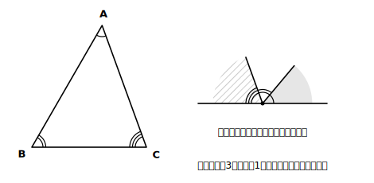
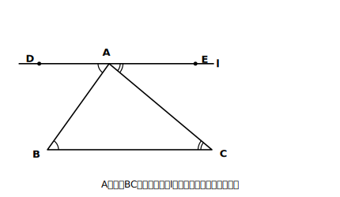
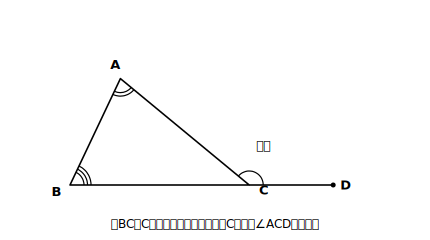

# L03 三角形の角〜「角を集める」だけでは足りない

## ねらい

- 「三角形の内角の和は180°」を、実験ではなく**平行線の性質を根拠に**導けるようになる。
- **内角・外角**という用語を使い、三角形の外角の性質（となり合わない2つの内角の和に等しい）を導いて使えるようになる。

## 活動：まず、手で確かめてみる

紙に三角形を1つかいて、はさみで3つの角のあたりを切り取り、頂点が1点に集まるように並べてみよう（はさみがなければ、3つの角を折り込んで1点に集めてもよい。手元に道具がなければ、この後の図を目で追うだけでも先へ進める）。

3つの角はぴったり並んで、**一直線**になる。つまり合計180°に見える。

<!-- figure-spec: 意図=「角を集める」実験の再現図。要素=左に三角形（3頂点の角に別々の弧マーク）・右に切り取った3つの角が1点のまわりに並び一直線をつくる様子。alt=三角形の3つの角を切り取って並べると一直線になる図。描かないもの=角度の数値。生成方法=パラメトリックSVG（3角は50°・60°・70°など非対称に）。 -->

さて、ここで前回までと同じ問いが立つ。**この実験で「どんな三角形でも180°」と言い切れただろうか？**

言い切れない。理由は2つある。①切って並べたのは**その1枚の三角形だけ**で、三角形の形は無限にある。②紙を切って並べる操作には**わずかなずれ**が必ずあり、「179.9°かもしれない」を否定できない。操作や実験は、予想を立てるにはとても良い方法だが、**常に成り立つことを示しているとはいえない**。

では、どうするか。L01・L02で磨いた武器（値を決めずに通用する、言葉の説明）の出番だ。

## 主概念1：平行線を1本引くと、実験が「証明の卵」に変わる

△ABCで、∠A＋∠B＋∠C＝180°を導く。さっきの実験では角を頂点Aのところへ「持ってきて」並べた。あの操作を、切らずに図の中で実現する道具が**平行線**だ。

**頂点Aを通り、辺BCに平行な直線 l を引く。**

<!-- figure-spec: 意図=内角の和180°の導出図。要素=△ABC（Bが左下・Cが右下）・Aを通りBCに平行な直線l・l上でAの左側に点D、右側に点E・∠DABと∠B（錯角）を同系マーク、∠EACと∠C（錯角）を別系マークで対応づけ。alt=三角形の頂点Aを通って底辺に平行な直線を引き、錯角の対応を示した図。描かないもの=角度値。生成方法=パラメトリックSVG。 -->

直線 l 上に、Aの左側に点D、右側に点Eをとる。すると、

- ∠DAB＝∠B　【根拠: l//BC だから錯角は等しい】
- ∠EAC＝∠C　【根拠: l//BC だから錯角は等しい】
- ∠DAB＋∠BAC＋∠EAC＝180°　【根拠: 一直線の角は180°】

3つ目の式の∠DABを∠Bに、∠EACを∠Cに置きかえると、

> **【ことば】∠B＋∠BAC＋∠C＝180°　すなわち、三角形の内角の和は180°。**

この説明は、△ABCの形をどこにも使っていない。細長い三角形でも、ほぼ直角の三角形でも、そのまま通用する。**実験で「並べた」ことを、平行線の性質が「いつでも並ぶ」に格上げした**——これがL02の性質を認めておいた最初の大きな見返りだ。三角形の3つの角を**内角**という。

## 主概念2：外角〜内角の「外側のとなり」

△ABCの辺BCを、Cの先へ延長して点Dをとる。このときできる∠ACDを、頂点Cにおける**外角**という。

<!-- figure-spec: 意図=外角の定義図と外角の性質。要素=△ABC・辺BCの延長上に点D・∠ACD（外角）に弧マーク・∠Aと∠B（となり合わない2内角）に別マーク。alt=三角形の辺を延長してできる外角を示した図。描かないもの=角度値。生成方法=パラメトリックSVG。 -->

定義から真っ先に言えるのは、**外角と、となりの内角の和は180°ということ**（∠ACB＋∠ACD＝180°【根拠: 一直線の角は180°】）。外角とは「内角を180°から引いた残り」だ。**「まわり1周360°から引いた残り」ではない**。この取り違えは多角形（L04）で事故のもとになるので、いま図と一緒に固定しておこう。

さらに、内角の和と組み合わせると便利な性質が出る。

- ∠A＋∠B＋∠ACB＝180°　【根拠: 三角形の内角の和は180°（主概念1で導いた）】
- ∠ACD＋∠ACB＝180°　【根拠: 一直線の角は180°】
- 2つの式を見比べて、**∠ACD＝∠A＋∠B**

> **【ことば】三角形の外角は、それととなり合わない2つの内角の和に等しい。**

主概念1で導いたばかりの「内角の和180°」が、もう次の性質の**根拠**として働いた。導く→リストに入る→次の根拠になる。この連鎖が、この章のリズムだ。

:::guide
**「証明の卵」と呼んだ理由**

主概念1の説明は、実質的にはもう証明になっている。ただ、証明という言葉の正式な意味（仮定・結論・根拠のルール）はL07でそろえるので、それまでは「根拠つきの説明」と呼んでおく。逆に言えば、L07で新しく難しいことが始まるのではない。**L01からずっとやってきたことに、正式な名前と書式が付くだけ**だ。
:::

:::guide
**補助線は「魔法」ではなく「実験の翻訳」**

「頂点Aを通る平行線を引く」という一手は、天下りの魔法に見えるかもしれない。でも出どころは冒頭の実験だ。角を切ってAのまわりへ運んだ——その「運ぶ」を、切らずにやる道具が錯角（平行線）だった。補助線に出会ったら「この線は、どんな操作の代わりをしているのか」と考えると、暗記でなく再現できるようになる。
:::

:::zatsudan
「角を集める」実験、あれはあれで名誉挽回しておくとね、実験がなければ「180°になりそうだ」という**予想**自体が生まれなかった。数学の進み方はだいたい「実験や観察で予想する→根拠を言って確定させる」の二段ロケット。実験は一段目として超優秀なんだ。ただし一段目だけでは軌道に乗らない。「常に成り立つことを示しているとはいえない」から、二段目（今日の平行線）が要る。
:::

## 練習

1. △ABCで、∠A＝47°、∠B＝85°のとき、∠Cの大きさを求めよう。【根拠】も一言。
2. 主概念2の図で、∠A＝62°、∠B＝71°のとき、外角∠ACDの大きさを2通りの方法（①∠ACBを経由する ②外角の性質を使う）で求め、答えが一致することを確かめよう。
3. 次の説明のあやしい所を1か所指摘しよう。
   「どんな三角形も、紙で作って角を並べたら一直線になった。だから三角形の内角の和が180°であることが証明された。」
4. 三角形の3つの外角（各頂点に1つずつ）の和は何度になるか。∠A・∠B・∠Cを使って計算で導いてみよう。

:::stretch
**S1** 主概念1では「Aを通りBCに平行な直線」を引いた。別の補助線「辺BCをCの先へ延長し、さらにCを通り辺ABに平行な半直線CEを引く」でも、内角の和180°を導ける。同位角と錯角が1回ずつ登場するこの導き方を、自分で完成させてみよう。
:::

---

対応解答: answer_key_L01-04.md

<!-- gen_nav:nav:start（自動生成・手編集しない） -->

---

[← 前のレッスン](lesson_02.md)｜[単元の目次](README.md)｜[解答](answer_key_L01-04.md)｜[次のレッスン →](lesson_04.md)

<!-- gen_nav:nav:end -->
