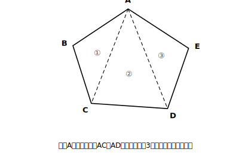

# L04 多角形の角

## ねらい

- n角形の内角の和が **180°×(n−2)** になることを、三角形に分ける考えで導いて使えるようになる。
- 多角形の**外角の和は、頂点の数によらず360°**であることを導いて使えるようになる。
- 外角＝180°−（となりの内角）を確実に運用する（**360°から引く誤りを自分で検出できる**ようにする）。

## 主概念1：多角形は三角形の集まり〜内角の和

五角形の内角の和を知りたい。手持ちの根拠のリストに「五角形」の項目はまだない。あるのは「三角形の内角の和は180°」だ。**知らないものを、知っているものに分解する**——1つの頂点から対角線を引いてみよう。

<!-- figure-spec: 意図=内角の和の導出（三角形分割）。要素=凸五角形ABCDE・頂点Aから対角線AC・ADを引き三角形3つに分割・各三角形に薄い番号①②③。alt=五角形が1つの頂点からの対角線で3つの三角形に分割された図。描かないもの=角度値。生成方法=パラメトリックSVG（正五角形は避け、一般の凸五角形にする）。 -->

五角形ABCDEは、頂点Aからの対角線AC・ADで**3つの三角形**に分かれる。3つの三角形の内角を全部集めると、ちょうど五角形の5つの内角を過不足なく作る（分割の切れ目は頂点AとC・Dの内角の内側に収まっていて、余分な角も不足もない）。だから、

- 五角形の内角の和＝180°×3＝**540°**　【根拠: 三角形の内角の和は180°】

同じ方法はn角形でそのまま使える。1つの頂点から引ける対角線は（自分自身と両どなりを除いて）n−3本、できる三角形は**n−2個**。

> **【ことば】n角形の内角の和＝180°×(n−2)**

「(n−2)って何だっけ」と迷ったら、公式を思い出そうとするより**四角形で数え直す**のが速い。四角形は対角線1本で三角形2個→180°×2＝360°。この1例が(n−2)の意味（三角形の個数）を思い出させてくれる。

## 主概念2：外角の和は、いつでも360°

多角形の各頂点で、辺を延長して**外角**を1つずつつくる（L03の定義どおり、外角＝180°−となりの内角）。この外角を全部たすと、何度になるだろう。

五角形で計算してみる。各頂点で「内角＋外角＝180°」だから、5頂点分を全部たすと、

- （内角の和）＋（外角の和）＝180°×5＝900°　【根拠: 一直線の角は180°】
- 外角の和＝900°−540°＝**360°**　【根拠: 五角形の内角の和は540°（主概念1）】

n角形でも同じ計算ができる。

- 外角の和＝180°×n −180°×(n−2)＝180°×n−180°×n＋360°＝**360°**

> **【ことば】多角形の外角の和は、頂点の数によらず360°。**

頂点が増えるほど内角の和は増えていくのに、外角の和は**いつでも360°で変わらない**。頂点が増えた分だけ、外角1つあたりの**平均**が小さくなって、増えた個数をぴったり打ち消すからだ（正多角形を思い浮かべると分かりやすい。一般の多角形では、1つ1つの外角がどれも小さくなるとは限らない）。

:::zatsudan
外角の和360°には、体で感じられるイメージがある。多角形の辺の上を、辺にそって1周歩くところを想像してみて。頂点に来るたびに、進む向きを外角のぶんだけクイッと曲がる。1周してスタートの向きに戻ったとき、あなたの体はちょうど**1回転**している。1回転＝360°。曲がった角度の合計＝外角の和、というわけ。五角形でも百角形でも、1周すれば1回転——だから360°で変わらない。
:::

## 検出訓練：外角の「360°から引く」事故

外角のまちがいの定番パターンを、先に自分で踏んで、自分で直しておこう。

**問題**: 正五角形の1つの外角の大きさを求める。

**あやしい答案**: 「正五角形の1つの内角は540°÷5＝108°。外角は内角の外側の角だから、360°−108°＝252°。」

どこで事故が起きたか。**外角は「まわり1周360°の残り」ではない**。外角の定義（L03）は「辺を延長してできる角」で、となりの内角と**一直線（180°）**を作る。だから、

- 正五角形の1つの外角＝180°−108°＝**72°**

検算の道具も持っている: 外角の和は360°、正五角形なら5つの外角はすべて等しいから、360°÷5＝72°。**一致した**。逆に252°だったら、252°×5＝1260°≠360°で即アウトと分かる。「外角を出したら、外角の和360°で検算」を型にしよう。

:::guide
**内角から攻めるか、外角から攻めるか**

正多角形の角の問題は2つの入り口がある。①内角の和180°×(n−2)をnで割る、②外角の和360°をnで割ってから180°−外角で内角に戻る。**外角ルート②の方が計算が軽い**ことが多い（360÷nだけで済む）。どちらで解いても、もう一方で検算できるのが正多角形の良いところ。
:::

:::guide
**へこんだ多角形は？**

主概念1の三角形分割は、へこみのない多角形（凸多角形）なら1つの頂点からの対角線で必ずできる。へこんだ多角形では「1つの頂点から」は失敗することがあるが、分け方を工夫すればやはりn−2個の三角形に分けられ、内角の和の式は変わらない。この章の練習では、へこみのない多角形だけを扱う。
:::

## 練習

1. (1) 八角形の内角の和を求めよう。 (2) 内角の和が1440°になるのは何角形か求めよう。
2. 正九角形の1つの外角と1つの内角を、主概念2のguideの②のルート（外角から）で求め、①のルート（内角から）で検算しよう。
3. 次の答案のまちがいを見つけて直そう。
   「正六角形の1つの内角は120°。だから1つの外角は 360°−120°＝240°。」
4. ある多角形の外角の和を測ったら、どの頂点の外角も40°だった。この多角形は何角形か。また、1つの内角は何度か。
5. 【読む】次の説明を読み、(あ)〜(う)のうち**この説明から新たに分かったこと**はどれか選ぼう。
   「四角形ABCDに対角線ACを引くと、△ABCと△ACDに分かれる。三角形の内角の和は180°だから、四角形の内角の和は180°×2＝360°である。」
   (あ) 三角形の内角の和は180°である　(い) 四角形の内角の和は360°である　(う) 対角線ACは∠Aを二等分する

:::stretch
**S1** 「n角形の外角の和は360°」を、内角の和の式を使わずに、雑談枠の「1周歩くと1回転」のイメージを式に直す方針で説明できるか考えてみよう（ヒント: 各頂点で向きが外角ぶんだけ変わる。1周で向きの変化の合計は？）。この説明と主概念2の計算、どちらが「根拠のリストだけから組み立てられた説明」と言えるだろうか。
:::

---

対応解答: answer_key_L01-04.md

<!-- gen_nav:nav:start（自動生成・手編集しない） -->

---

[← 前のレッスン](lesson_03.md)｜[単元の目次](README.md)｜[解答](answer_key_L01-04.md)｜[次のレッスン →](lesson_05.md)

<!-- gen_nav:nav:end -->
