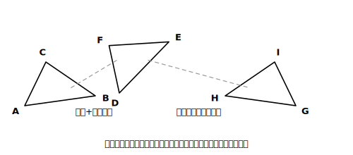
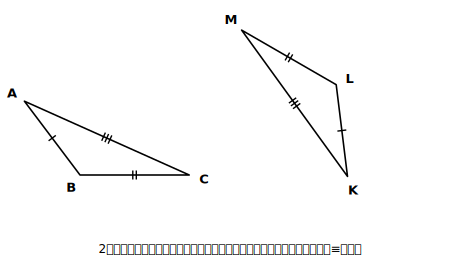

# L05 合同な図形〜ぴったり重なるとは

## ねらい

- **合同**の意味を、「動かして重ねる」見方と「対応する線分・角がすべて等しい」見方の**2本立て**で理解する。
- 記号**≡**を、**対応する頂点の順にそろえて**正しく書き、合同な図形の性質（対応する線分・角は等しい）を使えるようになる。

## 主概念1：合同の定義その1〜動かして、ぴったり重ねる

2枚の三角形の紙があって、一方をすべらせたり、回したり、裏返したりして、もう一方に**ぴったり重ねる**ことができるとする。このとき、2つの図形は**合同**であるという。

「すべらせる・回す・裏返す」——中1で学んだ**平行移動・回転移動・対称移動**そのものだ。つまり、

> **【ことば】定義（動的）: 一方の図形を移動して他方の図形に重ね合わせることができるとき、2つの図形は合同であるという。**

<!-- figure-spec: 意図=動的定義の図。要素=△ABCと、それを回転+平行移動した△DEF、さらに裏返した△GHI（鏡像）の3つ・移動の対応を薄い矢印で示す。alt=1つの三角形と、それを移動・裏返しで重ねられる2つの三角形。描かないもの=辺の長さの数値。生成方法=パラメトリックSVG（非対称な三角形を使い、鏡像が見分けられるようにする）。 -->

注意したいのは**裏返し（対称移動）も移動に含める**こと。左手と右手の手ぶくろのような鏡うつしの関係でも、裏返せば重なるなら合同だ。

## 主概念2：合同の定義その2〜動かさずに、測って言う

紙なら重ねられる。でも、ノートの上の図形は動かせないし、「重なるはず」は目分量になりがちだ。そこで、重なるかどうかを**長さと角度の言葉**に翻訳したもう1つの見方を用意する。

> **【ことば】定義（静的）: 2つの図形が合同であるとは、対応する線分の長さと角の大きさがすべて等しいことである。**

ぴったり重なるなら、重なり合う辺どうし・角どうし（**対応する**辺・角）は当然すべて等しい。逆に、対応する辺と角がすべて等しければ、ぴったり重ねられる。2つの定義は同じ内容の言いかえで、場面によって便利な方を使う。

- 直感で捉えるとき・図形を動かすソフトで観察するとき → **動的**（重なるか）
- 根拠を言って確かめるとき・答案に書くとき → **静的**（対応する辺・角が等しいか）

この章の後半では、もっぱら静的の見方が答案の言葉になる。

## 記号≡〜対応の順にそろえて書く

△ABCと△DEFが合同で、AとD、BとE、CとFがそれぞれ重なる（対応する）とき、

> **△ABC≡△DEF**

と書く。ここには絶対のルールが1つある。**頂点は対応する順に書く。** △ABC≡△DEFと書いたら、それは「A↔D、B↔E、C↔F」という対応表の宣言だ。だから、この1行から次が全部読み取れる。

- AB＝DE、BC＝EF、CA＝FD　（対応する辺）
- ∠A＝∠D、∠B＝∠E、∠C＝∠F　（対応する角）

> **【ことば】合同な図形の性質: 合同な図形では、対応する線分の長さ・角の大きさはそれぞれ等しい。**

逆に言うと、図の見た目が同じでも **△ABC≡△EFD と書いたら別の主張になる**（A↔E、B↔F、C↔Dと言ったことになる）。記号≡は「形が同じ」のスタンプではなく、**対応表つきの精密な宣言**——ここを雑にすると、次のレッスン以降の証明で「等しい辺・角の取り出し」を全部まちがえる。

:::guide
**対応の順を間違えない実務のコツ**

図を見て対応を決めるときは、**特徴のある部分から**押さえる。いちばん長い辺どうし・いちばん大きい角どうしは必ず対応する（合同なら大きさの順位も一致するから）。まず「最大の角はどれとどれか」で1組決めて、あとは図形をなぞりながら残りを並べる。ただし、**裏返しの合同では、なぞる向き（時計回りか反時計回りか）が2つの図形で逆になる**から、頼るのは向きではなく「等しい角・等しい辺のつながり」のほうだ。書き終えたら、1文字目どうし・2文字目どうし…が本当に対応しているか、指で押さえて読み合わせる。
:::

:::guide
**「対応する」を省くと何が壊れるか**

静的な定義から「対応する」を取って「線分と角がすべて等しければ合同」と言ってしまうと、**どの辺とどの辺を比べるのか**が決まらず、意味が壊れる。たとえば2つの三角形の「3辺の長さの集まり」が同じでも、比べる相手を取り違えたら等しさの主張はできない。この章では、辺や角の等しさを言うとき、常に「**対応する**〜が等しい」と言う。小さな一語だが、この一語が定義の心臓部だ。
:::

:::zatsudan
中1のとき、平行移動・回転移動・対称移動って「図形をずらして遊ぶ話」に見えたかもしれない。実はあれ、今日のための伏線だったんだ。「合同＝移動して重ねられる」という定義は、移動という言葉が先に用意されていたからこそ一行で書けた。数学のカリキュラムは、あとから振り返ると「あの単元はこのための部品だったのか」と分かる作りになっていることが多い。いま学んでいることも、たぶん何かの伏線だよ。
:::

## 練習

1. 四角形ABCDを平行移動だけで動かした四角形と、対称移動（裏返し）で動かした四角形は、どちらも元の四角形と合同と言えるか。定義（動的）を根拠に答えよう。
2. △ABC≡△PQRのとき、次を答えよう。
   (1) 辺BCと長さが等しい辺　(2) ∠Rと大きさが等しい角　(3) AB＝6cm、∠Q＝40°のとき、わかる辺の長さと角の大きさをすべて挙げる
3. 図の2つの三角形は合同で、最大の角どうし・最長の辺どうしが対応している。対応する頂点の順に注意して、合同を記号≡で表そう。

<!-- figure-spec: 意図=対応の読み取り練習。要素=△ABC（∠Bが鈍角・辺ACが最長）と、それを150°ほど回転配置した合同な△KLM（∠Lが鈍角・辺KMが最長）。等しい辺に同数の目盛りマーク。alt=向きの違う合同な2つの三角形。描かないもの=答え（≡の式）・角度数値。生成方法=パラメトリックSVG。 -->

4. 【読む】次の主張のまちがいを指摘しよう。
   「△ABCと△DEFで、ABとDEの長さが等しく、面積も等しい。だから△ABC≡△DEFである。」

:::stretch
**S1** 「合同ならば面積が等しい」は正しい（重なるのだから）。では入れかえた主張「面積が等しいならば合同」は正しいだろうか。成り立たない例を1つ、具体的な図形で作ってみよう（ヒント: 面積が同じ長方形はどれも合同？）。「入れかえた主張の正しさは別問題」という現象には、この章の後半（L14）で正式な名前が付く。
:::

---

対応解答: answer_key_L05-08.md

<!-- gen_nav:nav:start（自動生成・手編集しない） -->

---

[← 前のレッスン](lesson_04.md)｜[単元の目次](README.md)｜[解答](answer_key_L05-08.md)｜[次のレッスン →](lesson_06.md)

<!-- gen_nav:nav:end -->
