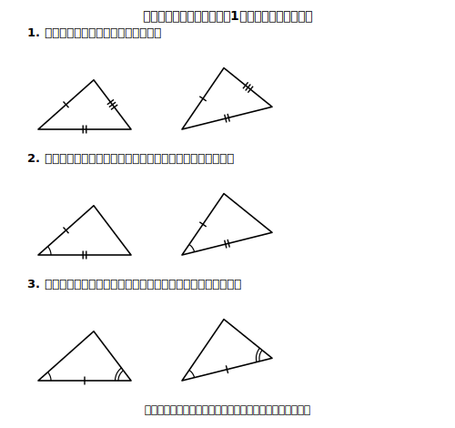
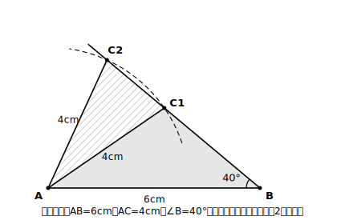

# L06 三角形の合同条件

## ねらい

- 三角形の**合同条件**3つを、正確な言い回しで身につけ、2つの三角形が合同かどうかの判断に使えるようになる。
- 「その間の角」「その両端の角」という**位置の指定**がなぜ必要かを、作図の実験で体感する。

## 導入：全部調べなくても、決まる？

△ABCと△DEFが合同かどうかを静的な定義（L05）で確かめるなら、対応する3組の辺と3組の角、**合計6組**をすべて調べることになる。毎回6組は大変だ。もっと少ない手がかりで言い切れないだろうか。

実験してみよう。「3辺が4cm・5cm・6cm」という指定だけで三角形を作図する（中1の作図: 6cmの線分の両端から半径4cm・5cmの円をかき、交点を結ぶ）。何度かいても、**同じ形・同じ大きさの三角形しかできない**（裏返しの違いは出るが、裏返しも移動なので合同のうち）。つまり3辺の長さの指定だけで、三角形は1種類に**決まって**しまう。三角形が1種類に決まる指定なら、その指定が一致する2つの三角形は合同のはずだ。

## 主概念1：三角形の合同条件〜3つの言い回しを正確に

同じような作図実験を重ねると、次の3つのどれかが成り立てば三角形は合同だと認められる。

> **【ことば】三角形の合同条件**
> 2つの三角形は、次のどれかが成り立つとき合同である。
> 1. **対応する３組の辺がそれぞれ等しい**
> 2. **対応する２組の辺がそれぞれ等しく，その間の角が等しい**
> 3. **対応する１組の辺が等しく，その両端の角がそれぞれ等しい**

<!-- figure-spec: 意図=3条件の一覧図。要素=3段。各段に三角形のペア。1段目=3組の辺に1本/2本/3本の目盛りマーク。2段目=2組の辺のマーク+その間の角に弧マーク。3段目=1組の辺のマーク+その両端の2角に弧マーク。alt=三角形の合同条件3つをマークで示した対応図。描かないもの=長さ・角度の数値・条件の略称。生成方法=パラメトリックSVG。 -->

この3つは、この章では**証明して得るものではなく、作図などの直観的・実験的な確かめを通して「正しいと認める」約束**として使う（三角形の内角の和のように根拠から導いたものとは、認め方が違う。この違いは覚えておく価値がある。実は後で「導ける条件」も登場する: L10）。

そして、言い回しをまるごと正確に覚えてほしい。特に落としてはいけない部品が2つある。

- **「対応する」**: どの辺とどの辺を比べているかの宣言（L05の心臓部の一語）。
- **「その間の」「その両端の」**: 等しい角の**位置指定**。ここを外すと、条件は壊れる。次で実験する。

## 主概念2：位置指定を外すと壊れる〜「間ではない角」の実験

条件2から「その間の」を外した主張「2組の辺がそれぞれ等しく、**どこかの**角が等しければ合同」は正しいだろうか。作図で確かめる。

**指定**: AB＝6cm、AC＝4cm、**∠B＝40°**（∠Bは、等しい2辺AB・ACの「間の角」∠Aではない）。

作図してみよう。6cmの線分ABをかき、Bから40°の方向に半直線をのばす。Aを中心に半径4cmの円をかくと——**半直線と2点で交わる**。つまり、指定を満たす三角形が**形の違うもの2種類**できてしまう。

<!-- figure-spec: 意図=「間ではない角」では三角形が決まらないことの実験図。要素=線分AB(6cm相当)・Bから40°の半直線・Aを中心とする半径4cm相当の円弧・半直線との交点C1とC2・△ABC1と△ABC2を薄い色分け。alt=2辺と間ではない角の指定で、2種類の三角形が作図できてしまう図。描かないもの=「合同条件」という語をこの図に付けない（条件ではないことが主旨）。生成方法=パラメトリックSVG（6×sin40°≈3.86<4<6 の2交点条件を厳密に反映）。 -->

同じ指定から違う形の三角形が2つ——ということは、「2組の辺と、間ではない1組の角が等しい」だけでは、2つの三角形が合同だとは**言い切れない**。「その間の」という位置指定は、飾りではなく**条件の生命線**だった。

だから、答案で合同条件を使うときは、**正確な言い回しのまま**書く。「2組の辺と1組の角が…」のような**縮めた言い方は、実在しない条件**であり、根拠として無効だ。

:::guide
**根拠は「実在する文言」で〜自作の条件を発明しない**

証明の答案でいちばん残念な事故は、正しい図・正しい着眼までたどり着いたのに、最後に**実在しない合同条件**（例:「1組の辺とその間の角が等しい」「2組の角がそれぞれ等しい」）を書いてしまうこと。使う直前に、上の枠囲みの3つの文言と**一字ずつ**照合する習慣をつけよう。3つしかないのだから、照合は数秒で終わる。
:::

:::guide
**「2組の角と1組の辺」なら？〜条件3に翻訳できる場合**

「対応する2組の角と、間の辺ではない1組の辺が等しい」場面に出会うことがある。三角形の内角の和は180°（L03）だから、2組の角が等しければ**残りの角も自動的に等しい**。そこで等しい辺の**両端の角**がそろい、条件3に持ち込める。ただし答案では、この「残りの角も等しい」の一行を省かずに書いてから条件3を使う。翻訳の過程も根拠のうちだ。
:::

:::zatsudan
6つの条件（3辺3角）を全部調べなくても3つで決まる、というのは、考えてみるとかなり得な話。実は「3つならなんでもいい」わけではないのが面白いところで、3つの角だけが等しい場合は、大きさの違う同じ形（拡大コピーの関係）ができるだけで、合同にはならない。どの3つを選ぶかのセンスが問われるわけだ。ちなみに「同じ形で大きさ違い」の話は中3でちゃんと主役になる。
:::

## 練習

1. 次の各組の三角形は合同と言えるか。言える場合は合同条件を**正確な言い回しで**書き、≡の式（対応順に注意）も書こう。言えない場合は理由を書こう。
   (1) △ABCと△DEF: AB＝DE＝5cm、BC＝EF＝7cm、CA＝FD＝4cm
   (2) △GHIと△JKL: GH＝JK＝6cm、∠G＝∠J＝55°、∠H＝∠K＝60°
   (3) △MNPと△QRS: MN＝QR＝5cm、NP＝RS＝6cm、∠P＝∠S＝35°
2. △ABCと△DEFで、AB＝DE、∠A＝∠Dまで分かっている。あと1つ何が等しければ合同と言えるか。**使える追加条件を2通り**挙げ、それぞれどの合同条件になるか答えよう。
3. 【読む】次の判断のまちがいを指摘しよう。
   「△ABCと△DEFで、∠A＝∠D、∠B＝∠E、∠C＝∠F。3組も等しいので、合同条件『対応する3組の角がそれぞれ等しい』により△ABC≡△DEF。」
4. 主概念2の作図を実際にやってみよう（定規・コンパス・分度器。分度器がなければ、40°の代わりに三角定規の30°を使ってよい: AB＝6cm、AC＝3.5cm、∠B＝30°でも2種類できる）。できた2つの三角形のどこが違うか、言葉で記録しよう。

:::stretch
**S1** 主概念2の指定（AB＝6cm、AC＝4cm、∠B＝40°）では三角形が2種類できた。では、ACをもっと長く（たとえばAC＝7cmに）すると、できる三角形は何種類になるだろう。作図で確かめ、なぜそうなるか（円と半直線の交わり方）を考えてみよう。「2辺と間ではない角」の指定でも、辺の長さの大小関係によっては三角形が1種類に決まる場合があることが見えてくる。
:::

---

対応解答: answer_key_L05-08.md

<!-- gen_nav:nav:start（自動生成・手編集しない） -->

---

[← 前のレッスン](lesson_05.md)｜[単元の目次](README.md)｜[解答](answer_key_L05-08.md)｜[次のレッスン →](lesson_07.md)

<!-- gen_nav:nav:end -->
