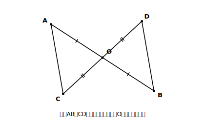

# L07 証明のしくみ〜仮定・結論・根拠

## ねらい

- **命題・仮定・結論**という言葉で、示したいことを整理できるようになる。
- **証明**とは何かを知り、**方針メモ→穴埋め→自力記述**の階段で、はじめての証明を書き上げる。
- 書いた証明を**見直し3点チェック**で点検できるようになる。

## 主概念1：なぜ証明するのか〜図は「すべての代表」

「分かりきったことを、どうして証明なんかするのか」。この疑問は自然だし、まともだ。正面から答えておきたい。

理由の核心は、L01からずっと出会ってきた、あの事情だ。**図形は無限にある。** 「中点で交わる2つの線分」と言われて図を1つかいても、それは無限にある場合のたった1例。すべてをかいて測って回ることは、誰にもできない。**調べつくせないものについて「いつでも成り立つ」と言い切る方法は、根拠から導く言い方しかない**。

そして、根拠から導く言い方には不思議な力がある。証明の中の図は特定の1枚に見えるが、証明が、図の**具体的な長さや角度など、仮定に書かれていない情報を一切使っていなければ**（「図でそう見えるから」も禁物だ）、その1枚は同じ条件を満たす**すべての図形の代表**になる。1枚の図で無限を相手にする——L03で三角形の内角の和を導いたとき、すでにあなたはこれをやっている。

## 主概念2：命題・仮定・結論〜「ならば」で切り分ける

「対頂角は等しい」「x＝2ならばx²＝4」のように、正しいか正しくないかが定まる事柄を**命題**という。命題の多くは「**〜ならば、…**」の形に整理できる。

> 「〜ならば」の**〜**の部分（与えられていること）を**仮定**、
> 「…」の部分（成り立つと主張していること）を**結論**という。

例:「△ABC≡△DEF **ならば** ∠A＝∠D」。仮定は「△ABC≡△DEF」、結論は「∠A＝∠D」。

「〜ならば」の形をしていない命題も、言い直せば切り分けられる。「対頂角は等しい」→「2つの角が対頂角である**ならば**、その2つの角は等しい」。

なぜ最初にこの切り分けをするのか。**仮定はスタート地点（使ってよい材料）、結論はゴール（まだ使ってはいけない、示すべき相手）**。両者の役割がまったく違うからだ。ここを混ぜると、証明はスタートとゴールがつながったふりをするだけの文章になってしまう。

## 主概念3：証明〜根拠で仮定と結論をつなぐ

> **【ことば】証明とは、常に成り立つことが認められている事柄を証明の根拠にして、「仮定」から「結論」を導くことである。**

根拠に使ってよいのは、①**仮定**（問題が与えてくれた材料）と、②**すでに正しいと認められている事柄**（対頂角・平行線の性質・内角の和・合同条件・合同な図形の性質など、この章で積み上げてきた「根拠のリスト」）だ。

やってみよう。はじめての証明にふさわしい、シンプルで良い問題がある。

**【問題】** 線分ABと線分CDが、それぞれの中点Oで交わっている。このとき、AC＝BDであることを証明する。

<!-- figure-spec: 意図=はじめての証明の図（L15で再訪する）。要素=点Oで交わる線分AB・CD（Oは両方の中点）・AとC、BとDを結ぶ線分・OA=OBに1本目盛り、OC=ODに2本目盛り。配置はAが左上・Bが右下・Cが左下・Dが右上（四角形ACBDが視認できる形）。alt=中点で交わる2つの線分の端どうしを結んだ図。描かないもの=平行マーク（L15の発見を先取りしない）・長さの数値。生成方法=パラメトリックSVG。 -->

**Step 1（仮定と結論の抜き出し）**。どんな証明でも、最初の仕事はこれ。

- 仮定: OA＝OB、OC＝OD　（「それぞれの中点で交わる」の翻訳）
- 結論: AC＝BD

**Step 2（方針メモ）**。いきなり清書しない。ゴールから逆向きに考える。

> 結論 AC＝BD を言いたい → ACとBDが**対応する辺**になっている合同な三角形があればよい → 候補は△OACと△OBD → 等しい材料は？ 仮定からOA＝OB、OC＝OD（2組の辺）。あと1つ…**その間の角**∠AOC＝∠BODは対頂角だ。→ 条件2でいける。

方針メモはこの3行程度の走り書きでいい。**仮定／結論／使えそうな根拠**の3点がそろえば、証明の設計図は完成している。

**Step 3（記述）**。設計図を、根拠を明示しながら文章にする。

> **【証明】** △OACと△OBDで、
> OA＝OB …①　【根拠: 仮定（OはABの中点）】
> OC＝OD …②　【根拠: 仮定（OはCDの中点）】
> ∠AOC＝∠BOD …③　【根拠: 対頂角は等しい】
> ①②③より、**対応する2組の辺がそれぞれ等しく、その間の角が等しい**から、
> △OAC≡△OBD
> 合同な図形では対応する辺は等しいから、AC＝BD ■

最後の1行に注意。△OAC≡△OBDは結論ではない。**結論はAC＝BD**。合同を示して満足せず、合同から「対応する辺が等しい」を取り出して、ゴールまで橋を渡りきる。

## 見直し3点チェック〜書いたら必ず通す

1. **示すべきこと（結論）を根拠に使っていないか。** 結論はゴールであって材料ではない。「AC＝BDだから…」が証明の途中に現れたら、その証明は循環している。
2. **根拠の文言は実在するか。** 合同条件は3つの正確な言い回しと照合（L06）。「そう見える」「図で等しそう」は根拠ではない。
3. **結論まで渡りきったか。** 合同で止まっていないか。最終行が、Step 1で書いた結論と同じ中身の主張になっているか（AC＝BDとBD＝ACのように、言い回しがちがっても意味が同じならよい）。

このチェックはこの先のすべての証明で使う。答案を書く時間の最後の1分を、必ずこの3つに使おう。

:::guide
**白紙で止まらないための、部分点の階段**

証明の問題でまったく手が動かないときでも、**Step 1（仮定と結論の抜き出し）だけは必ずできる**。問題文を翻訳するだけだからだ。次に方針メモ。完成しなくても「△○○と△△△が合同と言えれば良さそう」の1行が書ければ、設計の半分は済んでいる。証明は「全部書けるか白紙か」の二択ではない。**Step 1→方針メモ→記述**のどこまで登れたかを毎回記録していくと、自分の成長が階段の段数で見える。
:::

:::guide
**書き方の形はひとつではない**

上の【証明】は一つの書き方の例だ。①②③の番号の振り方、根拠を文中に織り込む書き方など、形には幅がある。守るべき芯は**「どの事実を、何を根拠に主張したか」が読み手に伝わること**——逆に言えば、形が整っていても根拠が書かれていなければ証明にならない。
:::

:::zatsudan
「根拠はどこまでさかのぼるの？」と思った人へ。対頂角の根拠は「一直線の角は180°」だった。じゃあその根拠は？と、「なぜ」を続けていくと、どこかで「これはもう認めて出発点にしよう」という事柄に行き着く。この章では平行線の性質や合同条件がその出発点だった。じつは数学全体が「最初に認める少数の約束を決め、あとはすべて証明でつなぐ」という建築方式でできていて、その意味で今日あなたが書いた数行は、数学という建物の工法そのものだ。
:::

## 練習

1. 次の命題の仮定と結論を書き出そう。
   (1) △ABC≡△DEFならば、BC＝EFである。
   (2) 2直線が平行ならば、錯角は等しい。
   (3) 対頂角は等しい。（まず「ならば」の形に言い直す）
2. 【穴埋め】線分ABの垂直二等分線 l 上の点Pについて、PA＝PBであることの証明を完成させよう。さらに、(あ)(い)に入れた行が**なぜ必要か**を一言ずつ書こう。
   「lとABの交点をMとする。△PMAと△PMBで、
   MA＝MB【根拠: (　あ　)】、∠PMA＝∠PMB＝90°【根拠: (　い　)】、PMは共通 …
   よって（　う　）がそれぞれ等しく，（　え　）から、△PMA≡△PMB。
   合同な図形では対応する辺は等しいから、PA＝PB ■」
3. 主概念3の【問題】で、結論をAC＝BDから「∠OAC＝∠OBD」に変えると、証明はどこまでそのまま使えて、最後の1行だけがどう変わるか。実際に書いてみよう。
4. 【読む】次の答案を見直し3点チェックにかけ、引っかかる箇所を指摘しよう。
   「△OACと△OBDで、AC＝BDである。また、OA＝OB、OC＝OD。対応する3組の辺がそれぞれ等しいから△OAC≡△OBD。よってAC＝BD ■」

:::stretch
**S1** 主概念3の図で、さらに「∠OCA＝∠ODB」も成り立つ。これを証明してみよう（△OAC≡△OBDはすでに証明済みの事実として使ってよい。一度証明したことは根拠のリストに入る）。そして、∠OCAと∠ODBは、直線CDに対してどんな位置関係の角だろうか。……何かに気づいた人は、その気づきをメモしておくこと。この図には、まだ言われていない秘密が残っている（章の終盤で回収する）。
:::

---

対応解答: answer_key_L05-08.md

<!-- gen_nav:nav:start（自動生成・手編集しない） -->

---

[← 前のレッスン](lesson_06.md)｜[単元の目次](README.md)｜[解答](answer_key_L05-08.md)｜[次のレッスン →](lesson_08.md)

<!-- gen_nav:nav:end -->
