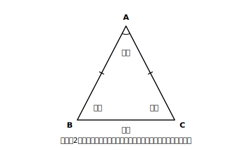
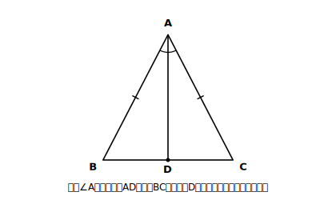

# L08 二等辺三角形の性質

## ねらい

- **定義**（2辺が等しい三角形）だけを出発点に、二等辺三角形の性質（**底角は等しい**／**頂角の二等分線は底辺を垂直に2等分する**）を証明できるようになる。
- 「知っていること」と「証明でつないだこと」を区別し、**循環論法を自分で検出**できるようになる。

## 導入：昔なじみの三角形に、調べ方を変えて再会する

二等辺三角形とは、はじめまして、ではないはずだ。小学校で紙を折って調べた記憶がある人も多いだろう。半分に折るとぴったり重なって、2つの角が等しかった、あの三角形だ。

では、なぜもう一度扱うのか。**図形が新しいのではなく、調べ方が新しい**からだ。あのときは折って・測って確かめた。いまのあなたは、実験が「常に成り立つことを示しているとはいえない」こと（L03）と、代わりに証明という方法があること（L07）を知っている。昔なじみの三角形は、新しい武器の最初の練習相手にちょうどいい。

## 主概念1：出発点は定義〜それ以外は、まだ何も知らないふりをする

> **【ことば】定義: 2つの辺が等しい三角形を、二等辺三角形という。**

用語の整理: 等しい2辺の間の角を**頂角**、頂角に向かい合う辺を**底辺**、底辺の両端の角を**底角**という。

<!-- figure-spec: 意図=用語の整理図。要素=二等辺三角形ABC（AB=AC・Aが上）・ABとACに同じ目盛りマーク・∠Aに「頂角」・BCに「底辺」・∠B∠Cに「底角」のラベル。alt=二等辺三角形の頂角・底辺・底角の名称を示した図。描かないもの=角度値・「底角は等しい」の主張（これから証明するため）。生成方法=パラメトリックSVG。 -->

ここで、この章らしい約束をする。**証明の間は、定義（AB＝AC）以外の「知っていること」を、いったん全部棚に上げる。**「底角が等しいのは知ってる」——その通り。でもそれは**これから示す結論**だ。結論を根拠に使ったら循環論法（見直しチェック①）になる。知っているからこそ、使わない我慢が要る。

## 主概念2：底角の定理〜はじめての「定義から性質を掘り出す」証明

**【定理】二等辺三角形の2つの底角は等しい。**

**Step 1** 仮定: AB＝AC　結論: ∠B＝∠C

**Step 2（方針メモ）** ∠Bと∠Cが対応する角になる合同な三角形を作りたい→△ABCの中に三角形は1つしかない→**補助線で2つに割る**。どう割る？ 左右対称っぽく割りたい→頂角∠Aの二等分線を引いてみる（角の二等分線は中1で作図できた。存在は保証されている）。

**Step 3（記述）** 頂角∠Aの二等分線と辺BCとの交点をDとする。

<!-- figure-spec: 意図=底角の定理の証明図。要素=二等辺三角形ABC（AB=AC）・∠Aの二等分線AD（DはBC上）・∠BADと∠CADに同じ弧マーク・AB,ACに同じ目盛り。alt=二等辺三角形の頂角の二等分線が底辺と交わる図。描かないもの=Dでの直角マーク・BD=CDのマーク（これから証明する内容のため）。生成方法=パラメトリックSVG。 -->

> **【証明】** △ABDと△ACDで、
> AB＝AC …①　【根拠: 仮定】
> ∠BAD＝∠CAD …②　【根拠: ADは∠Aの二等分線（そう引いた）】
> AD＝AD …③　【根拠: 共通な辺】
> ①②③より、**対応する2組の辺がそれぞれ等しく、その間の角が等しい**から、
> △ABD≡△ACD
> 合同な図形では対応する角は等しいから、**∠B＝∠C** ■

見直し3点チェックを通す。①結論∠B＝∠Cを途中で使っていない ✓　②合同条件は正確な文言 ✓（∠BADは辺ABとADの間の角、∠CADは辺ACとADの間の角。ちゃんと「間の角」だ）　③最終行は結論そのもの ✓。

**性質は、定義の中に折りたたまれていた。** 証明とは、定義に隠れていたものを根拠の力で掘り出す作業でもある。

## 主概念3：同じ合同から、もうひと掘り〜頂角の二等分線の定理

いまの証明で△ABD≡△ACDまで出した。取り出したのは∠B＝∠Cだけ——でも合同からは**対応する辺・角の等しさが全部**取り出せる。残りも見てみよう。

- BD＝CD　【根拠: 対応する辺】→ **ADは底辺BCを2等分する**
- ∠ADB＝∠ADC　【根拠: 対応する角】。さらに∠ADB＋∠ADC＝180°【根拠: 一直線の角は180°】だから、∠ADB＝∠ADC＝90° → **ADは底辺BCと垂直**

> **【定理】二等辺三角形の頂角の二等分線は、底辺を垂直に2等分する。**

1回の合同証明が、定理を2つ生んだ。小学校で「半分に折るとぴったり重なる」と感じたことの正体（**折り目こそが頂角の二等分線**であり、それが対称の軸になっている）が、根拠の言葉で言えるようになった。

:::guide
**補助線を引いたら、その線の「身分」を書く**

Step 3の冒頭で「∠Aの二等分線と辺BCとの交点をD」と宣言した。この一文がないと、②の根拠が宙に浮く。補助線は引いた瞬間に「これは何の線か」を宣言する。ADを「なんとなく真ん中へ引いた線」のままにすると、∠BAD＝∠CADもBD＝CDも**どれも仮定できない**。なお、引くときに宣言できる身分は1つだけ。「二等分線であり、かつBCの中点を通る線」と**両方**宣言してしまうと、まだ証明していない性質まで仮定に紛れこませたことになり、循環論法になる（あとから**証明できた**性質を追加の道具として使うのはかまわない）。
:::

:::guide
**「知ってるのに使えない」がつらいとき**

底角が等しいことは小学校から知っている。それを使わずに証明しろと言われるのは、階段を1段ずつ上れと言われているようでもどかしい。でもこの我慢には見返りがある。定義だけから掘り出せた事実は、**この先どんな二等辺三角形に対しても、根拠のリストの正式メンバーとして使える**（実際、次のL10でさっそく主役級の働きをする）。「知ってる」は自分の中の確信で終わるが、「証明した」は誰に対しても通用する資格になる。
:::

:::zatsudan
小3のころの自分に「二等辺三角形の2つの角が等しいのはなぜ？」と聞かれたら、当時は「折ったら重なるから！」と答えただろう。今日のあなたは「頂角の二等分線で2つの三角形に分けると合同になるから」と答えられる。同じ図形に、違う学年の自分が違う答え方をする。学びが進むって、新しいものを知ることだけじゃなく、**同じものへの答え方が深くなること**でもあるんだね。
:::

## 練習

1. 二等辺三角形ABC（AB＝AC）で、∠A＝40°のとき、底角∠B・∠Cの大きさを求めよう。【根拠: 底角の定理と内角の和】
2. 二等辺三角形ABC（AB＝AC）で、底角∠B＝70°のとき、頂角∠Aの大きさを求めよう。
3. 【穴埋め＋一言】主概念2の証明を、補助線を「辺BCの中点Mと頂点Aを結ぶ線分」に変えて書き直そう。
   「△ABMと△ACMで、AB＝AC【根拠: (あ)】、BM＝CM【根拠: (い)】、AM＝AM【根拠: (う)】。よって（　え　）から△ABM≡△ACM。したがって∠B＝∠C ■」
   この証明で使った合同条件は、主概念2と同じか違うか。また、(い)を「ADは∠Aの二等分線だから」と書いてはいけない理由を一言で説明しよう。
4. 【読む】次の答案のまちがいを、見直し3点チェックのどれに引っかかるかを添えて指摘しよう。
   「△ABDと△ACDで、AB＝AC（仮定）、∠B＝∠C（二等辺三角形の底角は等しいから）、∠BAD＝∠CAD（ADは∠Aの二等分線だから）。よって△ABD≡△ACD。合同な図形の対応する角は等しいから∠B＝∠C ■」

:::stretch
**S1** 主概念3で「頂角の二等分線は底辺を垂直に2等分する」を示した。では立場を入れかえて、「**底辺BCの垂直二等分線は、頂点Aを通る**」は成り立つだろうか。ヒント: BCの垂直二等分線とは「BCの中点を通り、BCに垂直な直線」で、そういう直線は1本しかない。主概念3で示した事実は、直線ADがまさにどんな直線であることを言っていただろうか。
:::

---

対応解答: answer_key_L05-08.md

<!-- gen_nav:nav:start（自動生成・手編集しない） -->

---

[← 前のレッスン](lesson_07.md)｜[単元の目次](README.md)｜[解答](answer_key_L05-08.md)｜[次のレッスン →](lesson_09.md)

<!-- gen_nav:nav:end -->
