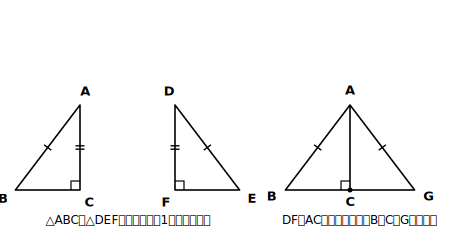

# L10 直角三角形の合同条件

## ねらい

- 直角三角形の合同条件（**斜辺と1つの鋭角（えいかく）がそれぞれ等しい／斜辺と他の1辺がそれぞれ等しい**）を使えるようになる。
- この2つが、L06の3条件と違って**証明で導ける**ことを、実際に導いて確かめる。

## 導入：情報が「足りないように見えて、足りている」三角形

直角三角形（1つの内角が直角の三角形）では、直角に向かい合う辺（いちばん長い辺）を**斜辺**（しゃへん）という。

2つの直角三角形があって、分かっているのは「斜辺が等しい」と「1つの鋭角が等しい」だけだとしよう。L06の3条件と照合すると……辺は1組、角は直角と鋭角の2組。「1組の辺とその両端の角」に見えるが、等しい角が斜辺の**両端**にあるとは限らない。条件に、ぴったりはまらない。

でも、直角三角形には隠し財産がある。**「直角である」という仮定そのものが、強力な角の情報**なのだ。掘り出してみよう。

## 主概念1：斜辺と1鋭角〜「残りの角」を掘り出す

**【定理】2つの直角三角形は、斜辺と1つの鋭角がそれぞれ等しければ合同である。**

△ABCと△DEFで、∠C＝∠F＝90°、AB＝DE（斜辺）、∠B＝∠E（鋭角）とする。

**方針メモ**: 斜辺ABの両端の角は∠Aと∠B。∠B＝∠Eは仮定にある。∠Aと∠Dは？　内角の和から出せるはず。

> **【証明】** 三角形の内角の和は180°だから、
> ∠A＝180°−90°−∠B、∠D＝180°−90°−∠E
> ∠B＝∠E【根拠: 仮定】だから、右辺どうしが等しく、∠A＝∠D となる …①
> また、AB＝DE …②【根拠: 仮定】、∠B＝∠E …③【根拠: 仮定】
> ①②③より、**対応する1組の辺（斜辺AB・DE）が等しく、その両端の角がそれぞれ等しい**から、
> △ABC≡△DEF ■

種明かしをすれば、L06の条件3に**内角の和で一行だけ橋を架けた**ものだ。新しく「認める」必要はどこにもなかった。

## 主概念2：斜辺と他の1辺〜背中合わせにくっつけて、二等辺を作る

**【定理】2つの直角三角形は、斜辺と他の1辺がそれぞれ等しければ合同である。**

△ABCと△DEFで、∠C＝∠F＝90°、AB＝DE（斜辺）、AC＝DF とする。今度は「2組の辺と……直角」。直角は等しい2辺の**間の角ではない**（間の角は∠Aと∠D。等しいかまだ不明）。L06主概念2で見たとおり、「2組の辺と間ではない角」は一般には危険な組み合わせだった。ところが直角のときだけは助かる。その理由を見よう。

**方針メモ**: 図形は動かして考えてよい（合同の動的定義）。等しい辺ACとDFを**ぴったり重ねて**、2つの三角形を背中合わせに貼ると、大きな三角形が1つできる。それが二等辺三角形になっていれば、L08の底角の定理が使えて、鋭角の等しさが手に入る→主概念1に持ち込める。

> **【証明】** △DEFを裏返して移動し、DFをACに重ねる（AとD、CとFを一致させ、EはBと反対側に置く）。移動した後のEをGとする。
> ∠ACB＝90°、∠ACG＝90°【根拠: 仮定（∠F＝90°を移した）】だから、
> ∠BCG＝∠ACB＋∠ACG＝180°。よって**B、C、Gは一直線上**にある。
> すると△ABGができて、AB＝AG【根拠: 仮定AB＝DEと、AG＝DE（移動は長さを変えない）】。
> 2辺が等しいから△ABGは二等辺三角形で、∠B＝∠G【根拠: 底角の定理（L08）】。
> ここで△ABCと△AGC（＝移動した△DEF）は、斜辺AB＝AG、鋭角∠B＝∠Gだから、
> **斜辺と1つの鋭角がそれぞれ等しい**（主概念1）より、△ABC≡△AGC。
> △AGCは△DEFを移動したものだから、△ABC≡△DEF ■

<!-- figure-spec: 意図=主概念2の証明図。要素=左に△ABC（∠C=90°・Cが下・直角マーク）と△DEF（∠F=90°）を並べ、右にDFをACに重ねて裏返し貼りした合成図（B・C・Gが一直線・AB=AGに同じ目盛り・大きな二等辺三角形ABGが見える）。alt=直角三角形2つを直角の辺で貼り合わせ、二等辺三角形を作る図。描かないもの=角度数値。生成方法=パラメトリックSVG。 -->

> **【ことば】直角三角形の合同条件**
> 2つの直角三角形は、次のどちらかが成り立つとき合同である。
> 1. **斜辺と1つの鋭角がそれぞれ等しい**
> 2. **斜辺と他の1辺がそれぞれ等しい**

## 立ち止まる価値のある違い〜「認めた条件」と「導いた条件」

L06の3条件は、作図の実験を通して**直観的・実験的に認めた**出発点だった。今日の2条件は、その出発点＋内角の和＋底角の定理から**証明で導いた**。使うときの手触りは同じ「条件」でも、**根拠のリストに入った経緯が違う**。

導いた条件の強みは、「なぜ成り立つの？」に最後まで答えられることだ。今日の証明は、この章で積み上げてきた部品（内角の和・二等辺・合同条件・移動）が総動員される、いわば**中間決算**でもある。

:::guide
**直角三角形の条件を使うときの答案の書き方**

答案では、①直角であること（∠C＝∠F＝90°）②斜辺が等しいこと③もう1つ（鋭角または他の1辺）の3点を明示してから、条件名「斜辺と1つの鋭角がそれぞれ等しい」または「斜辺と他の1辺がそれぞれ等しい」を正確に書く。**「直角三角形だから」だけで条件名を省くのは不可**。また、この条件は直角三角形専用——直角の確認を落とすと根拠が壊れる（見直しチェック②）。
:::

:::guide
**どこで使う条件なのか〜垂線が出てきたら思い出す**

この条件の主戦場は、**垂線**が登場する場面だ。「頂点から辺に垂線を下ろす」「角の二等分線上の点から2辺に垂線を引く」。垂線があれば直角三角形が生まれ、斜辺（もとの線分）と組み合わせて合同が言えることが多い。練習3がその典型例だ。
:::

:::zatsudan
直角三角形だけ専用の合同条件をもらえるのは、ちょっと特別扱いに見えるよね。からくりは「直角」という情報の濃さにある。角が1つ直角と決まると、内角の和180°から残り2つの角の和も90°と縛られて、三角形の自由度がぐっと減る。情報の濃い仮定は、少ない追加材料で形を決めてしまう——「1つ分かると、芋づる式に決まる」の気持ちよさが、直角三角形には最初から仕込まれているんだ。
:::

## 練習

1. 次の各組の直角三角形（∠C＝∠F＝90°）は合同と言えるか。言える場合は条件を正確に書こう。
   (1) AB＝DE＝8cm、∠A＝∠D＝35°
   (2) AB＝DE＝8cm、BC＝EF＝5cm
   (3) AC＝DF＝6cm、BC＝EF＝5cm（斜辺の情報なし）
2. (1)で「言える」とした場合、対応する頂点の順に注意して≡の式を書こう。
3. ∠XOYの二等分線上の、Oとは異なる点Pから、辺OX・OYに垂線PH・PKを下ろす。PH＝PKであることを証明しよう（Step 1: 仮定と結論の抜き出しから。方針メモ: どの2つの三角形に注目する？ 斜辺はどれ？）。
4. 【読む】次の答案のあやしい箇所を指摘しよう。
   「△ABCと△DEFで、AB＝DE、BC＝EF、∠A＝∠D。2組の辺と1組の角がそれぞれ等しいから△ABC≡△DEF ■」

:::stretch
**S1** 練習3の図で、さらに「OH＝OK」も成り立つ。証明してみよう（すでに示した△の合同から取り出せるか？ それとも別の直角三角形の組に、もう一度条件を使うか？　2通りの道がある。両方試して、短い方を答案にしよう）。
:::

---

対応解答: answer_key_L09-12.md

<!-- gen_nav:nav:start（自動生成・手編集しない） -->

---

[← 前のレッスン](lesson_09.md)｜[単元の目次](README.md)｜[解答](answer_key_L09-12.md)｜[次のレッスン →](lesson_11.md)

<!-- gen_nav:nav:end -->
