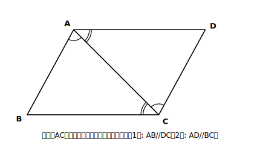
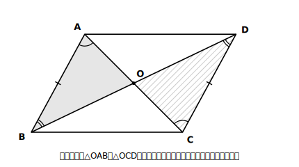

# L11 平行四辺形の性質

## ねらい

- 平行四辺形の**定義**（2組の対辺がそれぞれ平行）だけを出発点に、3つの性質（**対辺はそれぞれ等しい／対角はそれぞれ等しい／対角線はそれぞれの中点で交わる**）を証明できるようになる。
- **証明した性質が、次の証明の根拠になる**連鎖を体験する。

## 導入：また会ったね、平行四辺形

平行四辺形も、はじめましてではない。小学校で、紙の上の平行四辺形を測ったり切ったりして「向かい合う辺の長さは等しい」「向かい合う角の大きさは等しい」と調べた記憶があるはずだ。二等辺三角形（L08）と同じ再会のしかただ。**図形は同じ、調べ方が新しい**。今回は、測らずに定義から掘り出す。

> **【ことば】定義: 2組の対辺がそれぞれ平行な四角形を、平行四辺形という。**

用語の整理: 四角形の向かい合う辺を**対辺**、向かい合う角を**対角**という。四角形ABCDでは、辺ABとDC・辺ADとBCが対辺、∠Aと∠C・∠Bと∠Dが対角だ。平行四辺形ABCDを記号で▱ABCDと書くことがある（頂点は一周する順に読む）。

定義が言っているのは**平行だけ**。「対辺の長さが等しい」も「対角が等しい」も、定義には入っていない。知っているけれど、まだ使えない。L08と同じ我慢の場面だ。定義から掘り出そう。

## 主概念1：対辺相等〜対角線1本で、三角形の世界に持ち込む

**【定理】平行四辺形の対辺はそれぞれ等しい。**

**Step 1** 仮定: AB//DC、AD//BC　結論: AB＝DC、AD＝BC

**Step 2（方針メモ）** 手持ちの武器（合同条件）は三角形用。四角形のままでは使えない→**対角線ACを引いて三角形2つに割る**→△ABCと△CDAの材料: ACは共通。あとは角。平行が2組もあるから、錯角が2組取れるはず。

<!-- figure-spec: 意図=対辺相等の証明図。要素=平行四辺形ABCD（Aが左上・Bが左下・Cが右下・Dが右上）・対角線AC・∠BACと∠DCAに同系の弧マーク（AB//DCの錯角）・∠BCAと∠DACに別系の弧マーク（AD//BCの錯角）。alt=平行四辺形を対角線で2つの三角形に分け、錯角の対応を示した図。描かないもの=辺の等しさの目盛りマーク（これから証明する内容のため）。生成方法=パラメトリックSVG。 -->

**Step 3（記述）**

> **【証明】** 対角線ACを引く。△ABCと△CDAで、
> ∠BAC＝∠DCA …①　【根拠: AB//DC（仮定）だから錯角は等しい】
> ∠BCA＝∠DAC …②　【根拠: AD//BC（仮定）だから錯角は等しい】
> AC＝CA …③　【根拠: 共通な辺】
> ①②③より、**対応する1組の辺が等しく、その両端の角がそれぞれ等しい**から、
> △ABC≡△CDA
> 合同な図形では対応する辺は等しいから、**AB＝CD、BC＝DA** ■

見直し3点チェック: ①結論（辺の等しさ）を途中で使っていない ✓　②辺ACの両端の角は、Aの側が①、Cの側が②で、「両端」がそろってから条件3を使った ✓　③最終行は結論そのもの ✓。

## 主概念2：対角相等〜同じ合同から、もうひと掘り

**【定理】平行四辺形の対角はそれぞれ等しい。**

新しい合同証明は要らない。主概念1の△ABC≡△CDAから、まだ取り出していないものがある。

- ∠B＝∠D　【根拠: △ABC≡△CDAの対応する角】
- ∠BAD＝∠BAC＋∠CAD、∠DCB＝∠DCA＋∠ACB。①②より右辺どうしの和が等しいから、**∠BAD＝∠DCB**

もう1組の対角∠Aと∠Cは、①と②の**足し算**で出た。対角線ACが∠Aと∠Cを2つずつに割っていたから、部品どうしの等しさを足し合わせればよい。1回の合同証明から定理が2つ。L08（底角の定理→頂角の二等分線の定理）と同じ「もうひと掘り」だ。

ついでに、対角とセットで使う事実をひとつ。AD//BCで、ABを2直線に交わる直線とみると、∠Aと∠Bは同側内角（L02練習4）だから、**∠A＋∠B＝180°**、すなわち**平行四辺形のとなり合う角の和は180°**。対角は「等しい」、となりは「たして180°」。

## 主概念3：対角線〜証明した性質が、さっそく根拠になる

**【定理】平行四辺形の対角線は、それぞれの中点で交わる。**

**Step 1** 仮定: 四角形ABCDは平行四辺形（対角線ACとBDの交点をOとする）　結論: OA＝OC、OB＝OD

**Step 2（方針メモ）** OAとOC・OBとODが対応する辺になる合同を探す→候補は△OABと△OCD→材料: AB//DCから錯角が2組（∠OABと∠OCD、∠OBAと∠ODC）。辺は？　ABとCD——**主概念1で証明したばかりの対辺相等が使える**。

<!-- figure-spec: 意図=対角線の性質の証明図。要素=平行四辺形ABCD・対角線AC・BDとその交点O・△OABと△OCDを薄い色分け・∠OABと∠OCD、∠OBAと∠ODCに錯角のマーク・ABとDCに同じ目盛りマーク（対辺相等は証明済みのため付けてよい）。alt=平行四辺形の2本の対角線が交わり、向かい合う2つの三角形ができている図。描かないもの=OA=OC等の目盛り（これから証明する内容のため）。生成方法=パラメトリックSVG。 -->

**Step 3（記述）**

> **【証明】** △OABと△OCDで、
> AB＝CD …①　【根拠: 平行四辺形の対辺は等しい（主概念1で証明済み）】
> ∠OAB＝∠OCD …②　【根拠: AB//DC（仮定）だから錯角は等しい】
> ∠OBA＝∠ODC …③　【根拠: AB//DC（仮定）だから錯角は等しい】
> ①②③より、**対応する1組の辺が等しく、その両端の角がそれぞれ等しい**から、
> △OAB≡△OCD
> 合同な図形では対応する辺は等しいから、**OA＝OC、OB＝OD** ■

①に注目してほしい。根拠の欄に書いたのは、仮定でも「認めた事柄」でもなく、**さっき自分たちが証明した定理**だ。導く→リストに入る→次の根拠になる。この連鎖はL03（内角の和→外角の性質）から続くこの章のリズムで、平行四辺形はその連鎖がいちばん豊かに見える場所だ。

> **【ことば】平行四辺形の性質**
> 1. 2組の対辺はそれぞれ等しい。
> 2. 2組の対角はそれぞれ等しい。
> 3. 対角線はそれぞれの中点で交わる。

:::guide
**答案では「平行四辺形だから」で止めない**

平行四辺形の性質を根拠に使うときは、【根拠: 平行四辺形の対辺は等しいから】のように**どの性質か**まで書く。「平行四辺形だから」だけでは、定義（平行）と3つの性質のどれを使ったのか読み手に伝わらない。根拠の文言を特定するのは見直しチェック②の仕事だ。
:::

:::guide
**対角線は「四角形を三角形に翻訳する」補助線**

この章の合同条件は三角形専用の道具だから、四角形の問題では**対角線を引いて三角形の世界に持ち込む**のが基本の一手になる。L03の「平行線を引く」が実験の翻訳だったように、L11の「対角線を引く」は道具に合わせた翻訳だ。四角形で詰まったら、まず対角線。ただし引いたら身分の宣言（L08 guide）を忘れずに。
:::

:::zatsudan
定義に入っていたのは「2組の対辺がそれぞれ平行」——たったこれだけ。なのに、辺の長さの等しさ、角の等しさ、対角線の交わり方まで、ぜんぶ定義の中に折りたたまれていた。定義って、圧縮ファイルみたいなものだね。展開（証明）してみるまで、中に何が入っているか全部は見えない。数学者が定義を短くしたがるのは、短い定義ほど「これだけ認めれば、あとは全部ついてくる」という切れ味が出るからなんだ。
:::

## 練習

1. ▱ABCDで、AB＝7cm、AD＝4cm、∠A＝65°のとき、辺CD・BCの長さと、∠B・∠C・∠Dの大きさを求めよう。それぞれ【根拠: …】を一言そえること。
2. ▱ABCDの対角線の交点Oを通る直線が、辺ABと点E、辺CDと点F（いずれも頂点ではない）で交わっている。OE＝OFであることを証明しよう（Step 1: 仮定と結論の抜き出しから。方針メモ: どの2つの三角形？　Oのまわりに使える角は？）。
3. 【読む】主概念1の証明から**新たに分かったこと**はどれか、すべて選ぼう。
   (あ) AB//DCである　(い) AB＝CDである　(う) ∠BAC＝∠DCAである　(え) BC＝DAである
4. 次の答案のあやしい箇所を指摘しよう。
   「▱ABCDの対角線AC・BDの交点をOとする。平行四辺形の対角線は長さが等しいから、OA＝OC ■」

:::stretch
**S1** ▱ABCDの対角線の交点Oは、この図形の「180°回転の中心」になっている。Oを中心に図形全体を180°回すと、AはCに、BはDに移り、平行四辺形はもとの自分にぴったり重なる。今日証明した性質3（OA＝OC、OB＝OD）を根拠に、この理由を説明してみよう。また、この「点対称」の見方を使うと、性質1（AB＝CD）はどう説明できるだろうか。
:::

---

対応解答: answer_key_L09-12.md

<!-- gen_nav:nav:start（自動生成・手編集しない） -->

---

[← 前のレッスン](lesson_10.md)｜[単元の目次](README.md)｜[解答](answer_key_L09-12.md)｜[次のレッスン →](lesson_12.md)

<!-- gen_nav:nav:end -->
