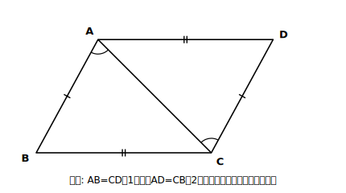

# L12 平行四辺形になるための条件

## ねらい

- 平行四辺形に**なるための条件**5つを整理し、四角形が平行四辺形かどうかの判定に使えるようになる。
- 条件の証明を通して、**合同を示して満足せず、「錯角が等しい→平行」まで橋を渡りきる**型を身につける（見直しチェック③の主戦場）。

## 主概念1：逆向きの橋〜「平行四辺形ならば」から「ならば平行四辺形」へ

L11で架けたのは「平行四辺形**ならば**、対辺が等しい・対角が等しい・対角線がそれぞれの中点で交わる」という橋だった。今度は矢印を入れかえたい。「対辺が等しい**ならば**、平行四辺形」は言えるか？　L09（二等辺三角形になるための条件）でやったのと同じ、逆向きの橋の点検だ。入れかえた主張は自動では正しくならない。**1本ずつ、新規に証明し直す。**

点検の結果だけ先にまとめると、次の5つが成り立つ。

> **【ことば】平行四辺形になるための条件**
> 四角形は、次のどれかが成り立つとき平行四辺形である。
> 1. 2組の対辺がそれぞれ平行である。（定義）
> 2. 2組の対辺がそれぞれ等しい。
> 3. 2組の対角がそれぞれ等しい。
> 4. 対角線がそれぞれの中点で交わる。
> 5. 1組の対辺が平行で、その長さが等しい。

1は定義そのもの。2〜4はL11の性質の逆向き。5だけは、L11で挙げた3つの性質のどれの逆にもなっていない新顔の**お得な条件**だ（平行1組＋長さ1組の、合計2つの情報で済む）。この時間は代表として**2と5**を証明する（3は練習とstretchで、4は練習2で自分の手で確かめる）。

## 主概念2：条件2の証明〜ゴールは「平行」。合同はまだ途中

**【定理】2組の対辺がそれぞれ等しい四角形は、平行四辺形である。**

**Step 1** 仮定: AB＝CD、AD＝CB　結論: 四角形ABCDは平行四辺形（**つまりAB//DCかつAD//BC**）

結論の翻訳が今日の急所だ。「平行四辺形である」を示すとは、定義に立ち返れば**2組の対辺が平行であること**を示すこと。ゴールは辺の等しさでも合同でもなく、**平行**。これを最初に確認しておかないと、途中で満足してしまう。

**Step 2（方針メモ）** 平行を言う道具は1つしかない: 平行線になるための条件（錯角または同位角が等しければ平行・L02）→錯角がほしい→対角線ACを引く→△ABCと△CDAは、仮定の2組の辺＋共通辺で「対応する3組の辺がそれぞれ等しい」→合同→錯角が手に入る→平行。

<!-- figure-spec: 意図=条件2の証明図。要素=四角形ABCD（平行四辺形の形だが平行マークは付けない）・対角線AC・ABとCDに1本目盛り、ADとCBに2本目盛り（仮定の対辺相等）・∠BACと∠DCAに弧マーク（合同から取り出す錯角）。alt=対辺がそれぞれ等しい四角形を対角線で2つの三角形に分けた図。描かないもの=平行マーク（これから証明する内容のため）。生成方法=パラメトリックSVG。 -->

**Step 3（記述）**

> **【証明】** 対角線ACを引く。△ABCと△CDAで、
> AB＝CD …①　【根拠: 仮定】
> BC＝DA …②　【根拠: 仮定】
> AC＝CA …③　【根拠: 共通な辺】
> ①②③より、**対応する3組の辺がそれぞれ等しい**から、△ABC≡△CDA
> 合同な図形では対応する角は等しいから、∠BAC＝∠DCA …④
> ④は直線ACに対する錯角だから、**錯角が等しければ2直線は平行**であり、AB//DC …⑤
> 同様に、∠BCA＝∠DAC …⑥【根拠: 対応する角】より、AD//BC …⑦
> ⑤⑦より、2組の対辺がそれぞれ平行だから、四角形ABCDは**平行四辺形**である ■

④で合同から角を取り出したあと、⑤で**平行線になるための条件に乗り換えた**——ここが橋の最後の一歩だ。「△ABC≡△CDAより平行四辺形 ■」と合同で切り上げた答案は、ゴールの手前で止まっている（見直しチェック③）。合同はこの証明では**中継地点**にすぎない。

## 主概念3：条件5の証明〜平行1組を最大限に使う

**【定理】1組の対辺が平行で、その長さが等しい四角形は、平行四辺形である。**

**Step 1** 仮定: AD//BC、AD＝BC　結論: 四角形ABCDは平行四辺形（示すべき残りは**AB//DC**）

仮定に平行が1組あるから、示すのは残りの1組だけでいい。

**Step 2（方針メモ）** AB//DCを言いたい→錯角がほしい→対角線ACを引く→△ABCと△CDA…材料は、BC＝DA（仮定）、AC共通、そして**仮定の平行AD//BCから錯角∠DAC＝∠BCAがただで手に入る**。2組の辺とその間の角、でいけそうだ。

**Step 3（記述）**

> **【証明】** 対角線ACを引く。△ABCと△CDAで、
> BC＝DA …①　【根拠: 仮定】
> ∠BCA＝∠DAC …②　【根拠: AD//BC（仮定）だから錯角は等しい】
> AC＝CA …③　【根拠: 共通な辺】
> ①②③より、**対応する2組の辺がそれぞれ等しく、その間の角が等しい**から、△ABC≡△CDA
> 合同な図形では対応する角は等しいから、∠BAC＝∠DCA
> 錯角が等しいから、AB//DC
> AD//BC（仮定）と合わせて、2組の対辺がそれぞれ平行だから、四角形ABCDは**平行四辺形**である ■

②では平行を「性質」の向きで使い（平行→錯角相等）、終盤では「条件」の向きで使った（錯角相等→平行）。**同じ道具を、行きと帰りで逆向きに使う**——L02で「向きの区別が勝敗を分ける」と言った、その現場がここだ。

:::guide
**条件はどれを使ってもよい〜選ぶ目安は「手元の材料」**

平行四辺形だと示したいとき、5つの条件のどれを目指すかは自由だ。目安は手元の材料: 辺の長さがそろっていれば条件2、角の情報ばかりなら条件3、対角線の交点が主役の図なら条件4、平行が1組見えていれば条件5。**材料の少ない条件（4や5）ほど、使えたときの節約が大きい**。証明の前に「どの条件がいちばん近いか」を方針メモで一言書く習慣をつけよう。
:::

:::guide
**「1組の対辺が平行で、もう1組の対辺の長さが等しい」ではダメ**

条件5は、平行と長さが**同じ組**の対辺についての条件だ。「AD//BCで、AB＝DC」のように**別の組**にずれた瞬間、平行四辺形は保証されなくなる。成り立たない四角形が実際に作れる（その形の正体はL14で明かす）。条件を使う直前に「平行の組と、等しい組は、同じ対辺か？」を確認すること。見直しチェック②（根拠の文言の照合）は、合同条件だけでなくここでも働く。
:::

:::zatsudan
工具箱や裁縫箱で、開くと段がスライドしてせり出すタイプを見たことはないかな。あの段を支える2本のアームは、長さの等しいものが向かい合わせに取り付けてある。AB＝CD、BC＝ADという作りだ。今日の条件2の言葉で言えば、アームがどの角度に開いても四角形ABCDは**常に平行四辺形**で、だから段は傾かずに水平のまませり出す。「2組の対辺がそれぞれ等しい」だけで平行が保証されるからこそ、蝶番の角度を測って調整する必要がない。条件のありがたみが、道具の設計にそのまま埋まっている例だね。
:::

## 練習

1. 四角形ABCDが次の各場合に平行四辺形と言えるか。言える場合はどの条件か番号で答え、言えない場合は理由を一言書こう（対角線AC・BDの交点をOとする）。
   (1) AB＝DC＝5cm、AD＝BC＝7cm
   (2) ∠A＝110°、∠B＝70°、∠C＝110°、∠D＝70°
   (3) OA＝OC＝4cm、OB＝OD＝6cm
   (4) AD//BC、AB＝DC＝5cm
2. 条件4「対角線がそれぞれの中点で交わる四角形は平行四辺形である」を証明しよう（Step 1から。方針メモ: 交点Oのまわりで合同を2回使う？　それとも1回の合同で錯角1組→条件5に乗り換える？　好きな道でよいが、最後は平行まで渡りきること）。
3. 【成り立たない例づくり】次の主張は正しくない。成り立たない四角形の例を1つ、図をかいて作ろう。
   「対角線が垂直に交わる四角形は、平行四辺形である。」
4. ▱ABCDの対角線BD上に、BE＝DFとなる点E・F（EはBの側、FはDの側）をとる。ただし、BE＝DFは対角線BDの半分より短いものとする。四角形AECFが平行四辺形になることを証明しよう（方針メモ: AECFの対角線は何と何？　その交点は？　条件4が近道）。
5. 【読む】次の答案を見直し3点チェックにかけ、足りない箇所を指摘して**続きを書き足そう**。
   「四角形ABCDで、AB＝CD、AD＝CB。対角線ACを引くと、△ABCと△CDAで、AB＝CD、BC＝DA、ACは共通。対応する3組の辺がそれぞれ等しいから△ABC≡△CDA。よって四角形ABCDは平行四辺形である ■」

:::stretch
**S1** 条件3「2組の対角がそれぞれ等しい四角形は平行四辺形である」を証明してみよう。ヒント: 対角線も合同も要らない。四角形の内角の和は360°（L04）。∠A＝∠C、∠B＝∠Dとおいて∠A＋∠Bを計算すると180°になる。「同側内角の和が180°ならば平行」（L02のstretchで組み立てた条件）が使える。どの辺とどの辺が平行と言えるか、2組とも確かめること。
:::

---

対応解答: answer_key_L09-12.md

<!-- gen_nav:nav:start（自動生成・手編集しない） -->

---

[← 前のレッスン](lesson_11.md)｜[単元の目次](README.md)｜[解答](answer_key_L09-12.md)｜[次のレッスン →](lesson_13.md)

<!-- gen_nav:nav:end -->
