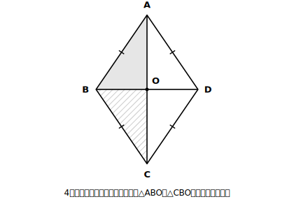
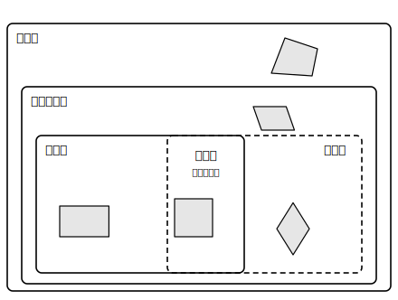

# L13 特別な平行四辺形〜長方形・ひし形・正方形

## ねらい

- 長方形・ひし形・正方形を、**定義**から出発して**平行四辺形の特別な場合**として位置づけられるようになる。
- それぞれの**対角線の性質**（長方形: 長さが等しい／ひし形: 垂直に交わる／正方形: 両方）を証明して使えるようになる。
- 4種類の四角形の**包含関係**を整理する。

## 主概念1：定義の系図〜「特別な場合」は性質を全部相続する

小学校からの顔なじみ3つを、定義で言い直すところから始める。

> **【ことば】定義: 4つの角がすべて等しい四角形を、長方形という。**
> **【ことば】定義: 4つの辺がすべて等しい四角形を、ひし形という。**
> **【ことば】定義: 4つの角がすべて等しく、4つの辺がすべて等しい四角形を、正方形という。**

どの定義にも「平行」の文字はない。それでも3つとも平行四辺形だと言える——L12の条件が働くからだ。

- **長方形**: 4つの角がすべて等しいなら、∠A＝∠Cかつ∠B＝∠D。**2組の対角がそれぞれ等しい**（条件3）から、平行四辺形。
- **ひし形**: 4つの辺がすべて等しいなら、AB＝DCかつAD＝BC。**2組の対辺がそれぞれ等しい**（条件2）から、平行四辺形。
- **正方形**: 定義が長方形の定義とひし形の定義を両方含むので、どちらの道でも平行四辺形。

平行四辺形だと分かった瞬間、L11で証明した性質（対辺相等・対角相等・**対角線はそれぞれの中点で交わる**）を、3つとも**ただで相続する**（L09で正三角形が二等辺三角形から相続したのと同じ仕組み）。だから、たとえば長方形の対角線も必ずそれぞれの中点で交わる。改めて証明し直す必要はない。

なお、長方形の4つの角は、内角の和360°を4等分して**1つ90°**。「4つの角がすべて等しい」と「4つの角がすべて直角」は同じことになる。

## 主概念2：対角線の性質〜特別な分だけ、対角線も特別になる

相続財産に加えて、特別な四角形には**固有の**対角線の性質が上乗せされる。

**【定理】長方形の対角線の長さは等しい。**

**Step 1** 仮定: 四角形ABCDは長方形（∠ABC＝∠DCB＝90°）　結論: AC＝DB

**Step 2（方針メモ）** ACとDBが対応する辺になる合同→△ABCと△DCB→材料: BCは共通、AB＝DC（平行四辺形の対辺相等・相続済み）、間の角∠ABC＝∠DCB＝90°（定義）。

> **【証明】** △ABCと△DCBで、
> AB＝DC …①　【根拠: 長方形は平行四辺形であり、平行四辺形の対辺は等しい】
> ∠ABC＝∠DCB …②　【根拠: 長方形の定義（4つの角がすべて等しい）】
> BC＝CB …③　【根拠: 共通な辺】
> ①②③より、**対応する2組の辺がそれぞれ等しく、その間の角が等しい**から、△ABC≡△DCB
> 合同な図形では対応する辺は等しいから、**AC＝DB** ■

**【定理】ひし形の対角線は垂直に交わる。**

**Step 1** 仮定: 四角形ABCDはひし形（対角線の交点をO）　結論: AC⊥BD

**Step 2（方針メモ）** 垂直を言うには∠AOB＝90°を出したい→∠AOBと∠COBが等しくて、和が180°（一直線）なら、それぞれ90°（L08主概念3で使った手だ）→△ABOと△CBOの合同を狙う→材料: BA＝BC（定義）、OA＝OC（対角線はそれぞれの中点で交わる・相続済み）、BO共通。3組の辺がそろう。

<!-- figure-spec: 意図=ひし形の対角線垂直の証明図。要素=ひし形ABCD（Aが上・Bが左・Cが下・Dが右）・対角線AC・BDと交点O・4辺に同じ目盛りマーク・△ABOと△CBOを薄い色分け。alt=ひし形の2本の対角線と、その交点をはさむ2つの三角形。描かないもの=Oの直角マーク（これから証明する内容のため）。生成方法=パラメトリックSVG。 -->

> **【証明】** △ABOと△CBOで、
> BA＝BC …①　【根拠: ひし形の定義（4つの辺がすべて等しい）】
> OA＝OC …②　【根拠: ひし形は平行四辺形であり、平行四辺形の対角線はそれぞれの中点で交わる】
> BO＝BO …③　【根拠: 共通な辺】
> ①②③より、**対応する3組の辺がそれぞれ等しい**から、△ABO≡△CBO
> 合同な図形では対応する角は等しいから、∠AOB＝∠COB
> ∠AOB＋∠COB＝180°【根拠: 一直線の角は180°】だから、∠AOB＝90°
> よって **AC⊥BD** ■

**正方形**は長方形でもありひし形でもあるから、対角線の性質を両方相続する: **長さが等しく、垂直に交わる**（もちろん、それぞれの中点でも交わる）。

## 主概念3：包含関係〜「仲間はずれ」ではなく「入れ子」

ここまでを1枚の系図にする。

<!-- figure-spec: 意図=包含関係の整理図。要素=大きな枠「四角形」の中に「平行四辺形」の枠、その中に一部重なり合う「長方形」と「ひし形」の2つの枠、重なり部分に「正方形」。各枠に代表図形の小さなシルエット。alt=四角形・平行四辺形・長方形・ひし形・正方形の包含関係を入れ子の枠で示した図。描かないもの=台形（この図の主役ではない）。生成方法=パラメトリックSVG。 -->

- 正方形は、長方形の特別な場合であり、ひし形の特別な場合でもある（**両方の重なり**にいる）。
- 長方形・ひし形は、平行四辺形の特別な場合。
- だから「正方形は平行四辺形ですか？」の答えは**はい**。日常の言葉では「あれは正方形で、平行四辺形じゃない」と言いたくなるが、数学の分類は**その名前の定義を満たすか**だけで決まる。狭い名前ほど条件が厳しく、厳しい条件を満たす図形は、ゆるい条件も自動的に満たしている。

:::guide
**「長方形になるための条件」も、逆向きの点検が要る**

主概念2は「長方形**ならば**対角線の長さが等しい」だった。入れかえた「対角線の長さが等しい**平行四辺形**ならば長方形」も実は成り立つ（stretch S1で証明する）。ただし「対角線の長さが等しい**四角形**ならば長方形」は成り立たない。平行四辺形という前提を外すと崩れる（その反例はL14で作る）。**どこまでが仮定に入っているか**で逆の成否が変わる。入れかえるときは仮定の範囲まで正確に。
:::

:::guide
**対角線は四角形の「指紋」**

4種類の四角形は、対角線だけ見ても区別できる: それぞれの中点で交わる（平行四辺形）／＋長さが等しい（長方形）／＋垂直（ひし形）／全部（正方形）。図の中で対角線の情報が与えられたら、この対応表を思い出すと、どの四角形の話をしているのか・どの性質が使えるのかが素早く特定できる。
:::

:::zatsudan
「正方形は長方形の特別な場合」と聞くと、格下げされたようで正方形に少し気の毒な感じもするけれど、分類の世界では逆で、**入れ子の内側ほど「持ち物」が多い**。正方形は、四角形の性質も、平行四辺形の性質も、長方形の性質も、ひし形の性質も、全部持っている大金持ちだ。条件が厳しいほど自由は減るが、その分だけ保証される性質が増える——制約と性質の交換は、数学のあちこちで顔を出す取引だよ。
:::

## 練習

1. 次の各文の正誤を答え、誤りのものは反対の例（あてはまらない図形の例）を1つ挙げよう。
   (1) ひし形は平行四辺形である。
   (2) 平行四辺形は長方形である。
   (3) 正方形はひし形である。
2. 長方形ABCDの対角線の交点をOとする。OA＝OB であることを、今日の定理と性質から導こう（ヒント: 対角線それぞれの中点＋長さが等しい）。
3. ひし形ABCDで、∠BAC＝28°のとき、∠ABD の大きさを求めよう（ヒント: 対角線は垂直に交わる。△ABOの内角の和）。
4. 【読む】次の答案のあやしい箇所を指摘しよう。
   「四角形ABCDで、AC⊥BDである。ひし形の対角線は垂直に交わるから、四角形ABCDはひし形である ■」
5. ▱ABCDに、さらに「AB＝BC」という条件を1つ加えると、この四角形は何になるか。理由（4つの辺がすべて等しくなること）もそえて答えよう。

:::stretch
**S1** 「対角線の長さが等しい**平行四辺形**は、長方形である」を証明してみよう。方針メモ: △ABCと△DCBで、3組の辺（AB＝DC・BC共通・AC＝DB）から合同→∠ABC＝∠DCB。一方、AB//DCだから∠ABC＋∠DCB＝180°（同側内角）。等しくて、たして180°の2つの角は……？　最後に、残りの2つの角も等しくなること（対角相等）まで言って、「4つの角がすべて等しい」で締めること。
:::

---

対応解答: answer_key_L13-16.md

<!-- gen_nav:nav:start（自動生成・手編集しない） -->

---

[← 前のレッスン](lesson_12.md)｜[単元の目次](README.md)｜[解答](answer_key_L13-16.md)｜[次のレッスン →](lesson_14.md)

<!-- gen_nav:nav:end -->
