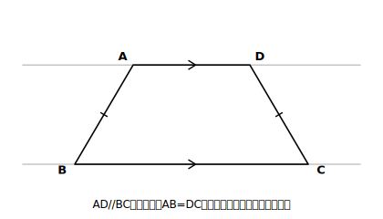

# L14 逆と反例

## ねらい

- 命題の**逆**という用語を知り、命題とその逆を正しく作り分けられるようになる。
- **正しい命題の逆は正しいとは限らない**ことを、具体例で言い切れるようになる。
- **反例**という用語を知り、正しくない命題に反例を1つ作って「正しくない」と示せるようになる。

## 主概念1：逆〜この章でずっとやってきた「入れかえ」に、名前が付く

この章では、仮定と結論を入れかえる場面に何度も出会ってきた。

- 「二等辺三角形**ならば**底角は等しい」（L08）⇄「2つの角が等しい**ならば**二等辺三角形」（L09）
- 「平行四辺形**ならば**対辺はそれぞれ等しい」（L11）⇄「2組の対辺がそれぞれ等しい**ならば**平行四辺形」（L12）

この入れかえの関係に、正式な名前を付ける。

> **【ことば】定義: 1つの命題の仮定と結論を入れかえた命題を、もとの命題の逆という。**

「AならばB」の逆は「BならばA」。上の2組は、**もとの命題も逆も両方正しい**幸運なペアだった（だからこそ性質と条件の両方向が使えた）。

では、いつでもそうか。試しに、この章の最初の定理でやってみよう。

- もとの命題: 「2つの角が対頂角である**ならば**、その2つの角は等しい」。これは正しい（L01で導いた）。
- 逆: 「2つの角が等しい**ならば**、その2つの角は対頂角である」……？

正しくない。等しい2つの角なんて、対頂角でなくてもいくらでもある。たとえば、**正三角形の2つの内角**は等しい（どちらも60°）が、対頂角ではない。

> **【ことば】正しい命題の逆は、正しいとは限らない。**

「限らない」であって「必ず誤り」でもない（L08⇄L09のように両方正しいペアもある）。**逆は、作ったら必ず、正しいかどうかを新規に点検する**——これがルールだ。

## 主概念2：反例〜たった1つの例で「正しくない」を言い切る

いま「逆は正しくない」と判断した根拠は、正三角形という**具体例1つ**だった。この道具にも名前を付ける。

> **【ことば】定義: 命題の仮定を満たしているが、結論を満たしていない例を、反例という。**

**命題が正しくないことを示すには、反例を1つあげればよい。** 「いつでも成り立つ」という主張は、成り立たない例が1つでもあれば崩れるからだ。証明（すべての場合を根拠で押さえる）に比べて、反例はたった1つの例で決着する——攻める道具としては驚くほど安上がりだ。

ただし反例には**資格審査**が2つある。

1. **仮定を満たしていること。** 仮定を満たさない例は、そもそもその命題の話の外にいる。
2. **結論を満たしていないこと。** ここが崩れて初めて「正しくない」の証拠になる。

L09・L12でやった「成り立たない例づくり」は、まさに反例づくりだった。今日は正式な名前と資格審査つきで、少し手ごわい相手に挑む。

## 活動：等脚台形〜「惜しい四角形」を自分の手で作る

**【命題】一組の対辺が平行で、もう一組の対辺の長さが等しい四角形は、平行四辺形である。**

L12の条件5（1組の対辺が平行で**その**長さが等しい）とそっくりだが、平行の組と等しい組が**別の組**にずれている。この命題、正しいだろうか。

反例を探そう。「AD//BC、AB＝DC、でも平行四辺形ではない」四角形を作りたい。

**作り方**: 平行な2本の直線を引く。上の直線に短い線分AD、下の直線に長い線分BCをとる。ただし、**ADの真下にBCの中央が来るように**、左右対称に置く。AとB、DとCを結ぶ。

<!-- figure-spec: 意図=反例（等脚台形）の作図。要素=水平な平行線2本（薄く）・上の線分AD（短い）・下の線分BC（長い・ADと中央をそろえて左右対称）・脚ABとDCに同じ目盛りマーク・AD//BCの平行マーク。alt=上底が短く下底が長い左右対称の台形。描かないもの=「平行四辺形」を思わせるゆがみ（左右対称を厳密に）。生成方法=パラメトリックSVG（AD:BC=2:4程度・等脚を厳密に）。 -->

左右対称に作ったから、2本の脚はAB＝DCで、仮定は満たす ✓。しかしABとDCは、のばせば左右から近づいて交わる向きにあり、平行ではない。つまり平行四辺形ではない。結論を満たさない ✓。資格審査を両方通過、**反例の完成**だ。

このような、平行でない1組の対辺の長さが等しい台形を**等脚台形**という。等脚台形は「平行1組・相等1組」まで平行四辺形と同じ持ち物なのに、組がずれているだけで平行四辺形になり損ねる。L12のguideで予告した「惜しい四角形」の正体だ。

:::guide
**反例づくりの手順は「仮定で作って、結論で壊す」**

やみくもに図を探すのではなく、①まず**仮定を満たす図形を素直に作り**、②その図形を、仮定を保ったまま**結論が崩れる方向へ変形できないか**動かしてみる。等脚台形も「AD//BCの四角形」をまず描き、ABとDCの長さをそろえたまま平行が壊れる置き方（左右対称）を探した結果だ。動的な図形ソフトが使えるなら、仮定の条件を固定して頂点をドラッグしてみると、反例候補が目で見つかる。
:::

:::guide
**「反例が見つからない」は「正しい」の証明ではない**

反例をしばらく探して見つからなくても、それは「正しい」ことの根拠にはならない。探し方が足りないだけかもしれないからだ。正しいと言い切るには、やはり**証明**が要る。命題と向き合うときの正しい構えは、「反例探しと証明の方針探しを**並行して**進め、先に決着した方を採る」。反例探しの途中で「どうしても壊れない部分」が見えたら、それはしばしば証明の急所のヒントになっている。
:::

:::zatsudan
「ならば」の逆が危ないのは、日常の言葉でも同じだね。「雨が降っているならば、地面はぬれている」は正しいけれど、逆の「地面がぬれているならば、雨が降っている」は……水まきかもしれないし、誰かがジュースをこぼしたのかもしれない。人間はつい「AならばB」を「BならばA」とセットで信じてしまうくせがある。だからこそ数学は、逆を作ったら必ず点検、という習慣をルールにして身につけさせるんだ。この習慣、図形の外でもかなり役に立つよ。
:::

## 練習

1. 次の命題の逆を作ろう。そして、もとの命題と逆のそれぞれについて、正しいか正しくないかを答えよう（正しくない場合は反例を1つ）。
   (1) △ABC≡△DEFならば、AB＝DEである。
   (2) 2直線が平行ならば、錯角は等しい。
   (3) x＝3ならば、x²＝9である。
   (4) 四角形ABCDが正方形ならば、四角形ABCDは長方形である。
2. 次の例は、命題「対角線がそれぞれの中点で交わる四角形は、平行四辺形である」の反例と言えるか。資格審査（仮定を満たすか・結論を満たさないか）で判定しよう。
   (1) 対角線の一方だけが他方を2等分している、平行四辺形でない四角形
   (2) 等脚台形
3. 【反例づくり】次の命題は正しくない。反例を1つ、図をかいて作ろう。
   「対角線の長さが等しい四角形は、長方形である。」（ヒント: 今日作ったばかりの、あの四角形の対角線を測ってみよう）
4. 【読む】次の主張のあやしい箇所を、今日の用語を使って指摘しよう。
   「『ひし形ならば対角線は垂直に交わる』は正しい。だから『対角線が垂直に交わるならばひし形』も正しい。」

:::stretch
**S1** 「n角形の内角の和が360°ならば、nは4である」。この命題は正しいだろうか。もとの命題「n＝4ならば内角の和は360°」（L04）と見比べながら考えてみよう。正しいと考えるなら理由を、正しくないと考えるなら反例を示すこと。（ヒント: 内角の和180°×(n−2)＝360°を満たすnは、いくつある？　「逆が正しい」とは、結論を満たす例のすべてが仮定も満たすこと、すなわち反例が1つもないことだ。）
:::

---

対応解答: answer_key_L13-16.md

<!-- gen_nav:nav:start（自動生成・手編集しない） -->

---

[← 前のレッスン](lesson_13.md)｜[単元の目次](README.md)｜[解答](answer_key_L13-16.md)｜[次のレッスン →](lesson_15.md)

<!-- gen_nav:nav:end -->
