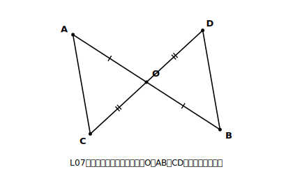

# L15 証明を読む〜新しい発見・誤りの指摘

## ねらい

- 書き終えた証明を**読み返して、新しい性質を見いだす**。証明が「答案を出したら終わり」の使い捨てではないことを体験する。
- 誤りを含む証明を読み、**どこが・なぜ**誤りかを、見直し3点チェックの言葉で指摘できるようになる。

## 主概念1：あの図に戻る〜証明は掘り返すと、まだ出てくる

L07で、はじめての証明を書いた。「線分ABと線分CDが、それぞれの中点Oで交わっているならば、AC＝BD」。△OAC≡△OBDを示して、対応する辺を取り出した、あの証明だ。

<!-- figure-spec: 意図=L07_fig1の再掲（発見活動の出発点）。要素=点Oで交わる線分AB・CD（Oは両方の中点）・線分ACとBD・OA=OBに1本目盛り、OC=ODに2本目盛り。配置はL07と同じ（Aが左上・Bが右下・Cが左下・Dが右上）。alt=中点で交わる2つの線分の端どうしを結んだ図。描かないもの=平行マーク（読み手がこれから発見する内容のため）。生成方法=パラメトリックSVG（L07_fig1と同一パラメータ）。 -->

あのとき取り出したのは AC＝BD だけだった。でも、合同からは対応する辺・角の等しさが**全部**取り出せる（L08主概念3の「もうひと掘り」）。取り出しそびれた角を見てみよう。

- ∠OAC＝∠OBD　【根拠: △OAC≡△OBDの対応する角】

この2つの角、図の中でどんな位置関係にあるか。直線ABが線分ACとBDに交わっていて、∠OACと∠OBDは……**錯角**だ。錯角が等しいなら——

- AC//BD　【根拠: 錯角が等しければ2直線は平行（L02）】

さらにAC＝BDはL07で証明済み。**1組の対辺が平行で、その長さが等しい**——L12の条件5だ。

> **四角形ACBDは、平行四辺形である。**

L07の問題は「AC＝BDを示せ」としか聞いていなかった。でも証明を読み返したら、聞かれていない事実（この図には平行四辺形が隠れていた）まで出てきた。これがL07 stretch S1の「この図には、まだ言われていない秘密が残っている」の答えだ。

別の道もある。四角形ACBDの対角線はABとCDで、仮定そのものが「対角線がそれぞれの中点で交わる」（条件4）と言っている。一直線でも平行四辺形に着地する。**証明や図は、問題に答えたら捨てるものではなく、読み返すたびに追加の性質を掘り出せる資源**なのだ。

## 主概念2：誤りの指摘〜3つの型を、名指しで見抜く

読む力のもう1つの使い道は、**誤った証明にだまされない**ことだ。この章で出会ってきた誤りは、だいたい3つの型に整理できる。どれも見直し3点チェックと対応している。

| 型 | 中身 | チェック |
|---|---|---|
| **循環型** | 示すべき結論（またはそれと同じ内容）を、根拠として途中で使う | ① |
| **架空根拠型** | 実在しない条件・性質を根拠に書く（「2組の辺と1組の角」など） | ② |
| **隠れた前提型** | 図から読み取った「等しく見える」「共通に見える」を、仮定でも証明済みでもないのに根拠に昇格させる | ② |

3つ目の型を実演しよう。次の答案は、どこがあやしいか。

**【問題】** 四角形ABCDで、AB＝AD、CB＝CD ならば、∠B＝∠D であることを証明する。

**【あやしい答案】** 「△ABCと△ADCで、AB＝AD（仮定）、CB＝CD（仮定）、**∠BAC＝∠DAC（ACは∠Aの二等分線だから）**。対応する2組の辺がそれぞれ等しく、その間の角が等しいから△ABC≡△ADC。よって∠B＝∠D ■」

∠BAC＝∠DACの根拠がおかしい。**ACが∠Aの二等分線だとは、どこにも与えられていない**。図をかくと確かに二等分して見えるが、「見える」は根拠ではない（L01からの約束）。これが隠れた前提型だ。

直し方も見ておこう。使ってよい材料だけで組み直す: AB＝AD、CB＝CD、そして**ACは共通**。**対応する3組の辺がそれぞれ等しい**。条件1なら、二等分線を持ち出さずに合同が言える。誤りの指摘は「ダメ出し」で終わらせず、**正しい道への架け替え**までがワンセットだ（ちなみに、合同が言えた後なら∠BAC＝∠DACも取り出せる。つまり「二等分して見えた」のは正しい直感で、順番だけが間違っていた。証明すべきことを先に使ってしまう点で、循環型と親戚の誤りでもある）。

:::guide
**読解2型の手順を型にする**

①「**新たに言えること**」を選ぶ問題では、選択肢を「仮定に書いてある／すでに証明済み／この証明で初めて導かれた」の3つに仕分けする。「正しいこと」と「新たに分かったこと」は違う。仮定は正しいが、新たに分かったことではない。
②「**どの行が崩れると何が崩れるか**」を追う問題では、行から行へ「これがないと、どの行が言えなくなるか」の矢印を逆向きにたどる。証明は行の積み木で、下の段を抜くと上が落ちる。どの段がどの段を支えているかを見る訓練だ。
:::

:::guide
**「共通」は書いてよい隠れ材料、「共通に見える」は書けない**

隠れた前提型とまぎらわしいが、**共通な辺・共通な角**（同じ辺・同じ角を2つの三角形が共有している）は、図の定義から確実に言えるので根拠にしてよい（AC＝CAなど）。ダメなのは「等しく**見える**別々のもの」を等しいと書くこと。区別の基準は「それは同一のものか、別々の2つか」。同一なら共通、別々なら証明か仮定が要る。
:::

:::zatsudan
「他人の証明のあら探しなんて意地悪では」と思うかもしれないけど、数学の世界では、証明はお互いに読み合ってチェックするのがふつうの文化なんだ。どんなに偉い人の証明でも、読んだ人が「この行の根拠は？」と聞いてよいし、答えられなければ証明は未完成扱いになる。肩書きではなく根拠だけがものを言う。考えてみると、かなり公平な世界だよね。今日きみがやった「誤りの指摘」は、その文化への参加第一歩だ。
:::

## 練習

1. 【読む・新発見】L11練習2で証明した「▱ABCDの対角線の交点Oを通る直線が辺AB・CDと交わる点をE・Fとすると、OE＝OF」を読み返す。この証明（△OAE≡△OCF）から、OE＝OF以外に**新たに言えること**を1つ取り出そう（対応する辺・角の中から）。
2. 【読む・依存関係】主概念1の発見（四角形ACBDは平行四辺形）は、仮定「OはABの中点」が崩れる（OA≠OB になる）と、どの行から順に崩れるか。「△OAC≡△OBDの根拠のうち崩れるもの→合同→……」の順に、崩れる連鎖を書き出そう。
3. 【誤り指摘】次の各答案のあやしい箇所を、3つの型（循環型・架空根拠型・隠れた前提型）のどれかを名指しして指摘しよう。
   (1) 「△ABCと△DEFで、AB＝DE、∠A＝∠D、∠B＝∠E。1組の辺とその間の角がそれぞれ等しいから△ABC≡△DEF ■」
   (2) 「二等辺三角形ABC（AB＝AC）の底辺BCの中点をMとする。AM⊥BCを示す。∠AMB＝90°である。よって∠AMB＝∠AMC＝90°となり、AM⊥BC ■」
   (3) 「△ABCと△DBCで、AB＝DB（仮定）、BCは共通、∠ABC＝∠DBC（図より）。対応する2組の辺がそれぞれ等しく、その間の角が等しいから△ABC≡△DBC ■」
4. 練習3の(1)を、材料（AB＝DE、∠A＝∠D、∠B＝∠E）はそのままに、**実在する合同条件**で正しく書き直そう。

:::stretch
**S1** 主概念2の【問題】の図（AB＝AD、CB＝CDの四角形・たこ形）で、証明を読み返してさらに掘ろう。△ABC≡△ADCから∠BAC＝∠DACと∠BCA＝∠DCAも取り出せる。ここで対角線BDを引き、ACとの交点をEとする。「AC⊥BD」は証明できるだろうか（方針メモ: △ABEと△ADEに、いま取り出した∠BAE＝∠DAEが使える。L13のひし形の対角線の証明と見比べてみよう。ひし形でやった手が、たこ形にもどこまで通用する？）。
:::

---

対応解答: answer_key_L13-16.md

<!-- gen_nav:nav:start（自動生成・手編集しない） -->

---

[← 前のレッスン](lesson_14.md)｜[単元の目次](README.md)｜[解答](answer_key_L13-16.md)｜[次のレッスン →](lesson_16.md)

<!-- gen_nav:nav:end -->
