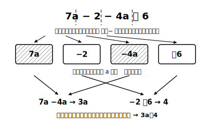

# L01 中1の道具箱を開け直す——項の意味

## ねらい

- 中1で学んだ一次式の計算を思い出し、**項**という「式の部品」の見方を確認する。
- 「まとめられる項」と「まとめられない項」を、**文字の部分が同じかどうか**で判定できるようになる。この判定基準が、中2の式の計算全体を支える土台になる。

## 準備運動：道具箱の点検（前提診断）

新しい学年の最初の章だ。まず中1の道具がさびていないか、5問で点検しよう。すらすら解ければ準備は万全。あやしいところが見つかったら、それだけで収穫だ。

1. 次を計算しよう。 3x＋5x
2. 次を計算しよう。 7a−2−4a＋6
3. かっこを外して計算しよう。 −(2x−5)
4. x＝−3 のとき、2x＋7 の値を求めよう。
5. 1本80円の鉛筆を a 本買ったときの代金を、文字式で表そう。

2で「3a と 4 をさらにまとめて 7a」とした人、4で符号を間違えた人は、このレッスンがちょうど効く。中1の内容は、この章でそのまま「部品」として使い続ける。

## 主概念1：式は「項」という部品でできている

7a−2−4a＋6 のような式は、**＋で結ばれた部品の集まり**として見ることができる。

7a−2−4a＋6 ＝ 7a＋(−2)＋(−4a)＋6

> **【ことば】項（こう）**……式を＋で結ばれた形に直したときの、一つひとつの部品を**項**という。7a−2−4a＋6 の項は 7a、−2、−4a、6。

ひき算に見える式も、「負の数をたしている」と読み直せば、すべて項の足し算になる。これは中1の負の数で手に入れた見方だ。

項に分けると、計算の方針がはっきりする。**同じ種類の項どうしだけを選んで、まとめればよい**。7a と −4a は文字の部分が同じ a どうしなので 3a に、−2 と 6 は数どうしなので 4 になる。答えは 3a＋4。

:::guide
**「−4a」の符号は項の一部**

項に分けるとき、定番の事故は符号の置き忘れだ。7a−2−4a＋6 を「7a、2、4a、6」と分けてしまうと、符号の情報が消えて計算が壊れる。**直前の＋・−ごと切り取って「7a／−2／−4a／＋6」と分ける**。ハサミを入れる位置は、いつも＋か−の直前。この癖はこの章の全レッスンで効き続ける。
:::

## 主概念2：まとめられない項——ある答案の解剖

次の計算を見てほしい。どこかに誤りがある。

(4x＋5)−(2x＋3)＝4x−2x＋5−3＝2x＋2＝4x

前半は正しい。かっこを外して 4x−2x＋5−3、文字の項どうし・数の項どうしをまとめて 2x＋2。ここまでは完璧だ。誤りは最後の一歩、**2x＋2 を 4x にしたところ**にある。

2x は「x の2個分」、2 はただの数。**文字の部分が違う（片方には x があり、片方にはない）項は、1つの項にまとめることができない**。だから 2x＋2 は、これ以上計算できない——**2x＋2 のままが答え**なのだ。

本当にまとめられないのか、数を入れて確かめられる。x＝3 とすると、2x＋2＝2×3＋2＝8。いっぽう 4x＝4×3＝12。値が違う——つまり 2x＋2 と 4x は別の式だ。**「計算した結果」と「元の式」に同じ数を代入して値が一致するか**。この検算は、この章のすべての計算で使える自己チェックになる。

:::zatsudan
中1のはじめ、3a＋2 みたいに「＋が残ったままの答え」に、なんだかムズムズした覚えはないだろうか。小学校まで、答えはいつも 5 とか 12 とか、1個の数だったから。でも文字の式では「これ以上まとめられない」もまた立派な答えの形。ムズムズの正体は「数の計算の常識」で「文字の式」を見ていたことなんだ。この章では、そのムズムズと正面から仲直りしていく。
:::

## 判定の型：「文字の部分は同じ？」

まとめてよいかどうか、迷ったらこの一言をつぶやこう。

> **文字の部分が同じ項だけが、まとめられる。**

- 5x と −3x → 文字の部分がどちらも x → まとめられる（2x）
- 2x と 2 → 片方に文字がない → まとめられない
- 数どうし（−2 と 6 など）→ まとめられる（4）

次のレッスンでは文字が2種類（x と y）登場する。そこでもこの一言が、そのまま判定基準になる。

:::guide
**検算の数の選び方**

代入検算では x＝1 は避けたほうが安全だ。x＝1 だと 2x＋2 も x＋3 も同じ 4 になってしまい、別の式なのに一致して見えることがある。**x＝2 や x＝3 など、1以外の数**を入れるのがコツ。2つの式が本当に等しいなら、どんな数を入れても一致するはずだ。ただし逆は言えない。代入は**間違いを見つけるための検査**で、1つの数で一致したからといって完全な証明になるわけではない（このことはL06でくわしく扱う）。それでも、計算ミスはたいていこの検査で見つかる。
:::

## 練習

1. 次の式の項をすべて書き出そう。
   (1) 5x−7　(2) −3a＋4−a
2. 次を計算しよう。
   (1) 8x−3x　(2) 6a−1−2a＋5　(3) (3x＋4)＋(2x−6)　(4) (5x＋2)−(3x−1)
3. 次の計算の誤りを見つけ、正しく直そう。
   「7x＋3−2x＝5x＋3＝8x」
4. 2の(4)の答えが正しいことを、x＝2 を代入して確かめよう（元の式と答えの式の値が一致するか）。

:::stretch
**S1** 「2x＋2 はこれ以上計算できない」のに、「2x＋2 に x＝3 を代入すると 8 という1個の数になる」。この2つの文は矛盾しないだろうか？ 「式を簡単にすること」と「式の値を求めること」の違いを、自分の言葉で説明してみよう。
:::

---

対応解答: answer_key_L01-04.md

<!-- gen_nav:nav:start（自動生成・手編集しない） -->

---

[単元の目次](README.md)｜[解答](answer_key_L01-04.md)｜[次のレッスン →](lesson_02.md)

<!-- gen_nav:nav:end -->
